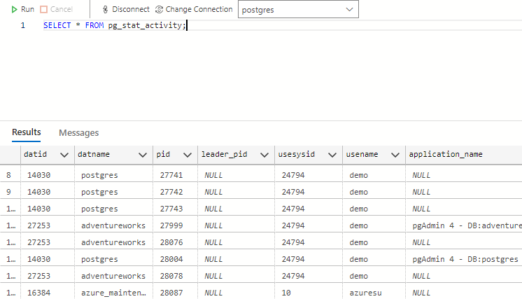

When a query runs, it needs to create a plan to decide how to access the data. For example, if a SELECT query returns every row, there's no benefit to using an index and it would be more efficient to scan the whole table. In this scenario, it's straightforward to plan the query, but most query plans aren't so simple to resolve.

Imagine a scenario where you're running a query that searched for every order between $10.00 and $20.00. Initially, we don't know if the query returns all of the data in the table, or just a small subset. This unknown makes it hard to plan the query strategy until we see the data. If we know that the table contains orders that have a purchase price between $1.00 and $800.00, an index could be used to search for a small subset of the data. However, there still might not be enough information to generate the proper query plan. In this example, although the orders have a purchase price between $1.00 and $800.00, 95% of orders are between $10.00 and $20.00 and a scan of the data is actually the most effective plan.

With scenarios such as the previous example, PostgreSQL needs detailed statistics to be able to use the optimum query plan.

To monitor planning and execution statistics there's a PostgreSQL extension called **pg_stat_statements**. **pg_stat_statements** is enabled by default in Azure Database for PostgreSQL and allows members of the **pg_read_all_stats** role to query statistics using multiple **pg_stat** views. The following query returns query activity using the **pg_stat_activity** view:

```sql
SELECT * FROM pg_stat_activity;
```



## Turning off pg_stat_statements

If your queries are unique and you don't repeat the same query periodically, then historic query data is less useful. Also, if you don't use the **pg_stat** views, then they provide no benefit. There's an overhead to maintaining the **pg_stat_statements**, which can be up to 50%, and you can turn off tracking of **pg_stat_statements** in these scenarios.

To turn off tracking of **pg_stat_statements**, perform the following steps:

1. Go to the Azure portal and select your Azure Database for PostgreSQL server.
1. Select **Server parameters** and navigate to the **pg_stat_statements.track** setting.
   
1. If you want to turn off tracking, select **NONE**.
1. For more exact tracking, select **ALL**.
1. The default setting is **TOP**.
1. Select **Save**.
