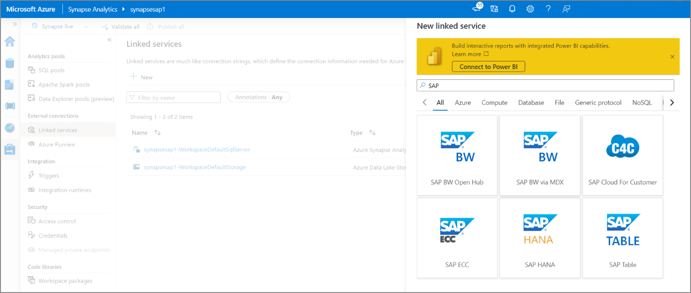
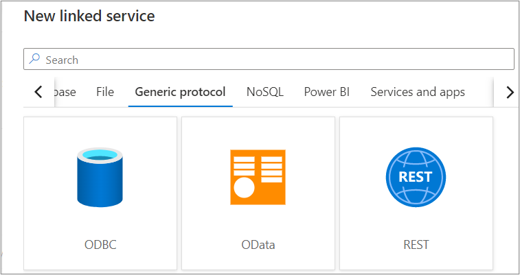
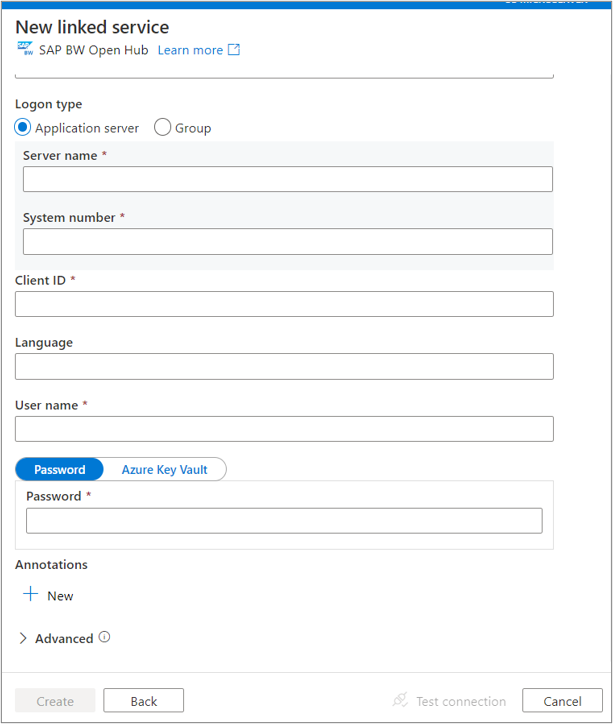
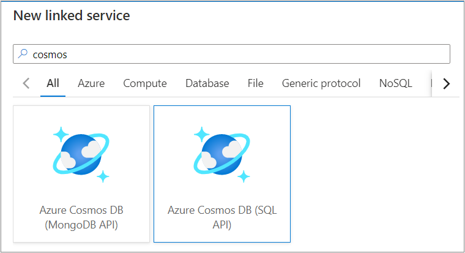
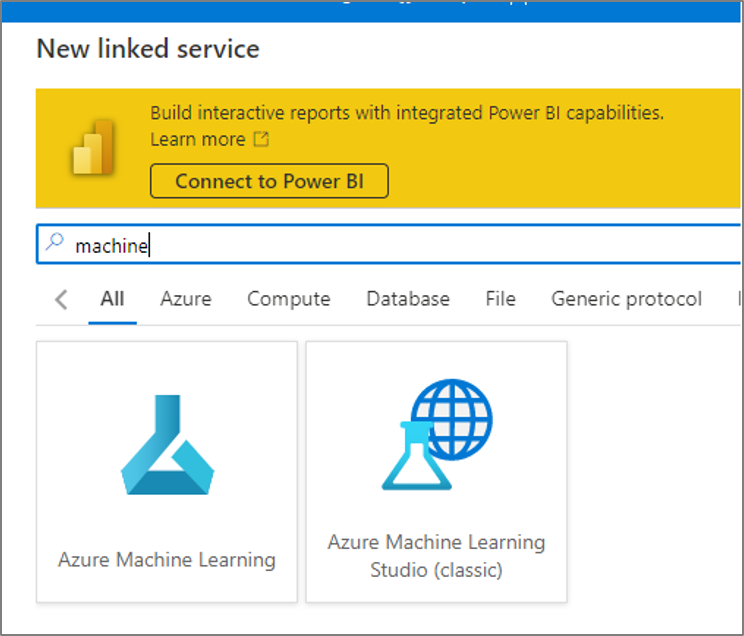

Linked services in Azure Synapse Studio work similarly to the data connectors in other Microsoft services. Use the Manage hub to find linked services to connect to a data source or application.

## Linking to SAP systems

Synapse includes more than 90 linked services, including six for SAP, plus an OData linked service that is used extensively by SAP for integration. You can also customize or build your own linked service .

To locate the SAP-specific linked services in the Synapse Studio UI, select Manage, then Linked services, then select + New and Search for SAP in the New linked service panel. To find the OData linked service, choose the Generic protocol category or search for OData. 
 

Select the SAP service you want to use in your solution and complete the requested fields to connect to the SAP service or database. The following screenshot, for example, shows a sample SAP BW Open Hub settings pane when creating a linked service for SAP in Synapse Studio. Add server and other details to bring in data from SAP servers on-premises, in Azure, or in another cloud.

 
Based on your business scenario, you need to create an SAP BW Open Hub linked service. You’ll use it later to extract vendor history data from your SAP Business Warehouse solution. Your SAP system is critical to your plan because it includes time-stamped order data for all parts vendors and the date that you received the parts.

## Linking to Azure Cosmos DB 

You also need to link to your Azure Cosmos DB. Because your business evaluates vendor products at multiple facilities throughout the world, you migrated to Cosmos DB, a globally distributed database system. Data added in one region is available immediately to all regions. 

Azure Cosmos DB is a NoSQL database for modern app development. As a fully managed service, Azure Cosmos DB eliminates the need for database administration tasks such as updates and patching. The service handles capacity management. It offers cost-effective serverless and automatic scaling options that respond to application needs and match capacity with demand.

To link to Cosmos DB, choose New linked service and search for Cosmos DB. Select the tile to configure the service, providing your Cosmos DB details when requested.

Azure Synapse simplifies your ability to connect to the required data sources.

## Other linked services

To find other linked services, use the search bar in the New linked service panel. Search for “machine learning” to find and enable the Azure Machine Learning service, which you’ll need later for your predictive analytics.

 
If your business scenario requires data from other sources, search for an available linked service, or create a custom linked service. For example, to analyze data for demand forecasting, you might link to weather data, social sentiment data, or store sales reports.

  
You can also view available linked services by category. Select a category from the options across the top of the UI to see available linked services.

## Custom linked services

If required, you can also create, customize, and update Azure Synapse Analytics linked services. This capability is useful if you want to use your own keys with Azure Key Vault or add parameters to the connection string, for example.

## Summary

At this point, you’ve created links to your SAP system, Azure Cosmos DB and Azure Machine Learning. You’re ready to extract and combine the data.