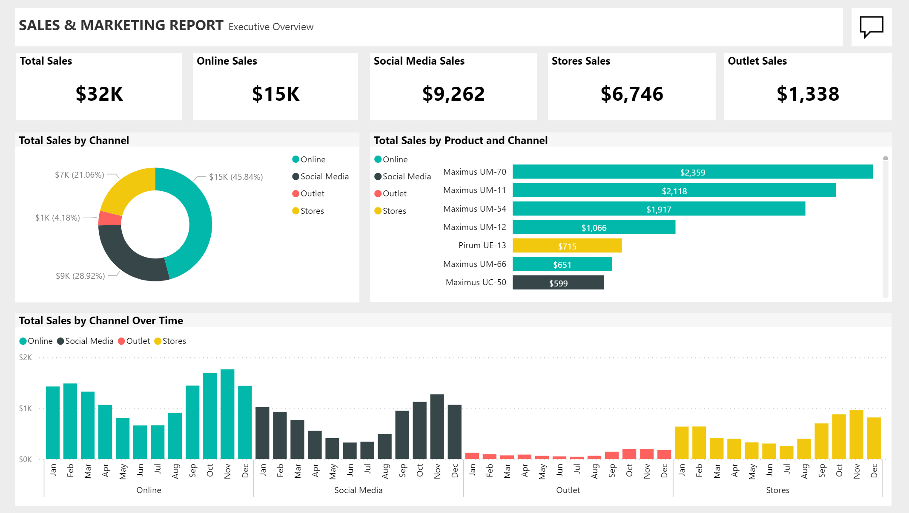
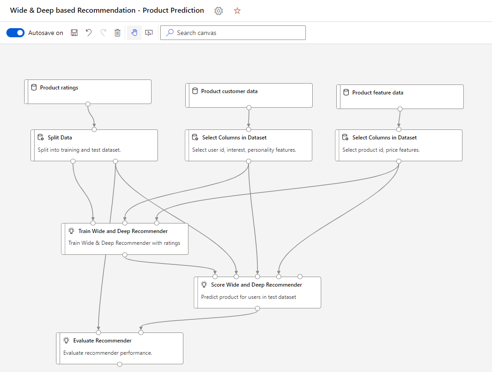
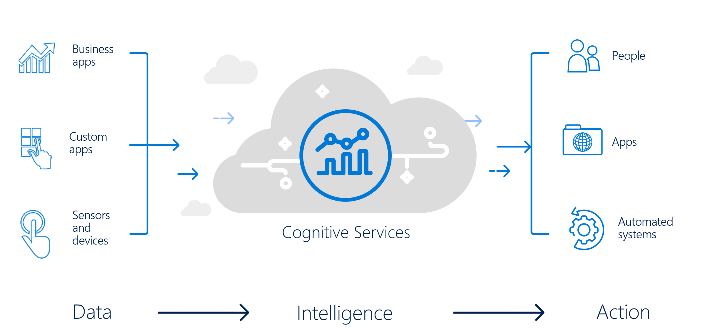

Data analytics is used for exploring data and extracting insights.

Data analytics covers a range of activities, each with its own focus and goals. These activities are categorized as descriptive, diagnostic, predictive, prescriptive, and cognitive analytics.

In this unit, you'll learn about these five categories of data analytics and what they are used for.

## Descriptive analytics
**What happened?**

*Descriptive analytics* answers questions about what happened, based on historical data, to inform decisions about the future. Descriptive analytics techniques summarize large datasets to present insights to stakeholders. Descriptive analytics is the most common type of analytics and is often performed by a data analyst.

The development of key performance indicators (KPIs) and other performance measures helps track the success or failure of business objectives. KPIs and performance metrics are often set by the business to track key initiatives. The presentation of data related to those KPIs is descriptive analytics.

Descriptive analytics outputs can take many forms, including reports and dashboards. The Sales and Marketing report below displays sales and marketing data for a year by product, channel, and over time.

## Diagnostic analytics
**Why did it happen?**

*Diagnostic analytics* helps answer questions about why things happened and is often the next step in data analytics after descriptive analytics. Analysts take findings from descriptive analytics and dig deeper to find the cause. Metrics and indicators of interest are further investigated to discover why they got better or worse. Diagnostic analytics is often performed by data analysts and data scientists.

Diagnostic analytics generally occurs in three steps:

1. Identify anomalies in the data. Anomalies may be unexpected changes in a metric or a particular market.
1. Collect data that's related to these anomalies.
1. Use statistical techniques to discover relationships and trends that explain these anomalies.

In Contoso's sales report below, we want to understand why Contoso is or isn't winning bids for new business. Diagnostic analytics help decision makers see that applying discounts of 2% increases the likelihood of winning a bid.

## Predictive analytics
**What will happen in the future?**

*Predictive analytics* helps answer questions about what will happen in the future. Predictive analytics techniques use historical data to identify trends and determine if they're likely to recur, providing insight into what may happen in the future. Techniques include statistical and machine learning techniques such as forecasting, neural networks, decision trees, and regression. Predictive analytics is often performed by data scientists. Predictive analytics is performed by data analysts and data scientists.

The line chart below looks at revenue won by year and month, which shows historical decline. Forecasting predicts that revenue won will continue to decrease. Decision makers may use this forecast to change course in an effort to increase the amount of revenue won.

## Prescriptive analytics
**What actions should be taken?**

*Prescriptive analytics* takes predictive analytics one step further and helps answer questions about what actions should be taken to achieve a goal or target. This technique allows businesses to make data-informed decisions in the face of uncertainty. Prescriptive analytics techniques rely on machine learning strategies to find patterns in large datasets. By analyzing past decisions and events, the likelihood of different outcomes can be estimated. Prescriptive analytics is often performed by data scientists. Microsoft also provides low-code tools that can be used by analyts to conduct prescriptive analytics, like using machine learning in Power BI.

Algorithmic content recommendations are a common implementation of prescriptive analytics. Using the recommendation algorithm in Azure Machine Learning studio, data scientists can recommend the best actions Contoso should take based on a customer's past habit and characteristics. The screenshot below displays the recommendation algorithm in Azure Machine Learning designer, in which customer data is being used to prescribe a specific recommendation rating.

> [!NOTE]
> To learn more about prescriptive analytics using Azure Machine Learning, review [Build a content-based recommendation system](/azure/architecture/example-scenario/ai/scalable-personalization-with-content-based-recommendation-system).

## Cognitive analytics
**How can the problem be solved best?**

*Cognitive analytics* combines artificial intelligence, machine learning, and data analytics approaches to guide decision making. Cognitive analytics draws inferences from existing data and patterns, derives conclusions based on existing knowledge bases, and adds findings back into the knowledge base for future inferences--a self-learning feedback loop. This feedback loop enables cognitive applications to become more precise over time.

By tapping the benefits of massive parallel/distributed computing and the falling costs of data storage and computing power, there's no limit to the cognitive development that these systems can achieve. Microsoft's Azure Cognitive Services enables users to take advantage of cognitive analytics by extracting insights from various types of data, including things like text and images.

> [!NOTE]
> To learn more about data cognitive analytics using Azure Cognitive Services, review [Get started with Cognitive Services](/azure/architecture/example-scenario/ai/scalable-personalization-with-content-based-recommendation-system).
