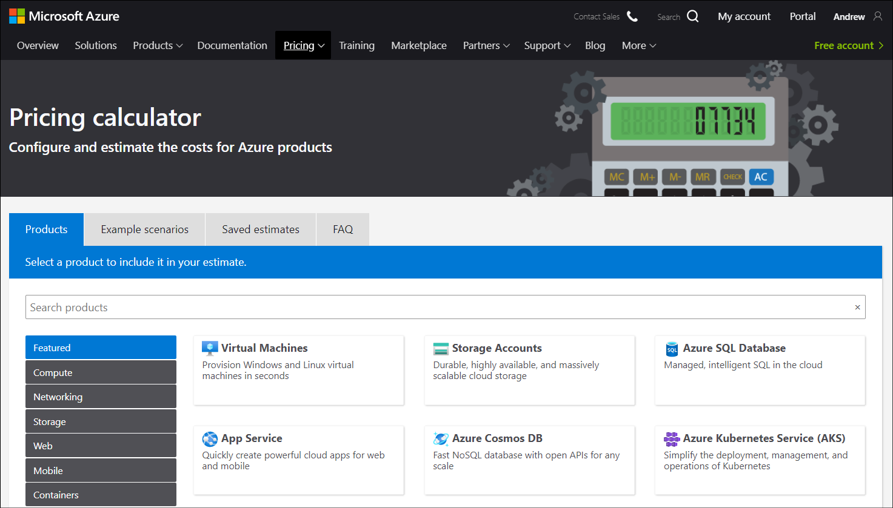
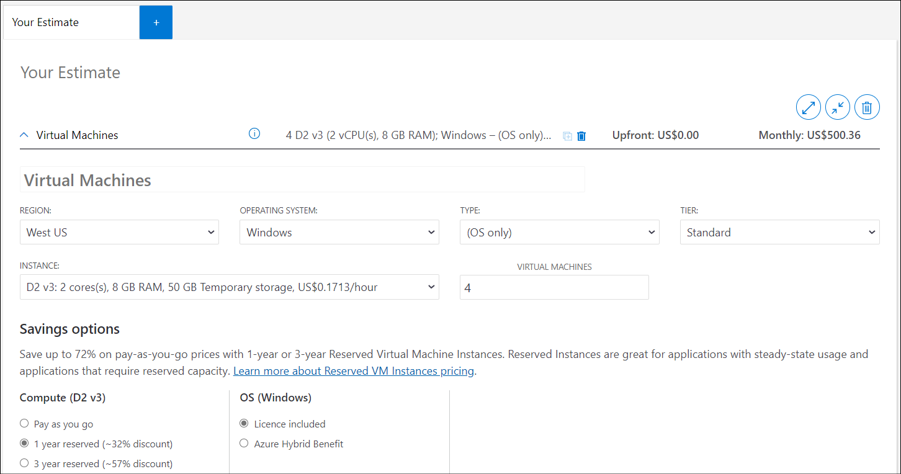
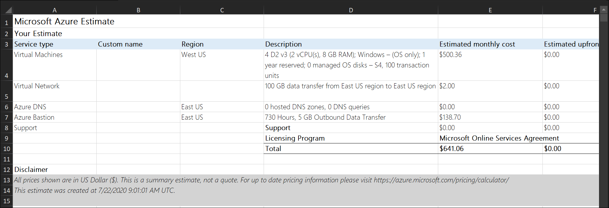

With Azure's cloud-based subscription model, most of Contoso's IT costs are operating expenditures. Because the IT director wants more detail on how costs can be managed, you can use the Pricing calculator to get an estimate of the expected costs.

## What is the Pricing calculator?

The Pricing calculator is a webpage that you can use to get estimates of Azure costs. The calculator provides links that enable you to select the specific services that you intend to use, and then determine estimated costs based on planned configurations.

> [!TIP]
> You can access the Pricing calculator here. `https://azure.microsoft.com/pricing/calculator/`.

On the **Products** tab, you can select specific products, such as:

- VMs
- Azure Functions
- Cloud Services
- Virtual Network
- Azure DNS
- Storage Accounts
- App Service
- Event Hubs

Products are grouped into collections, such as Compute, Networking, Storage, and Analytics. You can also review example scenarios and add those to your estimate. Scenarios currently include:

- Advanced analytics on big data
- Modern data warehouse
- Real-time analytics

These example scenarios identify all the components that you'll need to create the scenario, and then provide an easy way to estimate the costs for that scenario.

## Create an estimate

To create an estimate, browse to the **Pricing calculator** webpage. Sign in, so that your estimate can be saved for later. Then use the following procedure:

1. On the **Products** tab, select the products that you anticipate using. For example, for a simple compute estimate, in the navigation list, select **Compute**, and then select **Virtual Machines**.
2. Select **Networking**, and then select **Virtual Network**.
3. Also select **Azure DNS** and **Azure Bastion**.
4. Scroll down the webpage, where you can review the features you've added to your estimate.
5. You can now configure the details. For example, in the **Virtual Machines** section, select the **OPERATING SYSTEM**, **TYPE**, **TIER**, **INSTANCE**, and number of **VIRTUAL MACHINES**.
6. In the **Savings options** section, select any **Compute** savings. For example, select **1 year reserved (~32% discount)**.

    

7. Scroll down and review the information for additional products and components. In this case, review the **Virtual Network**, **Azure DNS**, and **Azure Bastion** pricing.
8. Make any changes to reflect your specific configuration.
9. At the end of the estimate, add any **Support** options or **Programs and Offers** you want, such as **Microsoft Online Services Agreement**.
10. Then review the final estimated monthly cost.

You can choose to save the estimate for future reference. If you save the estimate, when you return to **Pricing calculator** you'll find the saved estimate on the **Saved estimates** tab.

> [!TIP]
> You can also export the estimate to Microsoft Excel by selecting **Export**.

### Try it with Pricing calculator

If you'd like to try estimating costs with Pricing calculator, you can complete the exercise at [Exercise - Estimate costs with the Azure pricing calculator](https://aka.ms/predict-costs-and-optimize-spending-2-estimate-costs-with-the-azure-pricing-calculator?azure-portal=true). (This exercise doesn't require an Azure subscription.)

## Additional reading

You can learn more by reviewing the following document:

- [Azure pricing](https://aka.ms/pricing-azure?azure-portal=true).
