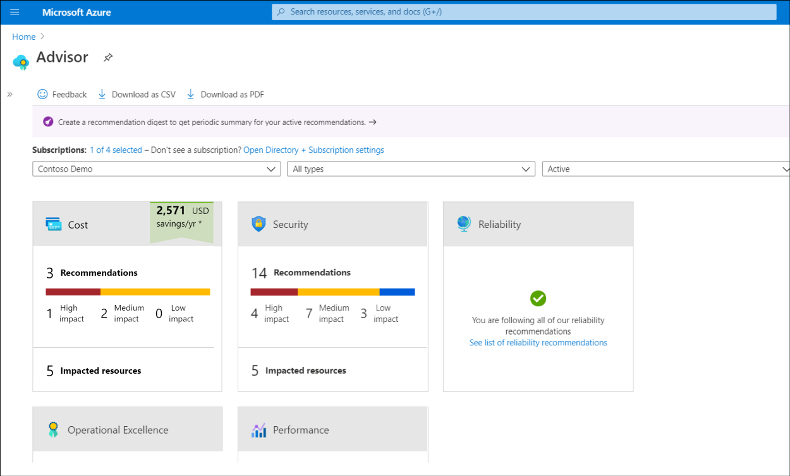
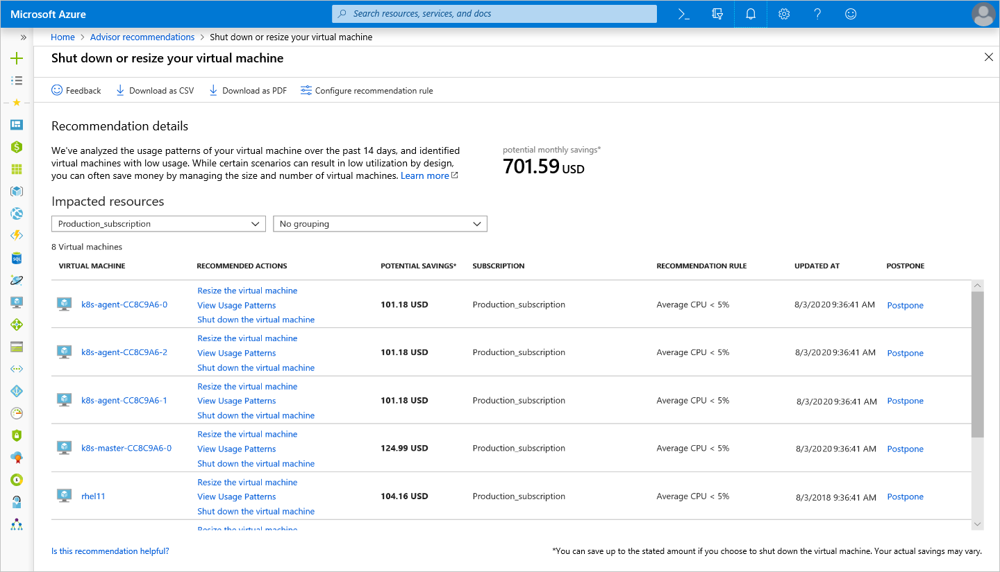
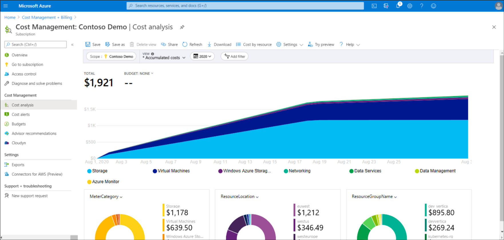
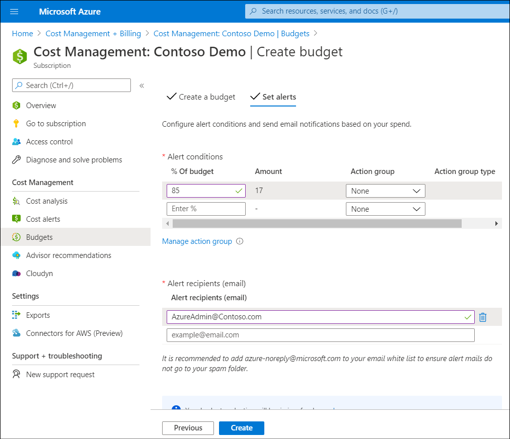
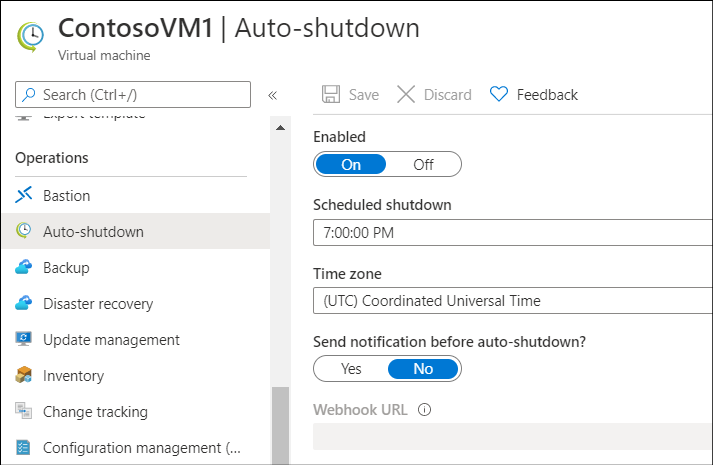

Contoso can use the Pricing calculator to estimate costs prior to deploying Azure resources. But after deployment, it's still important for them to be able to manage their resource costs in Azure. Using a number of Azure tools, Contoso can monitor and limit Azure resource costs.

## What is Azure Advisor?

*Azure Advisor* analyzes your deployed resources and services and identifies ways to improve your environment across each of these areas. *Azure Advisor* provides recommendations on:

- High availability
- Security
- Performance
- Operational excellence
- Cost

Advisor makes cost recommendations, including those described in the following table.

> [!TIP]
> For a complete list of possible recommendations, review  [Reduce service costs by using Azure Advisor](https://aka.ms/advisor-cost-recommendations?azure-portal=true).

|Recommendation|Description|
|------------------------------------------------------------|------------------------------------------------------------|
|Reduce costs by eliminating unprovisioned ExpressRoute circuits.|Advisor identifies ExpressRoute circuits that have been in the provider status of *Not Provisioned* for more than one month. It then recommends deleting the circuit if you aren't planning to provision the circuit with your connectivity provider.|
|Reduce costs by deleting or reconfiguring idle virtual network gateways.|Advisor identifies virtual network gateways that have been idle for more than 90 days. Because these gateways are billed hourly, you should consider reconfiguring or deleting them if you don't intend to use them anymore.|
|Buy reserved VM instances to save money over pay-as-you-go costs.|Advisor reviews your VM usage over the last 30 days and determines whether you could save money in the future by purchasing an Azure Reservation. Advisor identifies the regions and sizes where you potentially have the most savings and presents the estimated savings.|
|Optimize VM spending by resizing or shutting down underutilized instances.|Advisor monitors your VM usage and identifies underutilized VMs. VMs whose average central processing unit (CPU) utilization is 5 percent or less and network usage is 2 percent or less (over a seven day period) are considered underutilized VMs. Recommended actions are to shut down or resize, depending on the resource being evaluated.|

Advisor considers shutting down VMs when the following statements are true:

- 95 percent of the time, the maximum value of CPU utilization is less than 3 percent.
- Network utilization is less than 2 percent over a seven-day period.
- Memory pressure is lower than the threshold values.
  
Advisor considers resizing VMs when it's possible to fit the current load in a smaller SKU (within the same SKU family), or a smaller number of instances providing:

- The current load doesn’t exceed 80 percent utilization for workloads that aren't user facing.
- The current load doesn’t exceed 40 percent for user-facing workloads.

Advisor presents the estimated cost savings for both recommended actions: resize or shut down. For resize, Advisor provides current and target SKU information.

> [!TIP]
> If you want to be more aggressive about identifying underutilized VMs, you can adjust the CPU utilization rule on a per-subscription basis.

To use Azure Advisor to review cost recommendations, use the following procedure:

1. In the Azure portal, select **All Services**.
2. Search for and then select **Advisor**.
3. On the **Advisor** blade, in the **Recommendations** section, select **Cost**.

     > [!NOTE]
     > Advisor might not return any cost recommendations, either because assessments might not have completed, or because Advisor doesn't have any.

     

4. Select the **Cost** tile. This action takes you to detailed recommendations from Advisor.

     

5. Selecting a recommendation takes you to the details for that specific recommendation. You can then take a specific action, such as resizing VMs to reduce cost.

     

## What is Microsoft Cost Management?

You can use Microsoft *Cost Management* to gain greater insights into where your greatest Azure resource costs are. You can review historical information about which services are costing the most, and you can also track spending against configured budgets that you've set. To access Cost Management, use the following procedure:

1. From the Azure portal, search for and select **Cost management + Billing**.
2. On the **Cost Management + Billing** blade, select **Cost Management**.
3. On the **Cost Management** blade, select **Cost analysis**. After a moment, you can review the accumulated costs for your Azure resources in the **Current billing period**. This is the default report.
4. To change the report, on the menu, in the **VIEW** drop-down list, choose between **Accumulated costs**, **Cost by resource**, **Daily costs**, **Cost by service**, and **Invoice details**.
5. In the **Date** field, select the period that you want to review.
6. You can also choose between the types of charts you want to use to review your costs. The default is **Area**, but you can also choose **Line**, **Column**, or **Table**.

If you want to configure budgets to control spending, in the **Cost management** section, select **Budgets**. You can then create a budget for various Azure resources by selecting **+ Add**. If you also want to configure an alert for spending, select the **Set alerts** tab. From there you select the action group that is used when your action is triggered. Action groups define the appropriate action to be taken when your budget limit is approached.

> [!NOTE]
> Although you can set a budget and create alerts when spending approaches your budgetary limit, this doesn't prevent charges from being incurred. It merely alerts you to your current spending.

## Use spending limits

Some Azure subscriptions have an associated monthly credit. These include Azure trial accounts. These subscriptions have a *spending limit* that helps to ensure that you aren't charged after you've used up your credits.

> [!NOTE]
> Azure spending limits are different from subscription, service, or resource group limits and quotas. For more information, refer to [Azure subscription and service limits, quotas, and constraints](https://aka.ms/azure-subscription-and-service-limits-quotas-and-constraints?azure-portal=true).

The spending limits feature can help prevent you from consuming all the credit on your account within each billing period. When your Azure usage results in charges that use all of your included monthly credit, Azure disables and turns off services that you deployed for the rest of the billing period. After a new billing period begins, and assuming you've credits available, Azure reactivates and deploys your resources.

Azure notifies you by email when you reach the spending limit for your subscription. In addition, you can use the Azure portal to review notifications about your credit spend.

> [!IMPORTANT]
> The spending limit feature is specific to subscriptions that include a monthly Azure credit allotment. It's not available on pay-only subscriptions.

## Right-size underutilized VMs

Right-sizing a VM is the process of resizing it to a more appropriate size. For example, Contoso has a server running as a domain controller that is sized as a **Standard_D4s_v3**. However, this VM is operating at 90 percent idle for most of the time. By resizing this VM to a **Standard_D2s_v3**, Contoso can reduce their compute cost by 50 percent. In this case, Contoso might even benefit from changing the instance series to a less expensive VM series.

> [!NOTE]
> Costs are linear and double for each larger size in the same series.

Oversized Azure VMs are a common but unnecessary expense, and one that you can easily fix. You can change the size of a VM through the Azure portal, Azure PowerShell, or Azure Command-Line Interface (Azure CLI).

> [!NOTE]
> Resizing a VM causes it to restart to effect the changes. This might take a few minutes depending on how significant the size change is. Plan for an outage, or shift your traffic to another instance while you perform this task.

> [!TIP]
> If you stop a VM before resizing it, you can choose from more sizing options than when the VM is running.

## Deallocate VMs when not being used

If you've VM workloads that you don't use all of the time, but you're running them constantly, you're incurring unnecessary Azure costs. Consider shutting these VMs down, and using a schedule to restart as needed. While the VM is stopped in a deallocated state, you don't pay for the compute resources for that VM.

To deallocate a VM, from the Azure portal, locate the VM you want to configure, and in the **Operations** section, select **Auto-shutdown**. Then configure the auto-shutdown properties.

