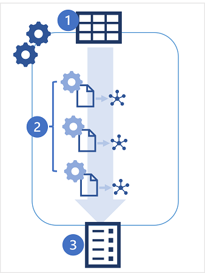

AutoML is a feature of Azure Databricks that enables you to automate training and evaluation of a machine learning model using different combinations of algorithm and hyperparameter values. By using AutoML, you can reduce the effort involved in an iterative model training process and create an optimal model for your data more quickly.

## How does AutoML work?

AutoML works by generating multiple experiment runs, each one training a model using a different algorithm and hyperparameter combination. In each run, a model is trained and evaluated based on the data and predictive metric that you specify. Azure Databricks keep track of the runs and the models they produce by using MLflow, enabling you to identify the best performing model and deploy it to production.

1. You start an AutoML experiment, specifying a table in your Azure Databricks workspace as the data source for training and the specific performance metric for which you want to optimize.
2. The AutoML experiment generates multiple MLflow runs, each producing a notebook with code to preprocess the data before training and validating a model. The trained models are saved as artifacts in the MLflow runs or files in the DBFS store.
3. The experiment runs are listed in order of performance, with the best performing models shown first. You can explore the notebooks that were generated for each run, choose the model you want to use, and then register and deploy it.

> [!TIP]
> For details of the specific preprocessing transformations and training algorithms used by AutoML, see [How Azure Databricks AutoML works](/databricks/machine-learning/automl/how-automl-works?azure-portal=true) in the Azure Databricks documentation.

## Prepare data for AutoML

AutoML needs a source of training data that includes feature and label values. To provide this data, create a table in the Hive metastore in your Azure Databricks workspace.

A simple way to create a table of training data for AutoML is to upload a data file in the Azure Databricks portal, as shown here.

AutoML generates code to handle common data preprocessing tasks; such as encoding categorical variables, scaling numeric variables, handling null values, and dealing with imbalanced datasets.
