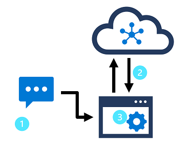

*Natural language processing* (NLP) is a common AI problem in which software must be able to work with text or speech in the natural language form that a human user would write or speak. Within the broader area of NLP, *natural language understanding* (NLU) deals with the problem of determining semantic meaning from natural language - usually by using a trained language model.

A common design pattern for a language understanding solution looks like this image:

> [!div class="mx-imgBorder"]
> 

In this design pattern:

1. An app accepts natural language input from a user
2. A language model is used to determine semantic meaning (the user's *intent*)
3. The app performs an appropriate action

In Microsoft Azure, the **Language Understanding** service enables developers to build apps based on language models that can be trained with a relatively small number of samples to discern a user's intended meaning.

In this module, you'll learn how to use the Language Understanding service to create a language understanding app.

After completing this module, you’ll be able to:

- Provision Azure resources for the Language Understanding service
- Define intents, entities, and utterances
- Use patterns to differentiate similar utterances
- Use pre-built entity components
- Train, test, publish, and review a model
