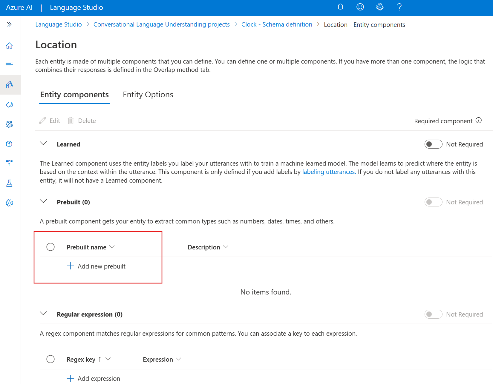

You can create your own language models by defining all the intents and utterances it requires, but often you can use prebuilt components to detect common entities such as numbers, emails, URLs, or choices.

For a full list of prebuilt entities the Language service can detect, see the list of [supported prebuilt entity components.](/azure/cognitive-services/language-service/conversational-language-understanding/prebuilt-component-reference?azure-portal=true)

Using prebuilt components allows you to let the Language service automatically detect the specified type of entity, and not have to train your model with examples of that entity.

To add a prebuilt component, you can create an entity in your project, then click "Add new prebuilt" to that entity to detect certain entities.

You can have up to five prebuilt components per entity. Using prebuilt model elements can significantly reduce the time it takes to develop a language understanding solution.
