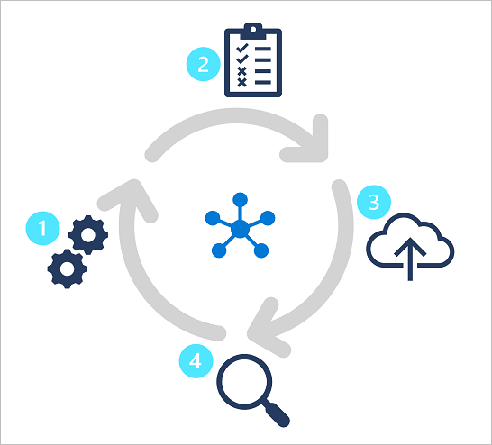

Creating a language understanding model is an iterative process with the following activities:

1. Train a model to learn intents and entities from sample utterances.
2. Test the model interactively, or by submitting a batch of utterances with known intent labels. Compare the predicted intents to the known label.
3. Publish a trained model for consumption and use it from client applications.
4. Review the predictions made by the model based on user input and apply *active learning* to correct misidentified intents or entities and improve the model.

By following this iterative approach, you can improve the language model over time based on actual user input, helping you develop solutions that reflect the way users indicate their intents using natural language.
