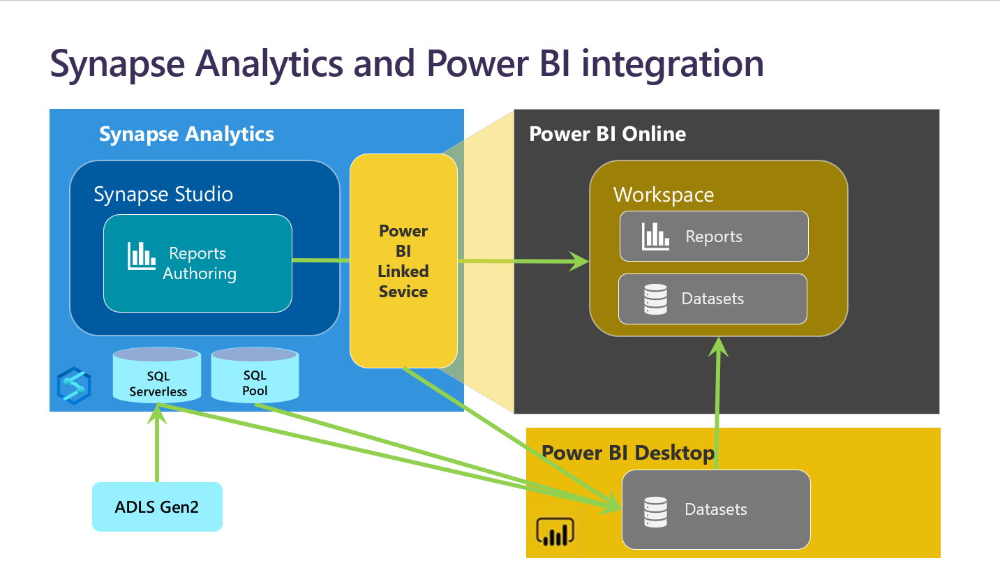
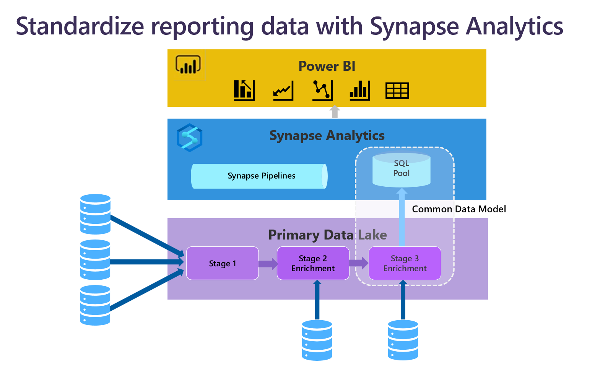

The combination of Azure Synapse Analytics and Power BI opens exciting possibilities for bridging the gap between massive volumes of structured or unstructured data and actionable insights. You can create new reports or consume your existing Power BI datasets and reports, all within Synapse by simply linking your Power BI and Synapse workspaces. You can make any edits to your reports in Synapse and the changes will instantly propagate to all users. This tight integration between Power BI and Azure Synapse greatly reduces time to insights as Data Analysts, Data Scientists, Data Engineers and business users can collaborate easily in a single environment.

A data warehouse is a centralized repository of integrated data from one or more disparate sources. Data warehouses store current and historical data and are used for reporting and analysis of the data. A Power BI linked service in Azure Synapse Analytics helps your reports access data in a data lake through serverless SQL pools or taps into tables in a dedicated SQL Pool quickly. This capability provides a large selection of data from multiple sources. Moreover, having the authoring tools in Azure Synapse Studio helps to craft the connection between data in the data lake or dedicated SQL pool much intuitively. 

To move data into a data warehouse, data is periodically extracted from various sources that contain essential business information. As the data is moved, it can be formatted, cleaned, validated, summarized, and reorganized with Azure Synapse Pipelines and Dataflows. Alternatively, the data can be stored in the lowest level of detail, with aggregated materialized views provided in Azure Synapse for reporting. In either case, Azure Synapse becomes a permanent data store for reporting, analysis, and business intelligence (BI), helping  ‘align and combine’ data from multiple sources and enforcing consistent data standards when needed.
