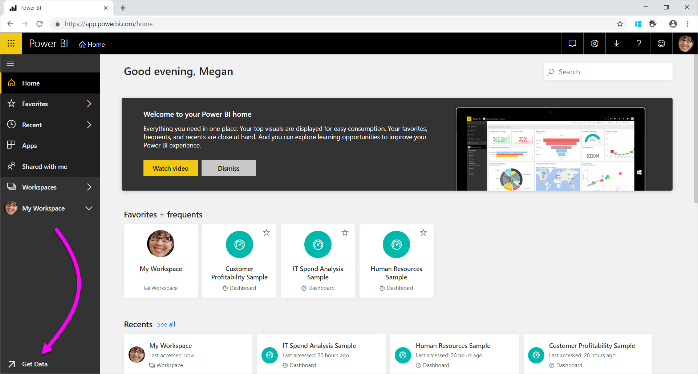
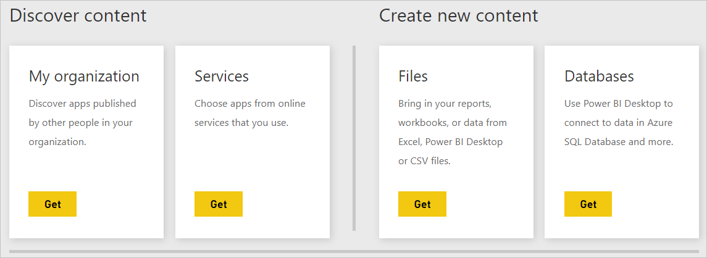

Power BI reports can connect to a number of data sources. Depending on how data is used, different data sources are available. There is a large number of varied data sources available for Power BI reports, encompassing:

* Online services (Salesforce, Dynamics 365, others)
* Databases (SQL Server, Access, Amazon Redshift, others)
* Simple files (Excel, JSON, others)
* Other data sources (Spark, Web sites, Microsoft Exchange, others)

You can connect to all sorts of different data sources when using Power BI Desktop or the Power BI service, and make those data connections in different ways. You can import data to Power BI, which is the most common way to get data, or connect directly to data in the original source repository, which is known as DirectQuery.

### Import connections

You can get data from any of the data sources in Power BI by selecting **Get Data** in the bottom-left corner of the page.

 

After you select **Get Data**, you can choose the data you want to access

For import, when using **Get Data** in Power BI Desktop to connect to a data source like SQL Server, the behavior of that connection is as follows:

* During the initial Get Data experience, the set of tables selected each define a query that will return a set of data. Those queries can be edited before loading the data, for example, to apply filters, or aggregate the data, or join different tables.
* Upon load, all of the data defined by those queries will be imported into the Power BI cache.
* Upon building a visual within Power BI Desktop, the imported data will be queried. The Power BI store ensures the query will be fast. All changes to the visual are reflected immediately.
* Any changes to the underlying data aren't reflected in any visuals. It's necessary to *Refresh* to reimport data.
* Upon publishing the report as a *.pbix* file to the Power BI service, a dataset is created and uploaded to the Power BI service. The imported data is included with that dataset. It's then possible to schedule refresh of that data, for example, to reimport the data every day. Depending upon the location of the original data source, it might be necessary to configure an on-premises data gateway.
* When opening an existing report in the Power BI service, or authoring a new report, the imported data is queried again, ensuring interactivity.
* Visuals, or entire report pages, can be pinned as dashboard tiles. The tiles automatically refresh whenever the underlying dataset refreshes.

### DirectQuery connections

For DirectQuery, when using **Get Data** in Power BI Desktop to connect to a data source, the behavior of that connection is as follows:

* During the initial Get Data experience, the source is selected. For relational sources, a set of tables are selected and each still define a query that logically returns a set of data. For multidimensional sources, like SAP BW, only the source is selected.
* However, upon load, no data is imported into the Power BI store. Instead, upon building a visual within Power BI Desktop, queries are sent to the underlying data source to retrieve the necessary data. The time taken to refresh the visual depends on the performance of the underlying data source.
* Any changes to the underlying data aren't immediately reflected in any existing visuals. It's still necessary to refresh. The necessary queries are resent for each visual, and the visual is updated as necessary.
* Upon publishing the report to the Power BI service, it will again result in a dataset in the Power BI service, the same as for import. However, *no data* is included with that dataset.
* When opening an existing report in the Power BI service, or authoring a new one, the underlying data source is again queried to retrieve the necessary data. Depending upon the location of the original data source, it might be necessary to configure an on-premises data gateway, as is needed for import mode if the data is refreshed.
* Visuals, or entire report pages, can be pinned as Dashboard tiles. To ensure that opening a dashboard is fast, the tiles are automatically refreshed on a schedule, for example, every hour. The frequency of this refresh can be controlled, to reflect how frequently the data is changing, and how important it's to see the latest data. When opening a dashboard, the tiles reflect the data at the time of the last refresh, and not necessarily the latest changes made to the underlying source. You can refresh an open dashboard to ensure it's current.

### Live connections

When connecting to SQL Server Analysis Services, there's an option to either import data from or connect live to, the selected data model. If you use import, you define a query against that external SQL Server Analysis Services source, and the data is imported as normal. If you use connect live, there's no query defined, and the entire external model is shown in the field list.
