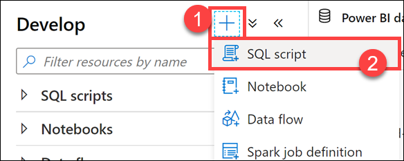
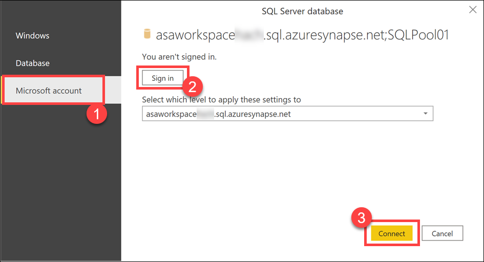
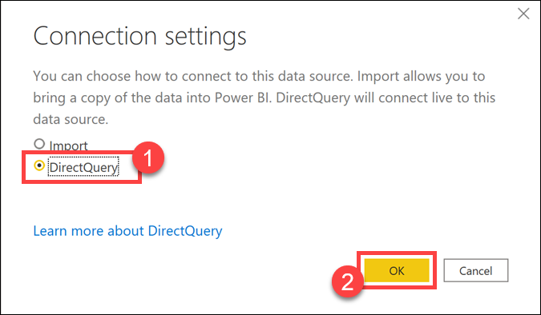
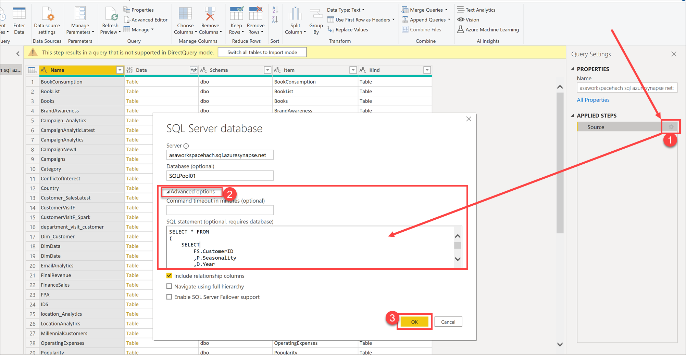
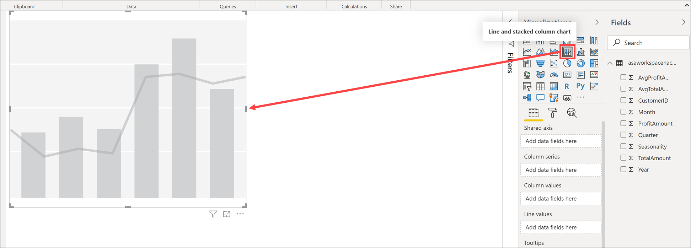
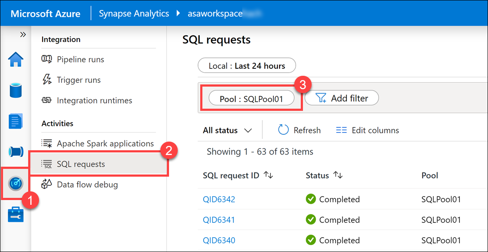
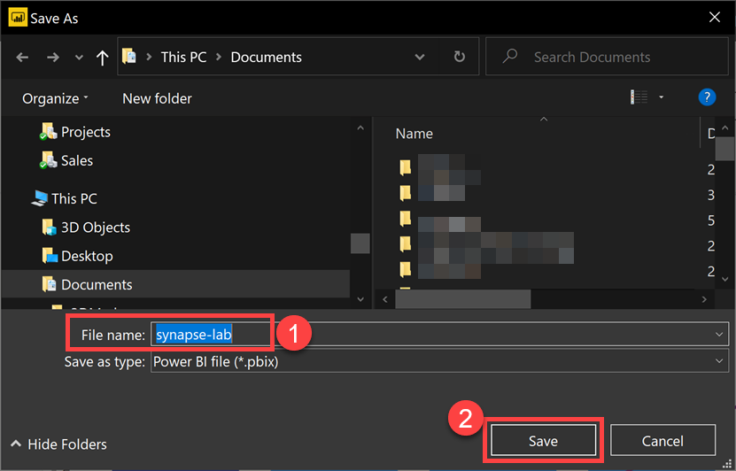
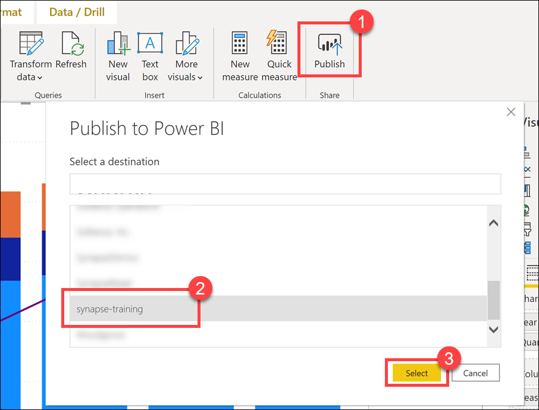
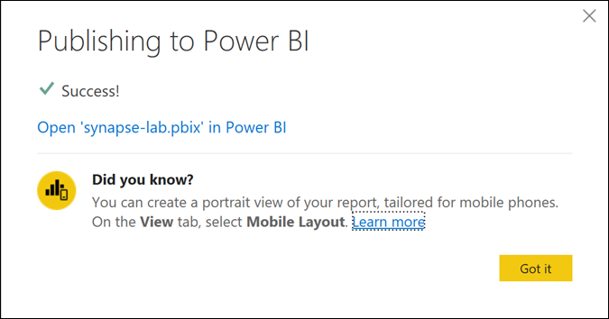
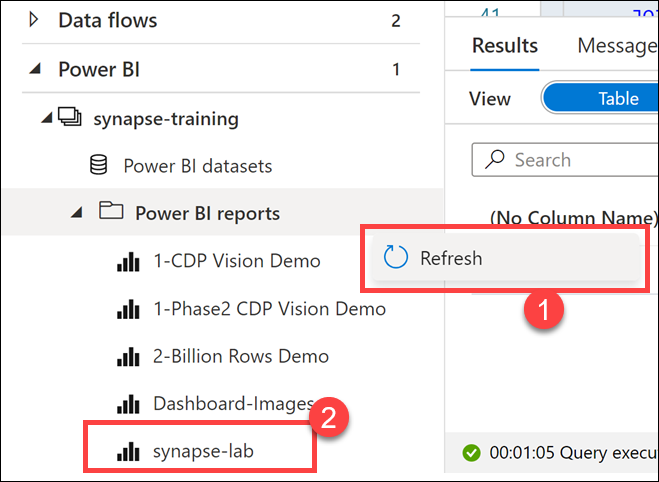

1. In [**Azure Synapse Studio**](<https://web.azuresynapse.net/>), select **Develop** from the left menu.

    

2. Select **+ (1)**, then **SQL script (2)**.

    

3. Connect to **SQLPool01**, then execute the following query to get an approximation of its execution time. This will be the query we'll use to bring data in the Power BI report you'll build later in this exercise.

    ```sql
    SELECT count(*) FROM
    (
        SELECT
            FS.CustomerID
            ,P.Seasonality
            ,D.Year
            ,D.Quarter
            ,D.Month
            ,avg(FS.TotalAmount) as AvgTotalAmount
            ,avg(FS.ProfitAmount) as AvgProfitAmount
            ,sum(FS.TotalAmount) as TotalAmount
            ,sum(FS.ProfitAmount) as ProfitAmount
        FROM
            wwi.SaleSmall FS
            JOIN wwi.Product P ON P.ProductId = FS.ProductId
            JOIN wwi.Date D ON FS.TransactionDateId = D.DateId
        GROUP BY
            FS.CustomerID
            ,P.Seasonality
            ,D.Year
            ,D.Quarter
            ,D.Month
    ) T
    ```

    You should see a query result of 194683820.

    

4. To connect to your data source, open the downloaded .pbids file in Power BI Desktop. Select the **Microsoft account (1)** option on the left, **Sign in (2)** (with the same credentials you use for connecting to the Synapse workspace) and click **Connect (3)**.

    

5. In the Navigator dialog, right-click on the root database node and select **Transform data**.

    

6. Select the **DirectQuery (1)** option in the connection settings dialog since our intention is not to bring a copy of the data into Power BI but to be able to query the data source while working with the report visualizations. Click **OK (2)** and wait a few seconds while the connection is configured.

    

7. In the Power Query editor, open the settings page of the **Source (1)** step in the query. Expand the **Advanced options (2)** section, paste the following query and click **OK (3)**.

    

    ```sql
    SELECT * FROM
    (
        SELECT
            FS.CustomerID
            ,P.Seasonality
            ,D.Year
            ,D.Quarter
            ,D.Month
            ,avg(FS.TotalAmount) as AvgTotalAmount
            ,avg(FS.ProfitAmount) as AvgProfitAmount
            ,sum(FS.TotalAmount) as TotalAmount
            ,sum(FS.ProfitAmount) as ProfitAmount
        FROM
            wwi.SaleSmall FS
            JOIN wwi.Product P ON P.ProductId = FS.ProductId
            JOIN wwi.Date D ON FS.TransactionDateId = D.DateId
        GROUP BY
            FS.CustomerID
            ,P.Seasonality
            ,D.Year
            ,D.Quarter
            ,D.Month
    ) T
    ```

    > Note that this step will take at least 40-60 seconds to execute since it submits the query directly on the Synapse SQL Pool connection.

8. Select **Close & Apply** on the topmost left corner of the editor window to apply the query and fetch the initial schema in the Power BI designer window.

    

9. Back to the Power BI report editor, expand the **Visualizations** menu on the right, then select the **Line and stacked column chart** visualization.

    

10. Select the newly created chart to expand its properties pane. Using the expanded **Fields** menu, configure the visualization as follows:

     - **Shared axis**: `Year`, `Quarter`
     - **Column series**: `Seasonality`
     - **Column values**: `TotalAmount`
     - **Line values**: `ProfitAmount`

    

    > It will take around 40-60 seconds for the visualization to render due to the live query execution on the Synapse dedicated SQL pool.

11. Switching back to Azure Synapse Studio, you can check the query executed while configuring the visualization in the Power BI Desktop application. Open the **Monitor** hub, and under the **Activities** section, open the **SQL requests** monitor. Make sure you select **SQLPool01** in the Pool filter, as by default, SQL on-demand is selected.

    

12. Identify the query behind your visualization in the topmost requests you see in the log and observe the duration, which is about 30 seconds **(1)**. Use the **Request content (2)** option to look into the actual query submitted from Power BI Desktop.

    

    

13. Switch back to the Power BI Desktop application, then click **Save** in the top-left corner.

    

14. Specify a file name, such as `synapse-lab` **(1)**, then click **Save (2)**.

    

15. Click **Publish** above the saved report. Make sure that, in Power BI Desktop, you are signed in with the same account you use in the Power BI portal and in Synapse Studio. You can switch to the proper account from the topmost right corner of the window. In the **Publish to Power BI** dialog, select the workspace you linked to Synapse (for example, **synapse-training**), then click **Select**.

    

16. Wait until the publish operation successfully completes.

    

    After the operation successfully completes, you should be able to see this report **(2)** published in the Power BI portal, as well as in Synapse Studio. To view it in Synapse Studio, navigate to the Develop hub and refresh **(1)** the Power BI reports node.

    
    