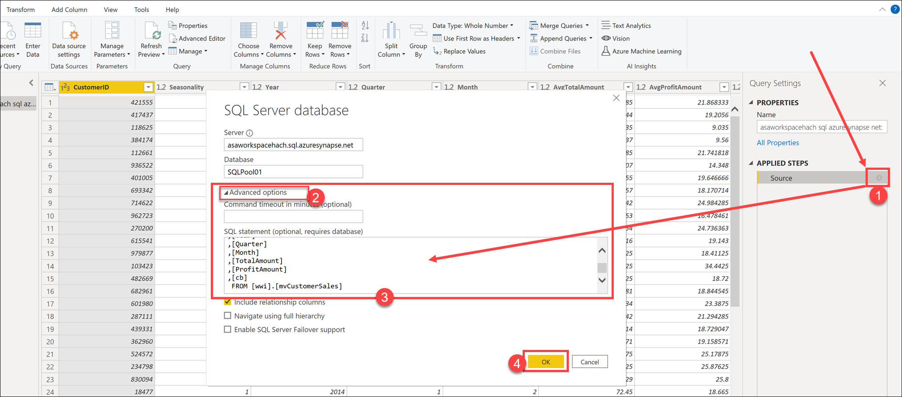

### Task 1: Improve performance with materialized views

1. In [**Azure Synapse Studio**](<https://web.azuresynapse.net/>), select **Develop** from the left-hand menu.

    

2. Select **+**, then **SQL script**.

    

3. Connect to **SQLPool01**, then execute the following query to get an estimated execution plan and observe the total cost and number of operations:

    ```sql
    EXPLAIN
    SELECT * FROM
    (
        SELECT
        FS.CustomerID
        ,P.Seasonality
        ,D.Year
        ,D.Quarter
        ,D.Month
        ,avg(FS.TotalAmount) as AvgTotalAmount
        ,avg(FS.ProfitAmount) as AvgProfitAmount
        ,sum(FS.TotalAmount) as TotalAmount
        ,sum(FS.ProfitAmount) as ProfitAmount
    FROM
        wwi.SaleSmall FS
        JOIN wwi.Product P ON P.ProductId = FS.ProductId
        JOIN wwi.Date D ON FS.TransactionDateId = D.DateId
    GROUP BY
        FS.CustomerID
        ,P.Seasonality
        ,D.Year
        ,D.Quarter
        ,D.Month
    ) T
    ```

4. The results should look similar to this:

    ```xml
    <?xml version="1.0" encoding="utf-8"?>
    <dsql_query number_nodes="1" number_distributions="60" number_distributions_per_node="60">
        <sql>SELECT count(*) FROM
    (
        SELECT
        FS.CustomerID
        ,P.Seasonality
        ,D.Year
        ,D.Quarter
        ,D.Month
        ,avg(FS.TotalAmount) as AvgTotalAmount
        ,avg(FS.ProfitAmount) as AvgProfitAmount
        ,sum(FS.TotalAmount) as TotalAmount
        ,sum(FS.ProfitAmount) as ProfitAmount
    FROM
        wwi.SaleSmall FS
        JOIN wwi.Product P ON P.ProductId = FS.ProductId
        JOIN wwi.Date D ON FS.TransactionDateId = D.DateId
    GROUP BY
        FS.CustomerID
        ,P.Seasonality
        ,D.Year
        ,D.Quarter
        ,D.Month
    ) T</sql>
        <dsql_operations total_cost="10.61376" total_number_operations="12">
    ```

5. Replace the query with the following to create a materialized view that can support the above query:

    ```sql
    IF EXISTS(select * FROM sys.views where name = 'mvCustomerSales')
        DROP VIEW wwi_perf.mvCustomerSales
        GO

    CREATE MATERIALIZED VIEW
        wwi_perf.mvCustomerSales
    WITH
    (
        DISTRIBUTION = HASH( CustomerId )
    )
    AS
    SELECT
        S.CustomerId
        ,D.Year
        ,D.Quarter
        ,D.Month
        ,SUM(S.TotalAmount) as TotalAmount
        ,SUM(S.ProfitAmount) as TotalProfit
    FROM
        [wwi_perf].[Sale_Partition02] S
        join [wwi].[Date] D on
            S.TransactionDateId = D.DateId
    GROUP BY
        S.CustomerId
        ,D.Year
        ,D.Quarter
        ,D.Month
    GO
    ```

    > This query will take between 30 and 120 seconds to complete.
    >
    > We first drop the view if it exists, since we create it in an earlier lab.

6. Run the following query to check that it actually hits the created materialized view.

    ```sql
    EXPLAIN
    SELECT * FROM
    (
    SELECT
    FS.CustomerID
    ,P.Seasonality
    ,D.Year
    ,D.Quarter
    ,D.Month
    ,avg(FS.TotalAmount) as AvgTotalAmount
    ,avg(FS.ProfitAmount) as AvgProfitAmount
    ,sum(FS.TotalAmount) as TotalAmount
    ,sum(FS.ProfitAmount) as ProfitAmount
    FROM
        wwi_pbi.SaleSmall FS
        JOIN wwi_pbi.Product P ON P.ProductId = FS.ProductId
        JOIN wwi_pbi.Date D ON FS.TransactionDateId = D.DateId
    GROUP BY
        FS.CustomerID
        ,P.Seasonality
        ,D.Year
        ,D.Quarter
        ,D.Month
    ) T

    ```

7. Switch back to the Power BI Desktop report, then click on **Transform data**.

    

8. In the Power Query editor, open the settings page of the **Source (1)** step in the query. Expand the **Advanced options (2)** section, paste the following query **(3)** to use the new materialized view, then click **OK (4)**.

    

    ```sql
    SELECT [CustomerID]
    ,[Seasonality]
    ,[Year]
    ,[Quarter]
    ,[Month]
    ,[TotalAmount]
    ,[ProfitAmount]
    ,[cb]
    FROM [wwi].[mvCustomerSales]
    ```

9. Select **Close & Apply** on the topmost left corner of the editor window to apply the query and fetch the initial schema in the Power BI designer window.

    

10. Click the **Refresh** button above the report to submit the query against the new materialized view.

    

    > Notice that the data refresh only takes a few seconds now, compared to before.

11. Check the duration of the query again in Synapse Studio, in the monitoring hub **(1)**, under SQL requests **(2)**. Notice that the Power BI queries using the new materialized view run much faster (Duration ~ 10s) **(3)**.

    

### Task 2: Improve performance with result-set caching

1. In [**Azure Synapse Studio**](<https://web.azuresynapse.net/>), select **Develop** from the left-hand menu.

    

2. Select **+**, then **SQL script**.

    

3. Connect to **SQLPool01**, then execute the following query to check if result set caching is turned on in the current SQL pool:

    ```sql
    SELECT
        name
        ,is_result_set_caching_on
    FROM
        sys.databases
    ```

4. If `False` is returned for `SQLPool01`, execute the following query to activate it (you need to run it on the `master` database):

    ```sql
    ALTER DATABASE [SQLPool01]
    SET RESULT_SET_CACHING ON
    ```

    Connect to **SQLPool01** and use the **master** database:

    

    >**Important**
    >
    >The operations to create result set cache and retrieve data from the cache happen on the control node of a Synapse SQL pool instance. When result set caching is turned ON, running queries that return large result set (for example, >1GB) can cause high throttling on the control node and slow down the overall query response on the instance. Those queries are commonly used during data exploration or ETL operations. To avoid stressing the control node and cause performance issue, users should turn OFF result set caching on the database before running those types of queries.

5. Next move back to the Power BI Desktop report and hit the **Refresh** button to submit the query again.

    

6. After the data refreshes, hit **Refresh once more** to ensure we hit the result set cache.

7. Check the duration of the query again in Synapse Studio, in the Monitoring hub **(1)** - SQL Requests **(2)** page. Notice that now it runs almost instantly (Duration = 0s) **(4)**.

    
