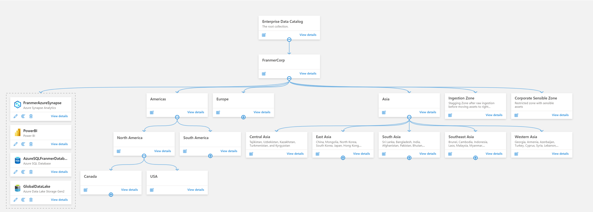
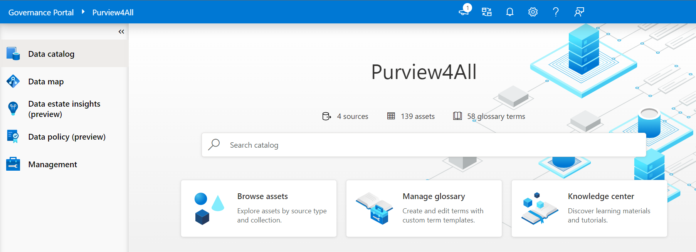
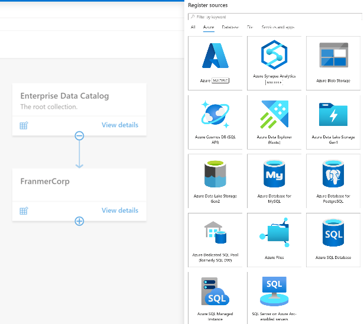
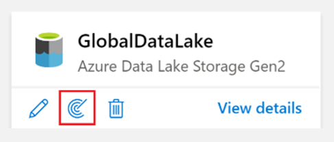

Registration and scanning of data enables discoverability of data across an estate. 

Before you can register and scan data, it’s important to understand the concept of collections. In Microsoft Purview Data Catalog, collections are key concept because they drive permissions and asset protection. Collections are also used to understand data estate health and catalog usage and adoption, as featured in the data stewardship section of your [Data Estate Insights](/azure/purview/data-stewardship).

## Collections

The data map is at the core of Microsoft Purview, which keeps an up-to-date map of assets and their metadata across your data estate. To hydrate the data map, you need to register and scan your data sources, which is done at the collection level. Collections support organizational mapping of metadata. By using collections, you can manage and maintain data sources, scans, and assets in a hierarchy instead of a flat structure. Collections allow you to build a custom hierarchical model of your data landscape based on how your organization plans to use Microsoft Purview to govern your landscape.

Collections also provide a security boundary for your metadata in the data map. Access to collections, data sources, and metadata is set up and maintained based on the collection’s hierarchy in Microsoft Purview, following a least-privilege model:
- Users have the minimum amount of access they need to do their jobs.
- Users don't have access to sensitive data that they don't need.

Data sources are registered at the collection level. Scan results can then be sent to this collection or a sub collection. The image below displays the structure of a collection.

> [!TIP]
> Learn more about [Microsoft Purview collections architectures and best practices.](/azure/purview/concept-best-practices-collections)

## Register and scan data sources

Data governance using begins at collection level, with the registration of data sources in Microsoft Purview governance portal. Microsoft Purview supports an array of data sources. Data teams (analysts, engineers, and scientists) may not be actively registering and scanning data in Microsoft Purview, but it's critical that data consumers understand governance efforts. Registering and scanning assets requires **Data Curator** permissions. 

> [!IMPORTANT]
> Data registered and scanned in Microsoft Purview only collects metadata information. Data remains in its location and isn't migrated to any other platform.

### Register a data source

Registering a data source is done from within the Azure portal. Once you have a Microsoft Purview service configured in Azure, you use the Microsoft Purview governance portal to register your data sources.

To register a data source, you'll select the icon to register a data source as displayed in the image below. Selecting this icon will give you access to all data source connectors. 

Below is a small sample of available connectors in Microsoft Purview Data Catalog. See [supported data sources and file types](/azure/purview/azure-purview-connector-overview) for an up-to-date list of supported data sources and connectors.

Registering a data source is straightforward, you need to complete the required fields. Authentication will be done during the scanning phase.

Each type of data source you choose will require specific information to complete the registration. For example, if your data sources reside in your Azure subscription, you'll choose the necessary subscription and storage account name. 

### Scan a data source

Once you have data sources registered in the Microsoft Purview governance portal and displayed in the data map, you can set up scanning. The scanning process can be triggered to run immediately or can be scheduled to run on a periodic basis to keep your Microsoft Purview account up to date.

Scanning assets is as simple as selecting **New scan** from the resource as displayed in the data map.

You'll now need to configure your scan and assign the following details:
- Assign a friendly name.
- Define which [integration runtime](/azure/purview/manage-integration-runtimes) to use to perform the scan.
- [Create credentials](/azure/purview/manage-credentials) to authenticate to your registered data sources.
- Choose a collection to send scan results.

After the basic configuration, you'll *scope* your scan, which allows you to choose just a specific zone of your data source. For instance, if you have a collection call “Raw” in your data map, you can define the scope to scan only the raw container of your data lake.

After configuring and scoping your scan, you'll define the *scan rule set*. A scan rule set is a container for grouping a set of scan rules together so that you can easily associate them with a scan. For example, you might create a default scan rule set for each of your data source types, and then use these scan rule sets by default for all scans within your company. You might also want users with the right permissions to create other scan rule sets with different configurations based on business need.

Once a scan is complete, you can refer to the scan details to view information about the number of scans completed, assets detected, assets classified, Scan information. It’s a good place to monitor scan progress, including success or failure.

> [!TIP]
> Refer to [Scanning best practices](/azure/purview/concept-best-practices-scanning) for more information on scanning assets.

## Roles and permissions

Permissions in Microsoft Purview are assigned at **collection** level. Collections are used to organize assets and sources and can be thought of as a logical grouping of data assets.

Data teams looking to discover and use data need to be assigned the **Data Reader** role in a collection in Microsoft Purview. The Data Reader role enables users to find assets, but doesn't enable users to edit anything. The **Data Curator** role is required to edit information about assets, assign classifications, and associate assets with glossary entries. To set up scans via the Microsoft Purview Governance Portal, individuals need to be either a data curator on the collection *or* data curator and data source administrator where the source is registered.

When a Microsoft Purview account is created, it starts with a root collection that has the same name as the Microsoft Purview account itself. The creator of the Microsoft Purview account is automatically added as a Collection Admin, Data Source Admin, Data Curator, and Data Reader on this root collection, and can edit and manage this collection. 

>[!TIP]
>Learn more about [Microsoft Purview permissions and access](/azure/purview/catalog-permissions#who-should-be-assigned-to-what-role).