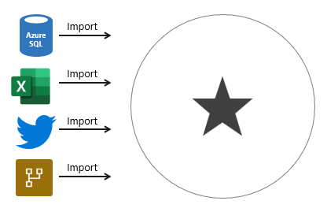

An import model comprises tables that have their storage mode property set to **Import**. It includes calculated tables, which you define with a DAX formula, too.

## Import model benefits

Import models are the most frequently developed model framework because there are many benefits. Import models:

- Support all Power BI data source types, including databases, files, feeds, web pages, dataflows, and more.
- Can integrate source data. For example, one table sources its data from a relational database while a related table sources its data from a web page.
- Support all DAX and Power Query (M) functionality.
- Support calculated tables.
- Deliver the best query performance. That’s because the data cached in the model is optimized for analytic queries (filter, group, and summarize) and the model is stored entirely in memory.

In short, import models offer you the most options and design flexibility, and they deliver fast performance. For this reason, Power BI Desktop defaults to use import storage mode when you “get data.”

## Import model limitations

Despite the many compelling benefits, there are limitations of import models that you must bear in mind. Linitations are related to **model size** and **data refresh**.

### Model size

Power BI imposes dataset size restrictions, which limit the size of a model. When you publish the model to a shared capacity, there’s a 1-GB limit per dataset. When this size limit is exceeded, the dataset will fail to refresh. When you publish the model to a dedicated capacity (also known as Premium capacities), it can grow beyond 10 GB, providing you enable the [Large dataset storage format setting](/power-bi/enterprise/service-premium-large-models) for the capacity.

You should always strive to reduce the amount of data stored in tables. This strategy helps to reduce the duration of model refreshes and speed up model queries. There are numerous data reduction techniques that you can apply, including:

- Remove unnecessary columns
- Remove unnecessary rows
- Group by and summarize to raise the grain of fact tables
- Optimize column data types with a preference for numeric data
- Preference for custom columns in Power Query instead of calculated columns in the model
- Disable Power Query query load
- Disable auto date/time
- Use DirectQuery table storage, as described in later units of this module.

For more information, see [Data reduction techniques for Import modeling](/power-bi/guidance/import-modeling-data-reduction).

### Data refresh

Imported data must be periodically refreshed. Dataset data is only as current as the last successful data refresh. To keep data current, you set up scheduled data refresh, or report consumers can perform an on-demand refresh.

Power BI imposes limits on how often scheduled refresh operations can occur. It’s up to eight times per day in a shared capacity, and up to 48 times per day in a dedicated capacity.

You should determine whether this degree of latency is tolerable. It often depends on the velocity (or volatility) of the data, and the urgency to keep users informed about the current state of data. When scheduled refresh limits aren’t acceptable, consider using DirectQuery storage tables, or creating a hybrid table. Or take a different approach, and create a real-time dataset instead.

> [TIP]
> Hybrid tables are described in unit 5. For information about real-time datasets, work through the [Monitor data in real-time with Power BI](#todo) module.

You must also consider refresh workload and duration. By default, to refresh a table, Power BI removes all data and reloads it again. These operations can place an unacceptable burden on source systems, especially for large fact tables. To reduce this burden, you can set up the incremental refresh feature. Incremental refresh automates the creation and management of time-period partitions, and intelligently update only those partitions that require refresh.

When your data source supports incremental refresh, it can result in faster and more reliable refreshes, and reduced resource consumption of Power BI and source systems.

Advanced data modelers can customize their own partitioning strategy. Automation scripts can create, manage, and refresh table partitions. For more information, see [Power BI usage scenarios: Advanced data model management](/power-bi/guidance/powerbi-implementation-planning-usage-scenario-advanced-data-model-management). This usage scenario describes using the XMLA endpoint available with Power BI Premium.