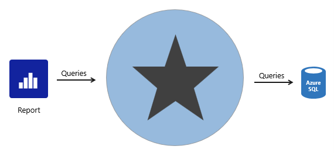

A DirectQuery model comprises tables that have their storage mode property set to **DirectQuery**, and they belong to the same source group.

A source group is a set of model tables that relate to a data source. There are two types:

- **Import** – Represents all import storage mode tables including calculated tables. There can only be one import source group in a model.
- **DirectQuery** – Represents all DirectQuery storage mode tables that relate to a specific data source.

> [!NOTE]
> An import model and a DirectQuery model only comprise a single source group. When there’s more than one source group, the model framework is known as a composite model. Composite models are described in [Unit 5](/training/modules/choose-power-bi-model-framework/5-determine-when-to-develop-composite-model).

## DirectQuery model benefits

There are several benefits to developing a DirectQuery model.

### Model large or fast-changing data sources

A DirectQuery model is a great framework choice when your source data exhibits volume and/or velocity characteristics. Because DirectQuery tables don’t require refresh, they’re well suited to large data stores, like a data warehouse. It’s impractical and inefficient, if not impossible, to import an entire data warehouse into a model. When the source data changes rapidly and users need to see current data, a DirectQuery model can deliver near real-time query results.

When a report queries a DirectQuery model, Power BI passes those queries to the underlying data source.

### Enforce source RLS

DirectQuery is also useful when the source database enforces row-level security (RLS). Instead of replicating RLS rules in your Power BI model, the source data base can enforce its rules. This approach works only for some relational databases, and it involves setting up single sign-on for the dataset data source. For more information, see [Azure SQL Database with DirectQuery](/power-bi/connect-data/service-azure-sql-database-with-direct-connect).

### Data sovereignty restrictions

If your organization has security policies that restrict data leaving their premises, then it isn’t possible to import data. A DirectQuery model that connects to an on-premises data source may be appropriate. (You can also consider installing [Power BI Report Server](/power-bi/report-server/get-started) for on-premises reporting.)

### Create specialized datasets

Typically, DirectQuery mode supports relational database sources. That’s because Power BI must translate analytic queries to native queries understood by the data source.

However, there’s one powerful exception. You can connect to a Power BI dataset (or Azure Analysis Services model) and convert it to a DirectQuery local model. A local model is a relative term that describes a model’s relationship to another model. In this case, the original dataset is a remote model, and the new dataset is the local model. These models are chained, which is term used to describe related models. You can chain up to three models in this way.

This capability to chain models supports the potential to personalize and/or extend a remote model. The simplest thing you can do is rename objects, like tables or columns, or add measures to the local model. You can also extend the model with calculated columns or calculated tables, or add new import or DirectQuery tables. However, these extensions result in the creation of new source groups, which means the model becomes a composite model. That scenario is described in [Unit 5](/training/modules/choose-power-bi-model-framework/5-determine-when-to-develop-composite-model).

For more information, see [Using DirectQuery for Power BI datasets and Azure Analysis Services](/power-bi/connect-data/desktop-directquery-datasets-azure-analysis-services).

## DirectQuery model limitations

There are many limitations related to DirectQuery models that you must bear in mind. Here are the main limitations:

- Not all data sources are supported. Typically, only major relational database systems are supported. Power BI datasets and Azure Analysis Services models are supported too.

- All Power Query (M) transformations are not possible, because these queries must translate to native queries that are understood by source systems. So, for example, it’s not possible to use pivot or unpivot transformations.

- Analytic query performance can be slow, especially if source systems aren’t optimized (with indexes or materialized views), or there are insufficient resources for the analytic workload.

- Analytic queries can impact on source system performance. It could result in a slower experience for all workloads, including OLTP operations.

## Boost DirectQuery model performance

When there’s a justification to develop a DirectQuery model, you can mitigate some limitations in two ways.

### Data source optimizations

You can optimize the source database to ensure the expected analytic query workload performs well. Specifically, you can create indexes and materialized views, and ensure the database has sufficient resources for all workloads.

> [!TIP] 
> We recommend that you always work in collaboration with the database owner. It’s important that they understand the additional workload a DirectQuery model can place on their database.

### DirectQuery user-defined aggregation tables

You can add user-defined aggregation tables to a DirectQuery model. User-defined aggregation tables are special model tables that are hidden (from users, calculations, and RLS). They work best when they satisfy higher-grain analytic queries over large fact tables. When you set the aggregation table to use DirectQuery storage mode, it can query a materialized view in the data source. You can also set an aggregation table to use import storage mode or enable automatic aggregations, and these options are described in Unit 4.

For more information, see [DirectQuery model guidance in Power BI Desktop](/power-bi/guidance/directquery-model-guidance).
