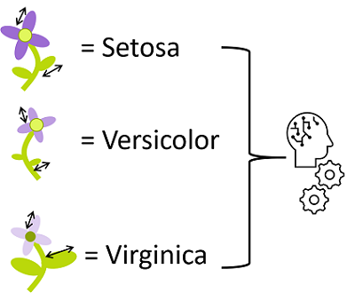
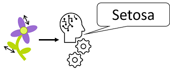
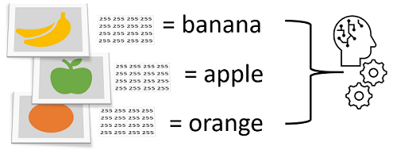

*Classification* is a machine learning technique that you can use to predict which category, or *class*, something belongs to. Classification machine learning models use a set of inputs, which we call *features*, to calculate a probability score for each possible class and predict a *label* that indicates the most likely class that an object belongs to.

For example, the features of a flower might include the measurements of its petals, stem, sepals, and other quantifiable characteristics. A machine learning model could be trained by applying an algorithm to these measurements that calculates the most likely species of the flower - its class.

To create a classification model, you need data that consists of features for which the labels are already known. You use this to train the model so that it determines a relationship between the features and the corresponding label. Then, after the model has been trained, you can use it with new sets of features to predict unknown label values.

## Image classification

*Image classification* is a machine learning technique in which the object being classified is an image, such as a photograph.

As with any form of classification, creating an image classification solution involves training a machine learning  model using a set of existing data for which the class is already known. In this case, the existing data consists of a set of categorized images. Digital images are made up of an array of pixel values, and these are used as features to train the model based on the known image classes.

Most modern image classification solutions are based on *deep learning* techniques that make use of *convolutional neural networks* (CNNs) to uncover patterns in the pixels that correspond to particular classes. Training an effective CNN is a complex task that requires considerable expertise in data science and machine learning. However, common techniques used to train image classification models have been encapsulated into the **Custom Vision** cognitive service in Microsoft Azure; making it easy to train a model and publish it as a software service with minimal knowledge of deep learning techniques.

## Uses of image classification

Some potential uses for image classification might include:

- Product identification - performing visual searches for specific products in online searches or even, in-store using a mobile device.
- Disaster investigation - evaluating key infrastructure for major disaster preparation efforts. For example, aerial surveillance images may show bridges and classify them as such.  Anything classified as a bridge could then be marked for emergency preparation and investigation.
- Medical diagnosis - evaluating images from X-ray or MRI devices could quickly classify specific issues found as cancerous tumors, or many other medical conditions related to medical imaging diagnosis.
