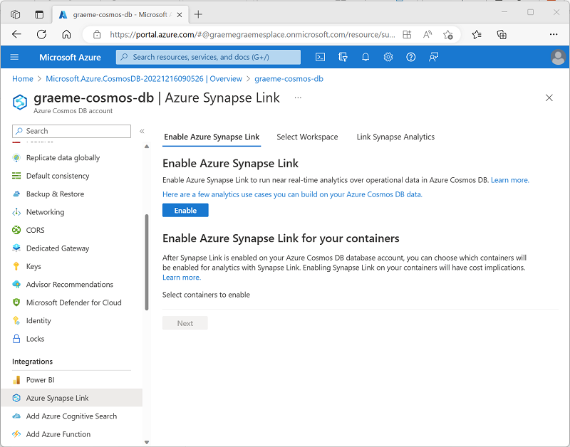

Azure Synapse Link for Azure Cosmos DB is a cloud-native HTAP capability that enables integration between Azure Cosmos DB and Azure Synapse Analytics.


In the diagram above, the following key features of the Azure Synapse Link for Cosmos DB architecture are illustrated:

1. An Azure Cosmos DB container provides a row-based transactional store that is optimized for read/write operations.
2. The container also provides a column-based analytical store that is optimized for analytical workloads. A fully managed autosync process keeps the data stores in sync.
3. Azure Synapse Link provides a linked service that connects the analytical store enabled container in Cosmos DB to an Azure Synapse Analytics workspace.
4. Azure Synapse Analytics provides Synapse SQL and Apache Spark runtimes in which you can run code to retrieve, process, and analyze data from the Cosmos DB analytical store without impacting the transactional data store in Cosmos DB.

## Enabling Azure Synapse Link in Azure Cosmos DB

The first step in using Azure Synapse Link for Cosmos DB is to enable it in an Azure Cosmos DB account. Azure Synapse Link is supported in the following types of Azure Cosmos DB account:

- Core (SQL) API
- MongoDB API

You can enable Azure Synapse Link in the Azure portal page for your Cosmos DB account, or by using the Azure CLI or Azure PowerShell from a command line or in a script.

### Using the Azure portal

In the Azure portal, you can configure features of Cosmos DB account on the **Features** page, as shown below.



> [!TIP]
> For core (SQL) API accounts, there's also a link on the **Data Explorer** page.

### Using the Azure CLI

To enable Azure Synapse Link using the Azure CLI, run the `az cosmosdb create` command (to create a new Cosmos DB account) or `az cosmosdb update` command (to configure an existing Cosmos DB account) with the `--enable-analytical-storage true` parameter. For example, the following command updates an existing Cosmos DB account named **my-cosmos-db** to enable Azure Synapse Link.

```
az cosmosdb update --name my-cosmos-db --resource-group my-rg --enable-analytical-storage true
```

### Using Azure PowerShell

To enable Azure Synapse Link using Azure PowerShell, run the `New-AzCosmosDBAccount` cmdlet (to create a new Cosmos DB account) or `Update-AzCosmosDBAccount` cmdlet (to configure an existing Cosmos DB account) with the `-EnableAnalyticalStorage 1` parameter. For example, the following command updates an existing Cosmos DB account named **my-cosmos-db** to enable Azure Synapse Link.

```
Update-AzCosmosDBAccount -Name "my-cosmos-db" -ResourceGroupName "my-rg" -EnableAnalyticalStorage 1
```

### Considerations for enabling Azure Synapse Link

When planning to enable Azure Synapse Link for a Cosmos DB account, consider the following facts:

- After enabling Azure Synapse Link for an account, you can't disable it.
- Enabling Azure Synapse Link doesn't start synchronization of operational data to an analytical store - you must also create or update a container with support for an analytical store.
- When enabling Azure Synapse Link for a core (SQL) API account using the Azure CLI or PowerShell, you can use the `--analytical-storage-schema-type` (Azure CLI) or `-AnalyticalStorageSchemaType` (PowerShell) parameter to specify the schema type as `WellDefined` (default) or `FullFidelity`. For a MongoDB API account, the default (and only supported) schema type is `FullFidelity`.
- After a schema type has been assigned, you can't change it.

    > [!NOTE]
    > You'll learn more about the analytical store and its schema types in the next unit.
