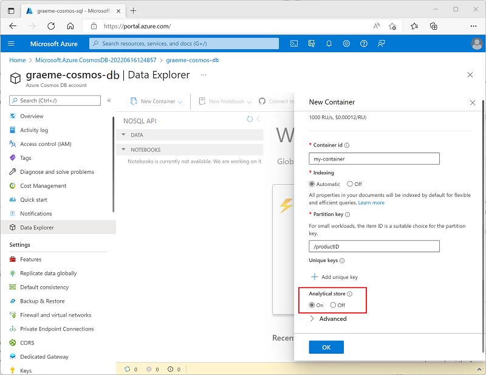
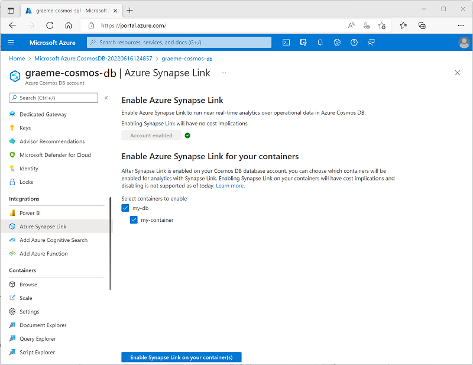

After enabling Azure Synapse Link in an Azure Cosmos DB account, you can create or update a container with support for an analytical store.

An analytical store is a column-based store within the same container as a row-based operational store. An *auto-sync* process synchronizes changes in the operational store to the analytical store; from where it can be queried without incurring processing overhead in the operational store.

## Analytical store schema types

As the data from the operational store is synchronized to the analytical store, the schema is updated dynamically to reflect the structure of the documents being synchronized. The specific behavior of this dynamic schema maintenance depends on the analytical store schema type configured for the Azure Cosmos DB account. Two types of schema representation are supported:

- **Well-defined**: The default schema type for an Azure Cosmos DB for NoSQL account.
- **Full fidelity**: The default (and only supported) schema type for an Azure Cosmos DB for MongoDB account.

The analytical store receives JSON data from the operational store and organizes it into a column-based structure. In a well-defined schema, the first non-null occurrence of a JSON field determines the data type for that field. Subsequent occurrences of the field that aren't compatible with the assigned data type aren't ingested into the analytical store.

For example, consider the following two JSON documents:

```json
{"productID": 123, "productName": "Widget"}
{"productID": "124", "productName": "Wotsit"}
```

The first document determines that the **productID** field is a numeric (integer) value. When the second document is encountered, its **productID** field has a string value, and so isn't imported into the analytical store. The document and the rest of its field is imported, but the incompatible field is dropped. The following columns represent the data in the analytical store:

|productID | productName |
|--|--|
| 123 | Widget |
| | Wotsit |

In a full fidelity schema, the data type is appended to each instance of the field, with new columns created as necessary; enabling the analytical store to contain multiple occurrences of a field, each with a different data type, as shown in the following table:

|productID.int32 | productName.string | productID.string |
|--|--|--|
| 123 | Widget | |
| | Wotsit | 124 |

> [!NOTE]
> For more information, see [What is Azure Cosmos DB analytical store?](/azure/cosmos-db/analytical-store-introduction).

## Enabling analytical store support in a container

You can enable analytical store support when creating a new container or for an existing container. To enable analytical store support, you can use the Azure portal, or you can use the Azure CLI or Azure PowerShell from a command line or in a script.

### Using the Azure portal

To enable analytical store support when creating a new container in the Azure portal, select the **On** option for **Analytical Store**, as shown here:



Alternatively, you can enable analytical store support for an existing container in the **Azure Synapse Link** page in the **Integrations** section of the page for your Cosmos DB account, as shown here:



### Using the Azure CLI

To use the Azure CLI to enable analytical store support in an Azure Cosmos DB for NoSQL container, run the `az cosmosdb sql container create` command (to create a new container) or `az cosmosdb sql container update` command (to configure an existing container) with the `--analytical-storage-ttl` parameter, assigning a retention time for analytical data. Specifying an `-analytical-storage-ttl` parameter of **-1** enables permanent retention of analytical data. For example, the following command creates a new container named **my-container** with analytical store support.

```
az cosmosdb sql container create --resource-group my-rg --account-name my-cosmos-db --database-name my-db --name my-container --partition-key-path "/productID" --analytical-storage-ttl -1
```

For an Azure Cosmos DB for MongoDB account, you can use the `az cosmosdb mongodb collection create` or `az cosmosdb mongodb collection update` command with the `--analytical-storage-ttl` parameter. For an Azure Cosmos DB for Apache Gremlin account, use the `az cosmosdb gremlin graph create` or `az cosmosdb gremlin graph update` command with the `--analytical-storage-ttl` parameter.

### Using Azure PowerShell

To use Azure PowerShell to enable analytical store support in n Azure Cosmos DB for NoSQL container, run the `New-AzCosmosDBSqlContainer` cmdlet (to create a new container) or `Update-AzCosmosDBSqlContainer` cmdlet (to configure an existing container) with the `-AnalyticalStorageTtl` parameter, assigning a retention time for analytical data. Specifying an `-AnalyticalStorageTtl` parameter of **-1** enables permanent retention of analytical data. For example, the following command creates a new container named **my-container** with analytical store support.

```
New-AzCosmosDBSqlContainer -ResourceGroupName "my-rg" -AccountName "my-cosmos-db" -DatabaseName "my-db" -Name "my-container" -PartitionKeyKind "hash" -PartitionKeyPath "/productID" -AnalyticalStorageTtl -1
```

For an Azure Cosmos DB for MongoDB API account, use the `New-AzCosmosDBMongoDBCollection` or `Update-AzCosmosDBMongoDBCollection` cmdlet with the `-AnalyticalStorageTtl` parameter.

### Considerations for enabling analytical store support

Analytical store support can't be disabled without deleting the container. Setting the analytical store TTL value to 0 or *null* effectively disables the analytical store by no longer synchronizing new items to it from the operational store and deleting items already synchronized from the analytical store. After setting this value to 0, you can't re-enable analytical store support in the container.
