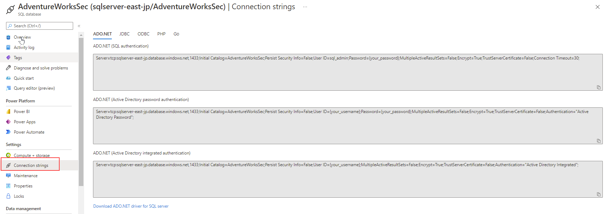

A connection failure can result from reconfiguration, firewall settings, connection timeouts, or incorrect login information. Furthermore, if some Azure SQL Database or SQL Managed Instance resources are over capacity, you will not be able to connect.

## Transient fault

When heavy workloads increase in the SQL Database service, the Azure infrastructure is able to dynamically reconfigure servers, and the client application may lose connection to the database during this operation.

Transient faults occur during database reconfiguration of a planned event or an unplanned event. These events are generally brief and shouldn't take longer than 60 seconds to complete.

Below is a list of a few transient errors that applications may receive when connecting to Azure SQL Database:

- Cannot open database "%.*ls" requested by the login. The login failed.
- Cannot process request. Not enough resources to process request.
- Cannot process request. Too many operations in progress for subscription "%ld".

> [!NOTE]
> For a complete list of transient errors, see [Troubleshooting connectivity issues and other errors with Azure SQL Database and Azure SQL Managed Instance](/azure/azure-sql/database/troubleshoot-common-errors-issues#list-of-transient-fault-error-codes).

### How to monitor transient connectivity errors

| Error | Action |
|------------|-------------|
|**Login failures** | Look for any outages during the time when the application reported the errors at Microsoft Azure Service Dashboard. |
|**Database reaches resource limits** | Monitor your database's compute and storage resources carefully, and take action when it reaches its resource limits to prevent transient failures. |
|**Extended authentication failures** | File an Azure support request through the Azure portal if your application encounters connectivity error for longer than 60 seconds or if it occurs more than once in a given day. |

## Retry logic

Application developers should anticipate periodic transient failures when integrating with cloud services, like Azure SQL Database, and implement a retry logic instead of displaying application errors to users. Setting a maximum number of retries before the program terminates is also important.

We recommend waiting for 5 seconds at a minimum on your first retry. Each subsequential retry should increase the delay exponentially, up to a maximum of 60 seconds.

> [!NOTE]
> If a SELECT statement fails with a transient error for SQL Database or SQL Database Managed Instance, don't directly retry it. Instead, retry the SELECT statement in a new connection.

## Unable to log in to the server

When the error **Login failed for user '< User name >'** happens, the service administrator can follow the following steps:

1. Check if the login is disabled by using the `sys.sql_logins` catalog view.
1. If the login is disabled, run `ALTER LOGIN <User name> ENABLE;` to enable it.
1. If the login does not exist, create it using the `CREATE LOGIN` statement.
1. Connect to the database you want to grant the user access to, and run the `CREATE USER` statement.
1. Either assign the user a role using the `ALTER ROLE` command, or grant the user access to one or more database objects using the `GRANT` command.

## Connection string

When you receive connectivity errors, it is a good practice to make sure your connection string is working properly. This is mostly important when provisioning a new database, or after making infrastructure changes to a database service.

The Azure portal allows you to retrieve the connection string you need to interact with Azure SQL Database.

1. From the Azure portal, select **All services**, and then **SQL databases**. Filter and select your database.
1. On the blade for your database, select **Connection strings**.

    > [!div class="mx-imgBorder"]
    > 

1. Copy and edit the connection string by including your password, or replacing the server name as needed.
1. Reference the connection string updated in the client application.

To learn more about connectivity errors for Azure SQL Database and Azure SQL Managed Instance, see [Troubleshooting connectivity issues and other errors with Azure SQL Database and Azure SQL Managed Instance](/azure/azure-sql/database/troubleshoot-common-errors-issues).
