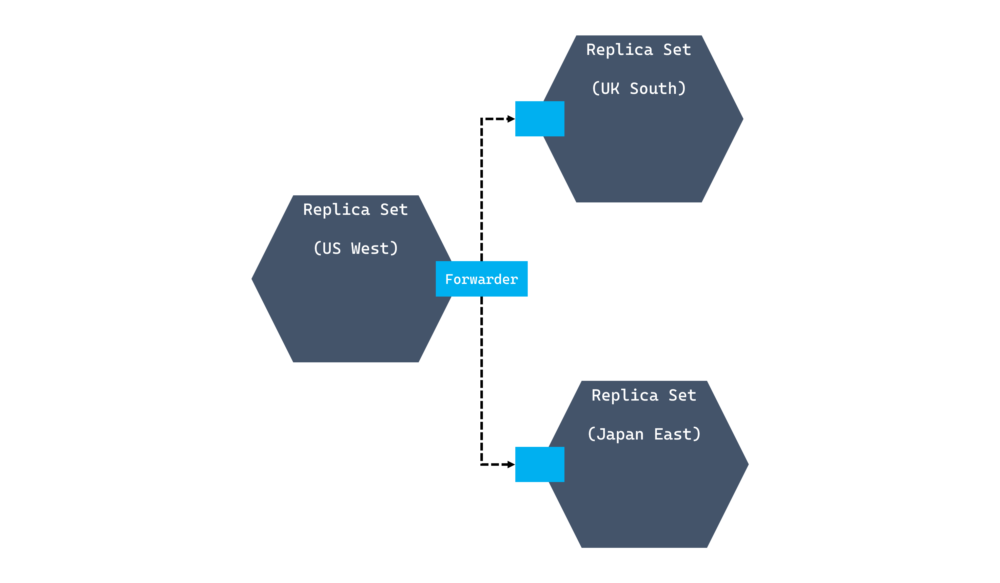

Azure Cosmos DB supports turnkey global scale-out using any of the available management tools (SDK, CLI, PowerShell, Azure portal, etc.). To better understand why scale-out is so frictionless, it's ideal to discuss how replication works in Azure Cosmos DB.

At the minimal configuration, every container has a partition key path defined. This path points to a key-value pair in each JSON item. The value of the partition key is then used to distribute data within a region. Effectively, each container in Azure Cosmos DB will distribute data using the partition key's value to various physical partitions within the same region.

But, a physical partition isn’t really a single physical machine or device. The actual implementation of a physical partition is as a replica set. A replica set is a group of replicas that can dynamically grow and shrink to meet the needs of the database platform.

Each replica set will have other geographically distant replica sets that manage the same partition keys if data is distributed globally. These replica sets can then forward data to other replica sets in different regions to create replica copies of the data.

An Azure Cosmos DB account replicates data within a region (local distribution) among different replica sets servicing various partition key values. Replica sets that manage the same partition key value are referred to as a partition set as they will forward data between each other (global distribution).

> [!NOTE]
> The direction that data flows between replica sets is contingent on whether the account is configured with a single-write region or with multi-region write enabled.
