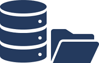
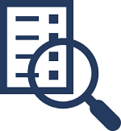

A cognitive search solution consists of multiple components, each playing an important part in the process of extracting, enriching, indexing, and searching data.

## Data source

  

Most search solutions start with a *data source* containing the data you want to search. Azure Cognitive Search supports multiple types of data source, including:

- Unstructured files in Azure blob storage containers.
- Tables in Azure SQL Database.
- Documents in Cosmos DB.

Azure Cognitive Search can pull data from these data sources for indexing.

Alternatively, applications can push JSON data directly into an index, without pulling it from an existing data store.

## Skillset

  

In a basic search solution, you might simply index the data extracted from the data source. he information that can be extracted depends on the data source. for example, when indexing data in a database, the fields in the database tables might be extracted; or when indexing a set of documents, file metadata such as file name, modified date, size, and author might be extracted along with the text content of the document.

While a basic search solution that indexes data values extracted directly from the data source can be useful, the expectations of modern application users have driven a need for richer insights into the data. In Azure Cognitive Search, you can apply artificial intelligence (AI) *skills* as part of the indexing process to enrich the source data with new information, which can be mapped to index fields. The skills used by an indexer are encapsulated in a *skillset* that defines an enrichment pipeline in which each step enhances the source data with insights obtained by a specific AI skill. Examples of the kind of information that can be extracted by an AI skill include:

- The language in which a document is written.
- Key phrases that might help determine the main themes or topics discussed in a document.
- A sentiment score that quantifies how positive or negative a document is.
- Specific locations, people, organizations, or landmarks mentioned in the content.
- AI-generated descriptions of images, or image text extracted by optical character recognition.
- Custom skills that you develop to meet specific requirements.

## Indexer

  

The *indexer* is the engine that drives the overall indexing process. It takes the outputs extracted using the skills in the skillset, along with the data and metadata values extracted from the original data source, and maps them to fields in the index.

An indexer is automatically run when it is created, and can be scheduled to run at regular intervals or run on demand to add more documents to the index. In some cases, such as when you add new fields to an index or new skills to a skillset, you may need to reset the index before re-running the indexer.

## Index

  

The index is the searchable result of the indexing process. It consists of a collection of JSON documents, with fields that contain the values extracted during indexing. Client applications can query the index to retrieve, filter, and sort information.

Each index field can be configured with the following attributes:

- **key**: Fields that define a unique key for index records.
- **searchable**: Fields that can be queried using full-text search.
- **filterable**: Fields that can be included in filter expressions to return only documents that match specified constraints.
- **sortable**: Fields that can be used to order the results.
- **facetable**: Fields that can be used to determine values for *facets* (user interface elements used to filter the results based on a list of known field values).
- **retrievable**: Fields that can be included in search results (*by default, all fields are retrievable unless this attribute is explicitly removed*).
