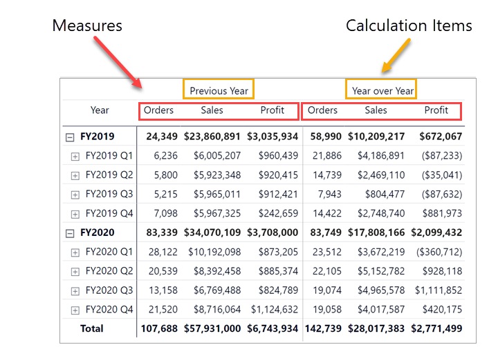

Calculation groups are a simple way to reduce the number of measures in a model by grouping common measure expressions. Calculation groups work with existing explicit DAX measures by automating repetitive patterns. 

Calculation groups can be created for tabular models in SQL Server 2019 and later, Analysis Services, Azure Analysis Services, and Power BI.

> [!Note]
> Implementing calculation groups in Power BI requires Power BI Premium licensing. 

The matrix below contains three measures: Orders, Sales, and Profit. Using a calculation group enables you to create two calculation items, Previous Year and Year over Year, which are then applied to each of our three existing measures.

## How to create calculation groups

The best tool for creating calculation groups in Power BI is the free, open-source [Tabular Editor 2.x](https://github.com/TabularEditor/TabularEditor) tool. Tabular Editor 2.x lets you manipulate and manage measures, calculated columns, display folders, perspectives, and translations in Analysis Services Tabular and Power BI XMLA Models (from Compatibility Level 1200 and onwards). Power BI Desktop doesn't have the user interface to create calculation groups.

Calculation groups are also supported in Visual Studio with Analysis Services Projects VSIX update 2.9.2 and later.

> [!Note]
> To understand more see [Calculation groups in analysis services models](/analysis-services/tabular-models/calculation-groups?view=asallproducts-allversions).

## Benefits of using a calculation group

The main benefit of using calculation groups is a reduction in the overall number of measures you need to create and maintain.

Calculation groups also enable the creation of creative report features, such as switching measures using a slicer, dynamic formatting, and even turning display labels on and off.

## Limitations of using a calculation group

The main limitation of using calculation groups is that implicit measures are no longer supported in your report. If you're used to using implicit measures to quickly cross-check calculations, note that implementing calculation groups will require the creation of explicit measures.

> [!Tip]
> Implicit measures are automatically generated calculations, achieved by configuring a Power BI visual to summarize column values. Explicit measures are calculations added to a tabular model using a DAX formula.

Refer to [calculation groups documentation](/analysis-services/tabular-models/calculation-groups?view=asallproducts-allversions#limitations) to read more about limitations.