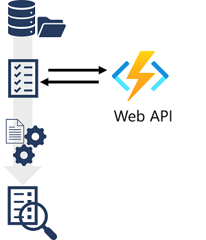

In a basic search solution, an *indexer* extracts information from a *data source*, such as a set of documents or a database, and maps the extracted data values to fields in an *index*. The information that can be extracted depends on the data source. for example, when indexing data in a database, the fields in the database tables might be extracted; or when indexing a set of documents, file metadata such as file name, modified date, size, and author might be extracted along with the text content of the document.

While a basic search solution that indexes data values extracted directly from the data source is useful, the expectations of modern application users have driven a need for richer insights into the data. In Azure Cognitive Search, you can apply artificial intelligence (AI) *skills* as part of the indexing process to enrich the source data with new information, which can be mapped to index fields. The skills used by an indexer are encapsulated in a *skillset* that defines an enrichment pipeline in which each step enhances the source data with insights obtained by a specific AI skill. Examples of the kind of information that can be extracted by an AI skill include:

- The language in which a document is written.
- Key phrases that might help determine the main themes or topics discussed in a document.
- A sentiment score that quantifies how positive or negative a document is.
- Specific locations, people, organizations, or landmarks mentioned in the content.
- AI-generated descriptions of images, or image text extracted by optical character recognition.

The skillset incrementally compiles a set of enriched data values, and at the end of the process the indexer maps these output values, along with the original data source fields, to the fields in the index.

In this module, you'll implement an enrichment pipeline for a search solution based on *Margie's Travel*, a fictitious travel agency that uses information in brochures and hotel reviews to help customers plan trips.
