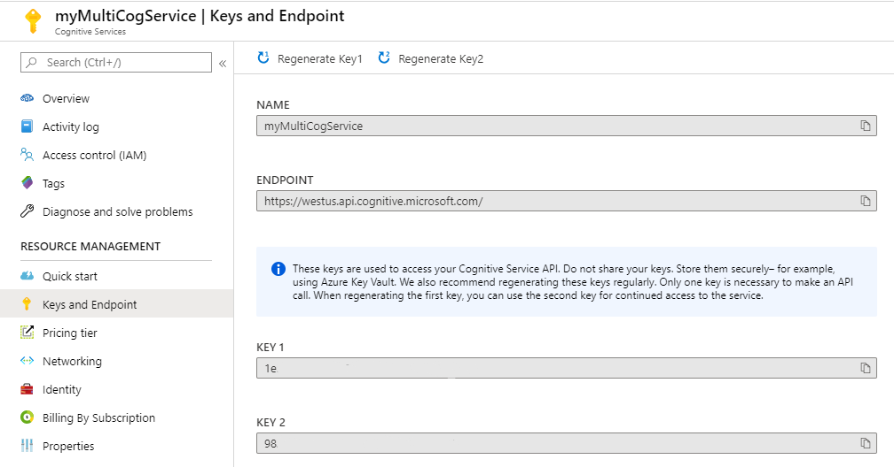

Every web API call to your Cognitive Service resources requires a subscription key.  Even though the term **subscription key** is used, the key actually applies to the resources you create.  From within the Azure portal, you can find these keys on the Keys and Endpoint page.



There are two keys available and either key will provide access to the web API endpoint for your service. Manage these keys carefully, to prevent unauthorized access to your service.  Only provide the keys to developers or others who require access and ensure they provide security mechanisms to protect them  as well. If you are creating software applications that access your services, consider using environment variables to discourage the use of hard coding these keys into the source code for your application.

If one or both keys become compromised, you can generate new keys in the portal by selecting the Regenerate buttons at the top of the **Keys and Endpoint** page.  You can also manage the keys in code through the Azure CLI.  The following examples show how to use the Azure CLI to manage your access keys.

## Get Key List

1. To retrieve your list of keys, sign in using the Azure CLI and provide the credentials when prompted.

    ```azurecli
    az login
    ```

1. Ensure you are in the correct Azure subscription that contains the service you want to manage.  Use this command to determine what your current subscription is set to.

    ```azurecli
    az account show
    ```

1. If you need to change the subscription, execute this command. Remember to replace &lt;subscriptionName&gt; with the proper subscription name.

    ```azurecli
    az account set --subscription <subscripionName>
    ```

1. Now get the list of keys.

    ```azurecli
    az cognitiveservices account keys list --name myMultiCogService --resource-group cog-services-staging
    ```

## Regenerate a Key

1. If you need to regenerate a key, you can access the proper Azure subscription and cognitive service by following steps 1 and 2 in the **Get Key List** section.
1. To regenerate Key 1, you would use the command

    ```azurecli
    az cognitiveservices account keys regenerate --name myMultiCogService --resource-group cog-services-staging --key-name key1
    ```

1. You can regenerate Key 2 by changing the **--key-name** parameter to **key2**

    >[!TIP]
    >Many of the Azure CLI command parameters can be used in one of two ways.  In the previous command examples, we have used the full name of the parameter such as ``` --resource-group ```.  You can use a shorter version of ``` -g ``` to keep your commands shorter.  The [Cognitive Services CLI command reference](https://docs.microsoft.com/cli/azure/cognitiveservices?view=azure-cli-latest) lists the parameter options for each of the CLI areas of focus.