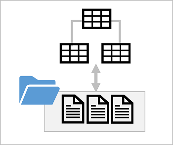

In a traditional relational database, the database schema is composed of tables, views, and other objects. Tables in a relational database define the entities for which data is stored - for example, a retail database might include tables for products, customers, and orders. Each entity consists of a set of attributes that are defined as columns in the table, and each column has a name and a data type. The data for the tables is stored in the database, and is tightly coupled to the table definition; which enforces data types, nullability, key uniqueness, and referential integrity between related keys. All queries and data manipulations must be performed through the database system.

In a data lake, there is no fixed schema. Data is stored in files, which may be structured, semi-structured, or unstructured. Applications and data analysts can work directly with the files in the data lake using the tools of their choice; without the constraints of a relational database system.

A *lake database* provides a relational metadata layer over one or more files in a data lake. You can create a lake database that includes definitions for tables, including column names and data types as well as relationships between primary and foreign key columns. The tables reference files in the data lake, enabling you to apply relational semantics to working with the data and querying it using SQL. However, the storage of the data files is decoupled from the database schema; enabling more flexibility than a relational database system typically offers.
  

## Lake database schema

You can create a lake database in Azure Synapse Analytics, and define the tables that represent the entities for which you need to store data. You can apply proven data modeling principles to create relationships between tables and use appropriate naming conversions for tables, columns, and other database objects.

Azure Synapse Analytics includes a graphical database design interface that you can use to model complex database schema, using many of the same best practices for database design that you would apply to a traditional database.

## Lake database storage

The data for the tables in your lake database is stored in the data lake as Parquet or CSV files. The files can be managed independently of the database tables, making it easier to manage data ingestion and manipulation with a wide variety of data processing tools and technologies.

## Lake database compute

To query and manipulate the data through the tables you have defined, you can use an Azure Synapse serverless SQL pool to run SQL queries or an Azure Synapse Apache Spark pool to work with the tables using the Spark SQL API.
