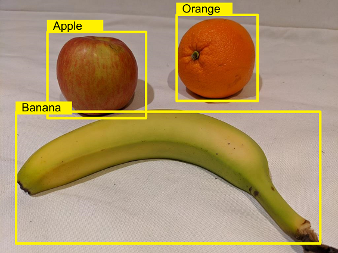

Custom Azure AI Vision models have different functionality based on the *type*. The types of custom models include **Image classification**, **Object detection**, and **Product recognition**

## Image classification

Image classification is a computer vision technique in which a model is trained to predict a label for an image based on the contents of the entire image. Usually the class label relates to the main *subject* of the image, however individual use cases may vary.

For example, the following images have been classified based on the type of fruit they contain.

Models can be trained for multi-class classification (in other words, there are multiple classes, but each image can belong to only one class) or multi-label classification (in other words, an image might be associated with multiple labels).

## Object detection

Object detection is a form of computer vision in which a model is trained to detect the presence and location of one or more classes of object in an image. For example, an AI enabled checkout system in a grocery store might need to identify the type and location of items being purchased by a customer.

There are two components to object detection:

- The class label of each object detected in the image. For example, you might predict that an image contains one apple and two oranges.
- The location of each object within the image, indicated as coordinates of a bounding box that encloses the object.

## Product recognition

Product recognition works the same way object detection does, but has improved accuracy for product labels and brand names. The predictions for product recognition will have both the class label and location, enabling you to know where in the image the product is.
