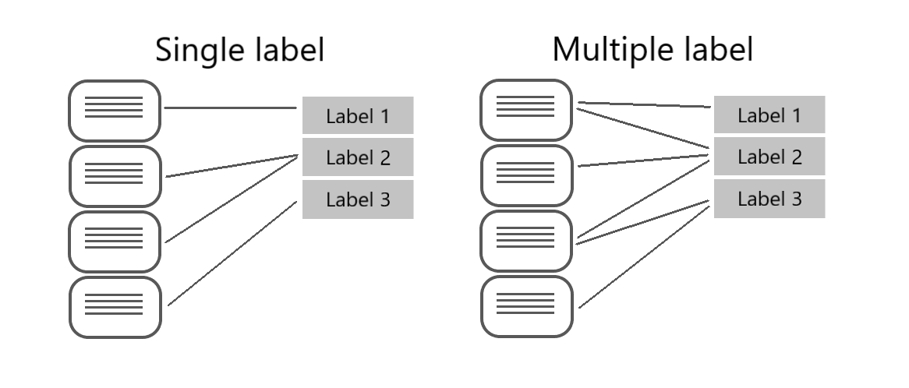

Custom text classification assigns labels, which in the Language service is a *class* that the developer defines, to text files. For example, a video game summary might be classified as "Adventure", "Strategy", "Action" or "Sports".

Custom text classification falls into two types of projects:

- **Single label classification** - you can assign only one class to each file. Following the above example, a video game summary could only be classified as "Adventure" or "Strategy".
- **Multiple label classification** - you can assign multiple classes to each file. This type of project would allow you to classify a video game summary as "Adventure" or "Adventure and Strategy".

When creating your custom text classification project, you can specify which project you want to build.

## Single vs. multiple label projects

Beyond the ability to put files into multiple classifications, the key differences with multiple label classification projects are tagging, considerations for improving your model, and the API payload for classification tasks.

### Label tags

In single label projects, each file is assigned one class during the tagging process; class assignment in the Language service only allows you to select one class.

When tagging multiple label projects, you can assign as many classes that you want per file. The impact of the added complexity means your data has to remain clear and provide a good distribution of possible inputs for your model to learn from.



Tagging data correctly, especially for multiple label projects, is directly correlated with how well your model performs. The higher the quality, clarity, and variation of your data set is, the more accurate your model will be.

### Evaluating and improving your model

Measuring predictive performance of your model goes beyond how many predictions were correct. Correct classifications are when the actual label is *x* and the model predicts a label *x*. In the real world, documents result in different kinds of errors when a classification isn't correct:

- False positive - model predicts *x*, but the file isn't labeled *x*
- False negative - model doesn't predict label *x*, but the file in fact is labeled *x*

These metrics are translated into three measures provided by the Language service:

- **Recall** - Of all the actual labels, how many were identified; the ratio of true positives to all that was labeled.
- **Precision** - How many of the predicted labels are correct; the ratio of true positives to all identified positives.
- **F1 Score** - A function of *recall* and *precision*, intended to provide a single score to maximize for a balance of each component

> [!TIP]
> Learn more about the [Language service evaluation metrics](https://aka.ms/language-evaluation-metrics), including exactly how these metrics are calculated

With a single label project, you can identify which classes aren't classified as well as others and find more quality data to use in training your model. For multiple label projects, figuring out quality data becomes more complex due to the matrix of possible permutations of combined labels.

For example, let's your model is correctly classifying "Action" games and some "Action and Strategy" games, but failing at "Strategy" games. To improve your model, you'll want to find more high quality and varied summaries for both "Action and Strategy" games, as well at "Strategy" games to teach your model how to differentiate the two. This challenge increases exponentially with more possible classes your model is classifying into.

### API payload

The Language service provides a REST API to build and interact with your model, using a JSON body to specify the request. This API is abstracted into multiple language-specific SDKs, however for this module we'll focus our examples on the base REST API.

To submit a classification task, the API requires the JSON body to specify which task to execute. You'll learn more about the REST API in the next unit, but worth familiarizing yourself with parts of the required body.

Single label classification models specify a task of `customClassificationTasks`:

```json
{
    "tasks": {
        "customClassificationTasks":[
            {
                "parameters": {
                      "project-name": "<YOUR PROJECT>",
                      "deployment-name": "<YOUR MODEL>"
                }
            }
        ]
    },
    <...>
```

Multiple label classification models specify a task of `customMultiClassificationTasks`

```json
{
    "tasks": {
        "customMultiClassificationTasks":[
            {
                "parameters": {
                      "project-name": "<YOUR PROJECT>",
                      "deployment-name": "<YOUR MODEL>"
                }
            }
        ]
    },
    <...>
```
