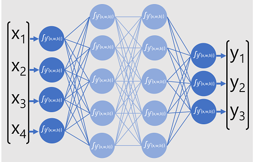

In your brain, you have nerve cells called neurons, which are connected to one another by nerve extensions that pass electrochemical signals through the network.

When the first neuron in the network is stimulated, the input signal is processed, and if it exceeds a particular threshold, the neuron is *activated* and passes the signal on to the neurons to which it's connected. These neurons in turn may be activated and pass the signal on through the rest of the network. Over time, the connections between the neurons are strengthened by frequent use as you learn how to respond effectively. For example, if you're shown a picture of a penguin, your neuron connections enable you to process the information in the picture and your knowledge of the characteristics of a penguin to identify it as such. Over time, if you're shown multiple pictures of various animals, the network of neurons involved in identifying animals based on their characteristic grow stronger. In other words, you get better at accurately identifying different animals.

Deep learning emulates this biological process using artificial neural networks that process numeric inputs rather than electrochemical stimuli.

The incoming nerve connections are replaced by numeric inputs that are typically identified as ***x***. When there's more than one input value, ***x*** is considered a vector with elements named ***x1***, ***x2***, and so on.

Associated with each ***x*** value is a *weight* (***w***), which is used to strengthen or weaken the effect of the ***x*** value to simulate learning. Additionally, a *bias* (***b***) input is added to enable fine-grained control over the network. During the training process, the ***w*** and ***b*** values are adjusted to tune the network so that it "learns" to produce correct outputs.

The neuron itself encapsulates a function that calculates a weighted sum of ***x***, ***w***, and ***b***.  This function is in turn enclosed in an *activation function* that constrains the result (often to a value between 0 and 1) to determine whether or not the neuron passes an output onto the next layer of neurons in the network.

## Training a deep learning model

Deep learning models are neural networks that consist of multiple *layers* of artificial neurons. Each layer represents a set of functions that are performed on the ***x*** values with associated ***w*** weights and ***b*** biases, and the final layer results on an output of the **y** label that the model predicts. In the case of a *classification* model (which predicts the most probably category or *class* for the input data), the output is a vector containing the probability for each possible class.

The following diagram represents a deep learning model that predicts the class of a data entity based on four features (the ***x*** values). The output of the model (the ***y*** values) is the probability for each of three possible class labels.

To train the model, a deep learning framework feeds multiple batches of input data (for which the actual label values are known), applies the functions in all of the network layers, and measures the difference between the output probabilities and the actual known class labels of the training data. The aggregated difference between the prediction outputs and the actual labels is known as the *loss*.

Having calculated the aggregate loss for all the batches of data, the deep learning framework uses an *optimizer* to determine how the weights and biases in the model should be adjusted in order to reduce the overall loss. These adjustments are then *backpropagated* to the layers in the neural network model, and then the data is passed through the network again and the loss recalculated. This process repeats multiple times, (each iteration is known as an *epoch*) until the loss is minimized and the model has "learned" the right weights and biases to be able to predict accurately.

During each epoch, the weights and biases are adjusted to minimize the loss. The amount that they're adjusted by is governed by the *learning rate* you specify to the optimizer. If the learning rate is too low, the training process may take a long time to determine optimal values; but if it's too high, the optimizer may never find the optimal values.
