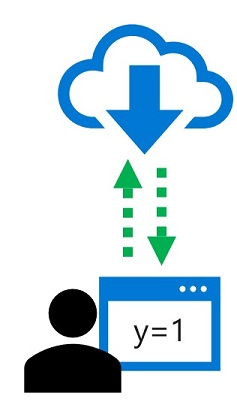

In machine learning, **Model Deployment** can be considered as a process by which you integrate your trained machine learning models into a production environment such that your business or end-user applications can use the model predictions to make decisions or gain insights into your data. The most common way you deploy a model using Azure Machine Learning from Azure Databricks, is to deploy the model as a real-time inferencing service. Here the term **inferencing** refers to the use of a trained model to make predictions on new input data on which the model has not been trained. 

## What is Real-Time Inferencing?

The model is deployed as part of a service that enables applications to request immediate, or *real-time*, predictions for individual, or small numbers of data observations.

In Azure Machine learning, you can create real-time inferencing solutions by deploying a model as a real-time service, hosted in a containerized platform such as Azure Kubernetes Services (AKS).
