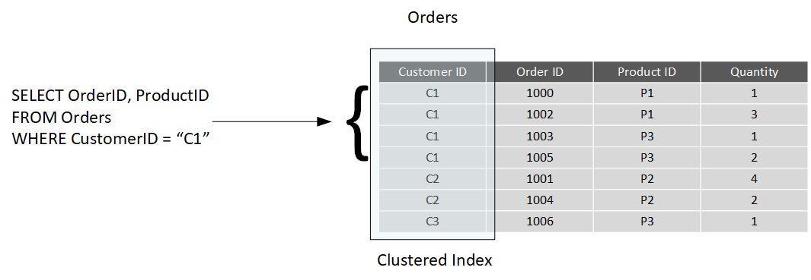

A relational database comprises a set of tables. A table can have zero (if the table is empty) or more rows. Each table has a fixed set of columns. You can define relationships between tables using primary and foreign keys, and you can access the data in tables using SQL. 

Apart from tables, a typical relational database contains other structures that help to optimize data organization, and improve the speed of access. In this unit, you'll look at two of these structures in more detail: indexes and views.

## What is an index?

An index helps you search for data in a table. Think of an index over a table like an index at the back of a book. A book index contains a sorted set of references, with the pages on which each reference occurs. When you want to find a reference to an item in the book, you look it up through the index. You can use the page numbers in the index to go directly to the correct pages in the book. Without an index, you might have to read through the entire book to find the references you're looking for.

When you create an index in a database, you specify a column from the table, and the index contains a copy of this data in a sorted order, with pointers to the corresponding rows in the table. When the user runs a query that specifies this column in the *WHERE* clause, the database management system can use this index to fetch the data more quickly than if it had to scan through the entire table row by row. In the example below, the query retrieves all orders for customer C1. The Orders table has an index on the Customer ID column. The database management system can consult the index to quickly find all matching rows in the Orders table.

> [!div class="mx-imgBorder"]
> 

You can create many indexes on a table. So, if you also wanted to find all orders for a specific product, then creating another index on the Product ID column in the Orders table, would be useful. However, indexes aren't free. An index might consume additional storage space, and each time you insert, update, or delete data in a table, the indexes for that table must be maintained. This additional work can slow down insert, update, and delete operations, and incur additional processing charges. Therefore, when deciding which indexes to create, you must strike a balance between having indexes that speed up your queries versus the cost of performing other operations. In a table that is read only, or that contains data that is modified infrequently, more indexes will improve query performance. If a table is queried infrequently, but subject to a large number of inserts, updates, and deletes (such as a table involved in OLTP), then creating indexes on that table can slow your system down.

Some relational database management systems also support *clustered indexes*. A clustered index physically reorganizes a table by the index key. This arrangement can improve the performance of queries still further, because the relational database management system doesn't have to follow references from the index to find the corresponding data in the underlying table. The image below shows the Orders table with a clustered index on the Customer ID column.

> [!div class="mx-imgBorder"]
> 

In database management systems that support them, a table can only have a single clustered index.

## What is a view?

A view is a virtual table based on the result set of a query. In the simplest case, you can think of a view as a window on specified rows in an underlying table. For example, you could create a view on the Orders table that lists the orders for a specific product (in this case, product *P1*) like this:

```SQL
CREATE VIEW P1Orders AS
SELECT CustomerID, OrderID, Quantity
FROM Orders
WHERE ProductID = "P1"
```

You can query the view and filter the data in much the same way as a table. The following query finds the orders for customer C1 using the view. This query will only return orders for product P1 made by the customer:

```SQL
SELECT CustomerID, OrderID, Quantity
FROM P1Orders
WHERE CustomerID = "C1"
```

A view can also join tables together. If you regularly needed to find the details of customers and the products that they've ordered, you could create a view based on the join query shown in the previous unit:

```SQL
CREATE VIEW CustomersProducts AS
SQL
SELECT Customers.CustomerName, Orders.QuantityOrdered, Products.ProductName
FROM Customers JOIN Orders
ON Customers.CustomerID = Orders.CustomerID
JOIN Products
ON Orders.ProductID = Products.ProductID
```

The following query finds the customer name and product names of all orders placed by customer C2, using this view:

```SQL
SELECT CustomerName, ProductName
FROM CustomersProducts
WHERE CustomerID = "C2"
```
