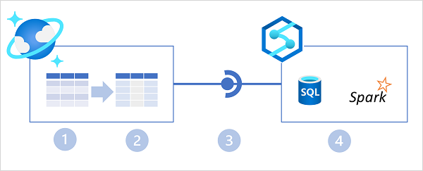
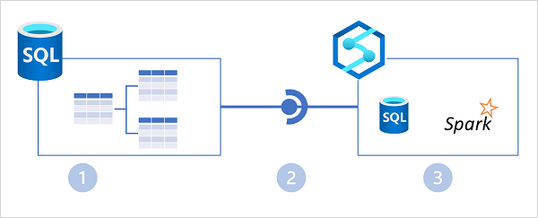
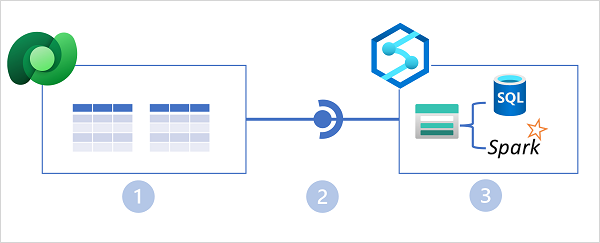

HTAP solutions are supported in Azure Synapse Analytics through **Azure Synapse Link**; a general term for a set of linked services that support HTAP data synchronization into your Azure Synapse Analytics workspace.

## Azure Synapse Link for Cosmos DB

Azure Cosmos DB is a global-scale NoSQL data service in Microsoft Azure that enables applications to store and access operational data by using a choice of application programming interfaces (APIs). Two commonly used APIs in Cosmos DB are the core (SQL) API and the MongoDB API, both of which are used to store and query data efficiently as a set of JSON documents in a *container* (referred to as a *collection* when using the MongoDB API).

Azure Synapse Link for Azure Cosmos DB is a cloud-native HTAP capability that enables you to run near-real-time analytics over operational data stored in a Cosmos DB container. Azure Synapse Link creates a tight seamless integration between Azure Cosmos DB and Azure Synapse Analytics.

In the diagram above, the following key features of the Azure Synapse Link for Cosmos DB architecture are illustrated:

1. An Azure Cosmos DB container provides a row-based transactional store that is optimized for read/write operations.
2. The container also provides a column-based analytical store that is optimized for analytical workloads. A fully managed autosync process keeps the data stores in sync.
3. Azure Synapse Link provides a linked service that connects the analytical store enabled container in Cosmos DB to an Azure Synapse Analytics workspace.
4. Azure Synapse Analytics provides Synapse SQL and Apache Spark runtimes in which you can run code to retrieve, process, and analyze data from the Cosmos DB analytical store without impacting the transactional data store in Cosmos DB.

## Azure Synapse Link for SQL

Microsoft SQL Server is a popular relational database system that powers business applications in some of the world's largest organizations. Azure SQL Database is a cloud-based platform-as-a-service database solution based on SQL Server. Both of these relational database solutions are commonly used as operational data stores.

Azure Synapse Link for SQL enables HTAP integration between data in SQL Server or Azure SQL Database and an Azure Synapse Analytics workspace.

In the diagram above, the following key features of the Azure Synapse Link for SQL architecture are illustrated:

1. An Azure SQL Database or SQL Server instance contains a relational database in which transactional data is stored in tables.
2. Azure Synapse Link for SQL replicates the table data to a dedicated SQL pool in an Azure Synapse workspace.
3. The replicated data in the dedicated SQL pool can be queried in the dedicated SQL pool, or connected to as an external source from a Spark pool without impacting the source database.

## Azure Synapse Link for Dataverse

Microsoft Dataverse is data storage service within the Microsoft Power Platform. You can use Dataverse to store business data in tables that are accessed by Power Apps, Power BI, Power Virtual Agents, and other applications and services across Microsoft 365, Dynamics 365, and Azure.

Azure Synapse Link for Dataverse enables HTAP integration by replicating table data to Azure Data Lake storage, where it can be accessed by runtimes in Azure Synapse Analytics - either directly from the data lake or through a Lake Database defined in a serverless SQL pool.

In the diagram above, the following key features of the Azure Synapse Link for Dataverse architecture are illustrated:

1. Business applications store data in Microsoft Dataverse tables.
2. Azure Synapse Link for SQL replicates the table data to an Azure Data Lake Gen2 storage account associated with an Azure Synapse workspace.
3. The data in the data lake can be used to define tables in a lake database and queried using a serverless SQL pool, or read directly from storage using SQL or Spark.
