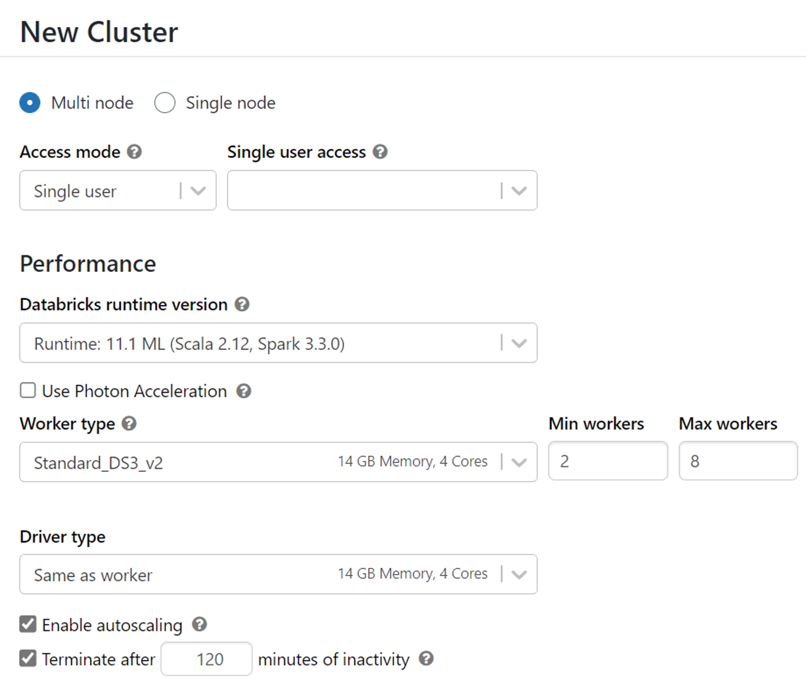

When you want to train your own model, the most valuable resource you’ll consume is compute. Especially during model training, it’s important to choose the most suitable compute. Additionally, you should monitor compute utilization to know when to scale up or down to save on time and costs.

Though finding which virtual machine size best fits your needs is an iterative process, there are some guidelines you can follow when you start developing.

## CPU or GPU

One important decision to make when configuring compute is whether you want to use a **central processing unit** (**CPU**) or a **graphics processing unit** (**GPU**). For smaller tabular datasets, CPU will be sufficient and cheaper to use. Whenever working with unstructured data like images or text, GPUs will be more powerful and effective.

For larger amounts of tabular data, it may also be beneficial to use GPUs. When processing your data and training your model takes a long time, even with the largest CPU compute available, you may want to consider using GPU compute instead. There are libraries such as RAPIDs (developed by NVIDIA) which allow you to efficiently perform data preparation and model training with larger tabular datasets. As GPUs come at a higher cost than CPUs, it may require some experimentation to explore whether using GPU will be beneficial for your situation.

> [!Tip]
> Learn how to [train compute-intensive models with Azure Machine Learning](/learn/paths/train-compute-intensive-models-azure-machine-learning?azure-portal=true)

## General purpose or memory optimized

When you create compute resources for machine learning workloads, there are two common types of virtual machine sizes you can choose from:

- **General purpose**: Have a balanced CPU-to-memory ratio. Ideal for testing and development with smaller datasets.
- **Memory optimized**: Have a high memory-to-CPU ratio. Great for in-memory analytics, which is ideal when you have larger datasets or when you're working in notebooks.  

The size of compute in Azure Machine Learning is shown as the **virtual machine size**. The sizes follow the same naming conventions as Azure Virtual Machines. 

> [!Tip]
> Learn more about [sizes for virtual machines in Azure](/azure/virtual-machines/sizes?azure-portal=true).

## Spark

Services like Azure Synapse Analytics and Azure Databricks offer Spark compute. Spark compute or clusters use the same sizing as virtual machines in Azure but distribute the workloads.
  
A Spark cluster consists of a driver node and worker nodes. Your code will initially communicate with the driver node. The work is then distributed across the worker nodes. By distributing the work, parts of the workload can be executed in parallel. Finally, the work is summarized and the driver node communicates the result back to you. 

> [!Important]
> To make optimal use of a Spark cluster, your code needs to be written in a Spark-friendly language like Scala, SQL, RSpark, or PySpark in order to distribute the workload. If you write in Python, you’ll only use the driver node and leave the worker nodes unused.

When you create a Spark cluster, you’ll have to choose whether you want to use CPU, or GPU compute. You’ll also have to choose the virtual machine size for the driver and the worker nodes.   

## Monitor the compute utilization 

Configuring your compute resources for training a machine learning a model is an iterative process. When you know how much data you have and how you want to train your model, you’ll have an idea of which compute options may best suit training your model.
 
Every time you train a model, you should monitor how long it takes to train the model and how much compute is used to execute your code. By monitoring the compute utilization, you’ll know whether to scale your compute up or down. If training your model takes too long, even with the largest compute size, you may want to use GPUs instead of CPUs. Alternatively, you can choose to distribute model training by using Spark compute which may require you to rewrite your training scripts.
