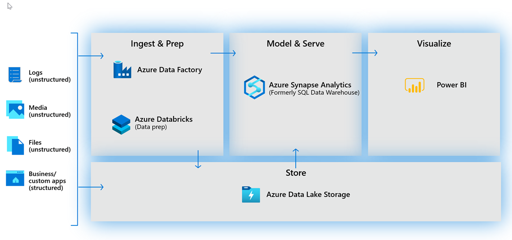
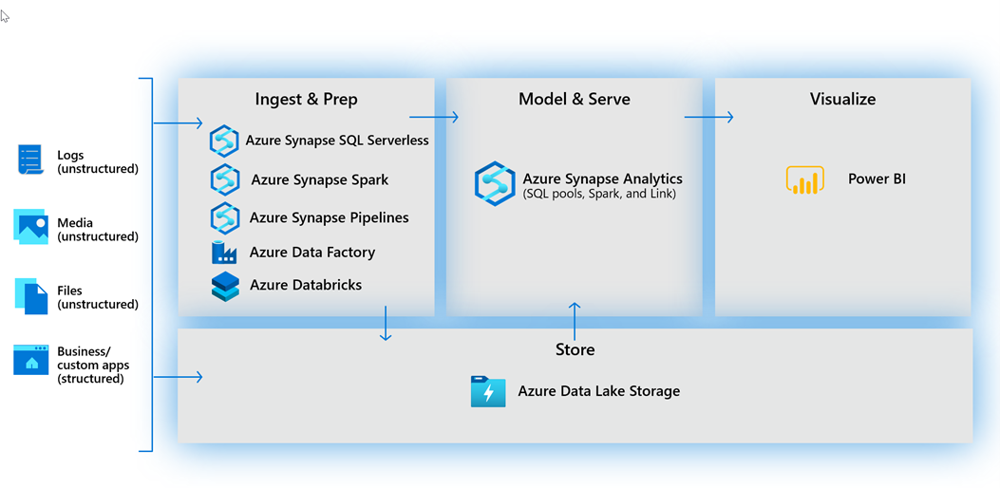

When thinking about usage patterns that customers are using today to maximize the value of their data, a modern data warehouse lets you bring together all your data at scale easily, so you get to the insights through analytics dashboards, operational reporting, or advanced analytics for your users.

The process of building a modern data warehouse typically consists of:

-	Data Ingestion and Preparation.
-	Making the data ready for consumption by analytical tools.
-	Providing access to the data, in a shaped format so that it can easily be consumed by data visualization tools. 

Prior to the release of Azure Synapse Analytics, this would be achieved in the following way.

## Data ingestion and preparation

At the foundation, customers build a data lake to store all their data and different data types with Azure Data Lake Store Gen2. 

To ingest data, customers can do so code-free with over 100 data integration connectors with Azure Data Factory. Data Factory empowers customers to do code-free ETL/ELT, including preparation and transformation. 

And while a lot of our customers are currently heavily invested in the SQL Server Integration Services packages (SSIS), they can leverage these without having to rewrite those packages in Azure Data Factory.

Whether the data is an on-premises data sources, other Azure services, or other cloud services, customers can seamlessly author, monitor, and manage their big data pipelines with a visual environment that is easy to use. 

Another option for data preparation is Azure Databricks - to shape the data formats and prep it using a Notebook—making internal collaboration on data more streamlined and efficient. 
 

## Making the data ready for consumption by analytical tools.

At the heart of a modern data warehouse, and cloud scale analytical solution is Azure Synapse Analytics. This implements a data warehouse using a dedicated SQL pool that leverages the Massively Parallel Processing engine that brings together enterprise data warehousing and Big Data analytics. 

## Providing access to the data, in a shaped format so that it can easily be consumed by data visualization tools. 

Power BI enables customers to build visualizations on massive amounts of data and ensures that data insights are available to everyone across their organization. Power BI supports an enormous set of data sources, which can be queried live, or be used to model and ingest for detailed analysis and visualization. Brought together with AI capabilities, it’s a powerful tool to build and deploy dashboards in the enterprise, through rich visualizations, and features like natural language querying. 

## Defining a modern data warehousing architecture with Azure Synapse Analytics

With the release of Azure Synapse Analytics, you have a choice. You can either use Azure Synapse exclusively, which works well for green field projects. But for organizations with existing investments in Azure with Azure Data Factory, Azure Databricks and Power BI, you can take a hybrid approach and combine them with Azure Synapse Analytics.
 

There are a variety of tools and techniques that can be used to implement the various stages of a modern data warehouse architecture. This module will show examples that have a specific focus on the components of Azure Synapse Analytics. Whilst other technologies and services can also be used as illustrated above, it is also important to understand that you can also use a range of languages to ingest data, clean, transform and serve the data. These languages can include the SQL, Python and Scala language. All of which can be used within Azure Synapse Analytics.
