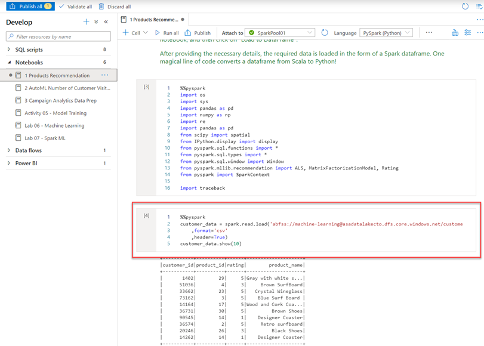
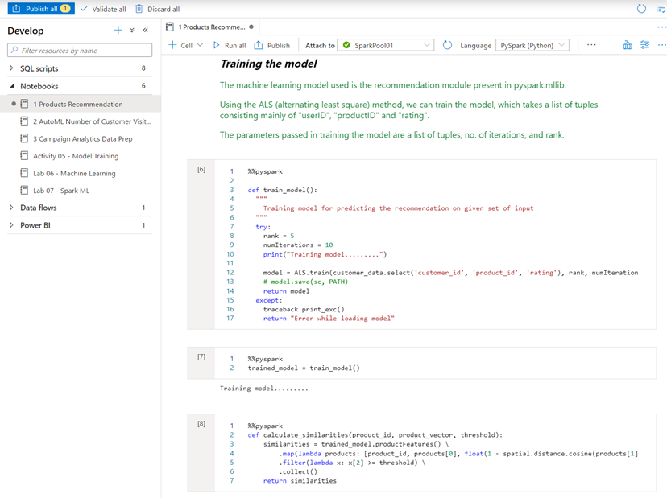
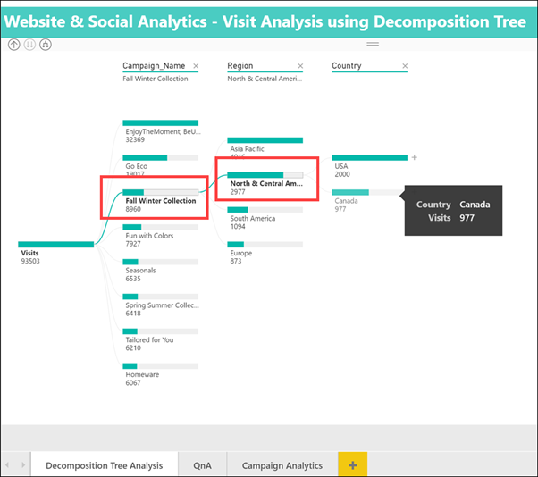
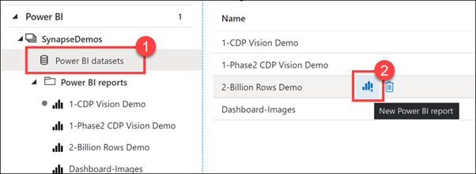
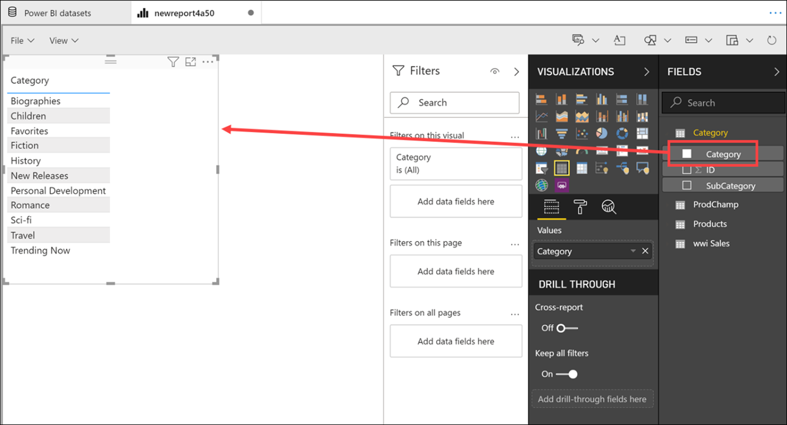
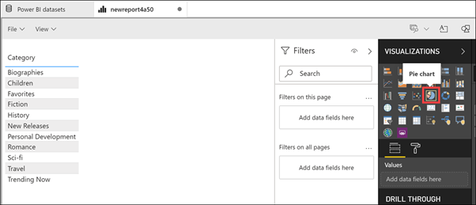
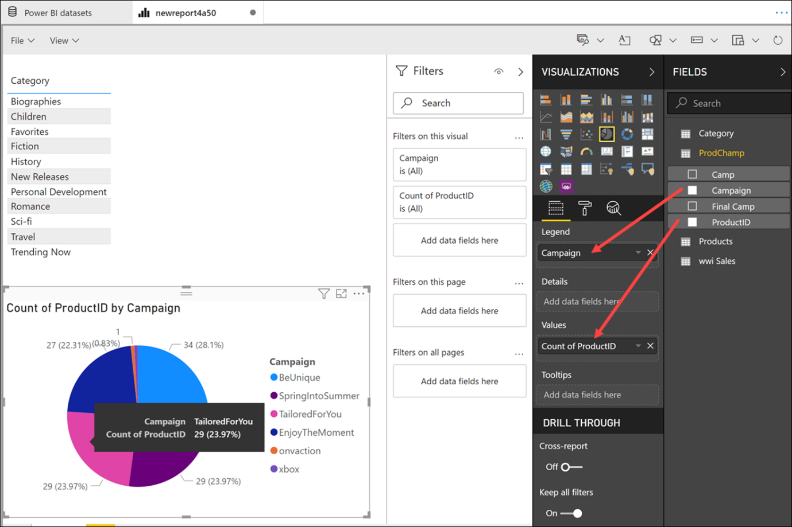

The aim of all this work is to be able to serve up the data to be consumed by the various consumers within the business. This can include business users and data analysts creating reports and dashboards to Power BI, to enabling data scientist perform model training for predictive analytics as shown in the following steps.

1.	Select the Develop hub.
 
    

2.	Expand Notebooks, then select **1 Products Recommendation**.
 
    

    This Synapse Notebook provides customized product recommendations.

    i.	Data is ingested from CSV files using PySpark (**cell 4**).

    

    The model is trained using the PySpark ML-Lib recommendations module (**cells 7 & 8**).

    

    ii.	Product recommendations are generated for each user (**cells 9-12**).
 
    

1.	Select the Develop hub.
 
    

2.	Expand Power BI, expand SynapseDemos, expand Power BI reports, then select **1-CDP Vision Demo (1)**. Select the arrows to collapse the **Visualizations** pane **(2)** and the **Fields** pane **(3)** to increase the report size.
 
    

    As you can see, we can create, edit, and view Power BI reports from within Synapse Studio! As a business analyst, data engineer, or developer, you no longer need to open another browser window, sign in to Power BI, and toggle back and forth between environments.

3.	Select a **Campaign Name** and **Region** within the **Decomposition Tree Analysis** tab to explore the data. If you hover over an item, you will see a tool tip.

    
    
4.	Select the **Campaign Analytics** tab at the bottom of the report.
 
    

    The Campaign Analytics report combines data from the various data sources we looked at today to create a compelling visualization of valuable data within an interactive interface. You can select various filters, campaigns, and chart values to filter the results. Select an item to for the second time to deselect it.
 
    

5.	Select **Power BI datasets (1)** in the left-hand menu, hover over the **2-Billion Rows Demo** dataset and select the **New Power BI report** icon **(2)**.
 
    

    Here is how we can create a brand new Power BI report from a dataset that is part of the linked Power BI workspace, from within Synapse Studio.

6.	Expand the Category table, then **drag-and-drop** the **Category** field on to the report canvas. This creates a new Table visualization that shows the categories.
 
    

7.	Select a blank area on the report canvas to deselect the table, then select the **Pie chart** visualization.
 
    

8.	Expand the ProdChamp table. Drag **Campaign** onto the **Legend** field, then drag **ProductID** onto the **Values** field. Resize the pie chart and hover over the pie slices to see the tool tips.
 
    

    We have very quickly created a new Power BI report, using data stored within our Synapse Analytics workspace, without ever leaving the studio.
    As you can see, the goal, and one of the primary strengths of Azure Synapse Analytics, is to help you build a modern data warehouse and have access to all of your data in one place.
