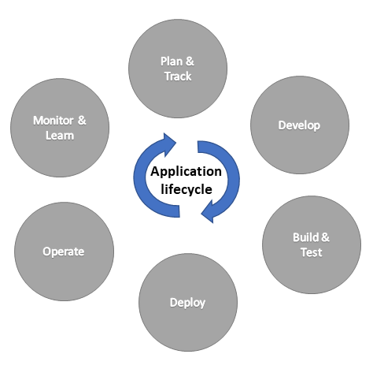

Application Lifecycle Management (ALM) is a common practice in development even if you're not familiar with the term. Enterprises use ALM to continually develop and maintain applications with minimal effort. By applying this same concept to Power BI, you'll create consistency, integrity, and improved customer experience with your reports.

## What is Application Lifecycle Management (ALM)?

ALM specifically manages the lifecycle of an application. There are three key aspects to ALM: *governance*, *development*, and *maintenance*.

* *Governance* includes
* requirements management, resource management, nurturing and system administration such as data security, user access, change tracking, review, audit, deployment control, and rollback.
* *Development* includes identifying current problems, and planning, design, building, and testing the application and its continuous improvements. This area includes traditional developer and app maker roles.
* *Maintenance* includes deployment of the app, and maintenance of optional and dependent technologies.

The *application lifecycle* is the cyclical software development process that involves these areas:

* Plan and track
* Develop
* Build and test
* Deploy
* Operate
* Monitor and learn

## Continuous integration and continuous delivery

Another popular aspect in ALM is *Continuous integration and continuous delivery* (CI/CD), which refers to an automated process to build, test, and deploy your application.

* **Continuous integration** includes the *build*, *test*, and *integration* of changes into a code repository.
* **Continuous delivery** includes the *staging* and *delivery* of code changes to production-ready environments for deployment.

CI/CD doesn't automatically deploy the code changes, and is dependent on approval for deployment. The term *continuous deployment* refers to automated deployment of code changes to production without approval.

## What next?

Now that you know what ALM is, let's determine how to implement ALM in your organization. First, determine where code will be stored and how you'll govern different versions. We'll dive into this more in the next unit, *Recommend a source control strategy*. Then, you'll want to determine your deployment strategy, which we cover as well in the *Design a deployment strategy* unit later.
