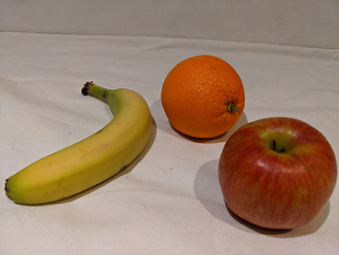

Let's look at example of object detection. Consider the following image:

An object detection model might be used to identify the individual objects in this image and return the following information:

Notice that an object detection model returns the following information:

- The *class* of each object identified in the image.
- The probability score of the object classification (which you can interpret as the *confidence* of the predicted class being correct)
- The coordinates of a *bounding box* for each object.

> [!NOTE]
> **Object detection vs. image classification**
>
> *Image classification* is a machine learning based form of computer vision in which a model is trained to categorize images based on the primary subject matter they contain. *Object detection* goes further than this to classify individual objects within the image, and to return the coordinates of a bounding box that indicates the object's location.

