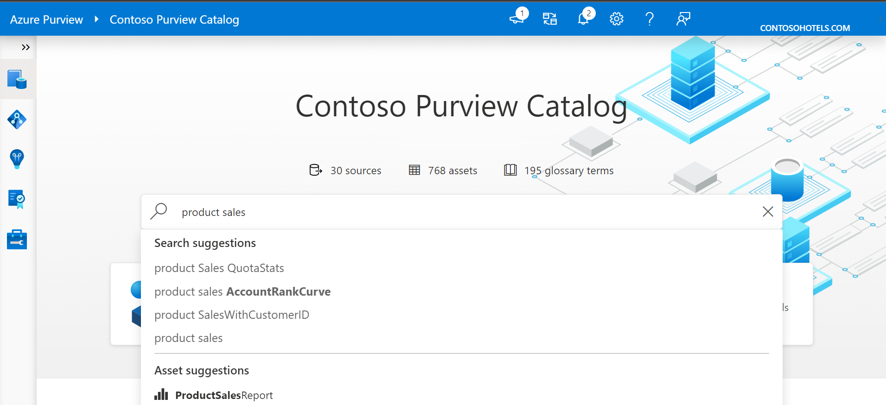
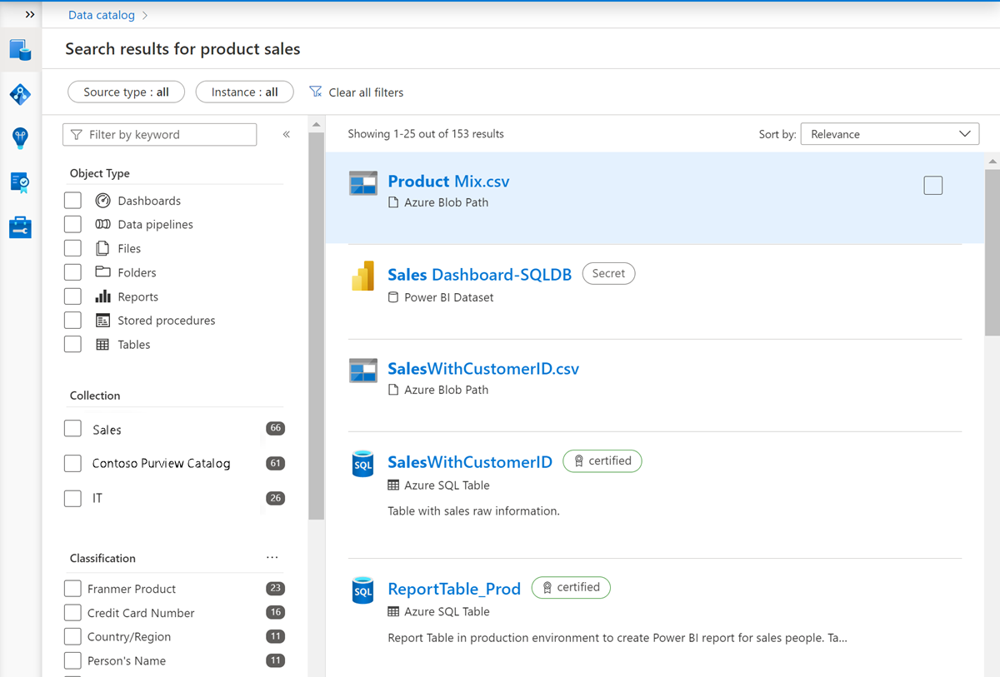
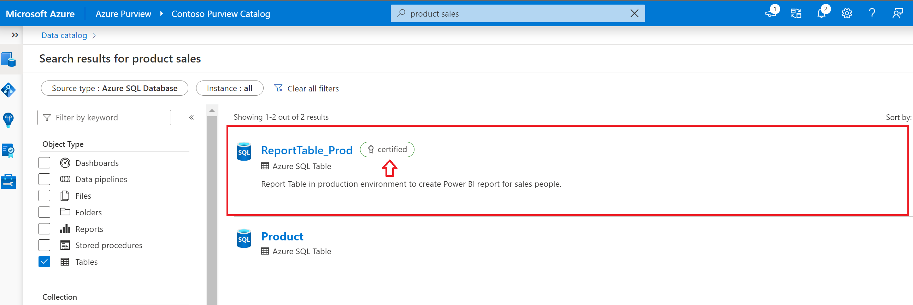
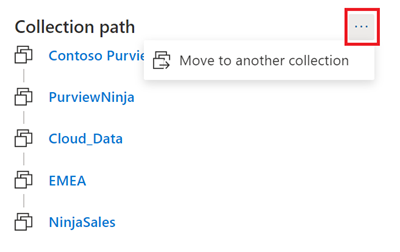
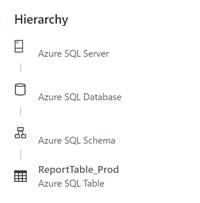
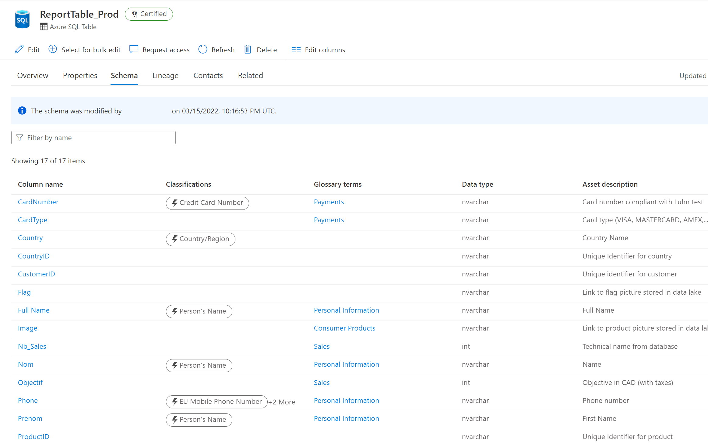
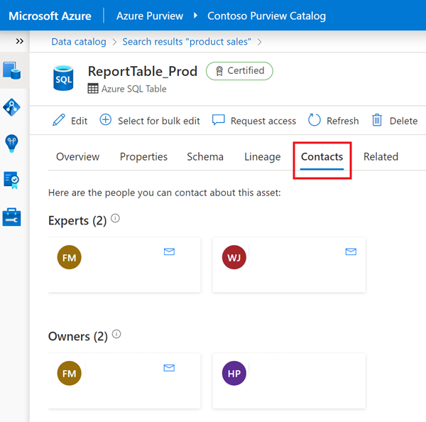
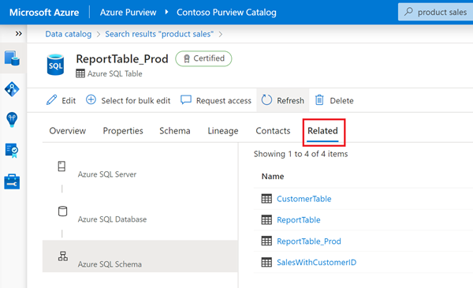

Azure Purview offers a central place to discover and understand assets to use in your day-to-day activities. This central place, Azure Purview data catalog, provides advanced search capabilities to quickly find the right assets and information. Using keywords, business terms and Azure Purview data catalog functionalities, you can find the assets needed to build and design reports.

As a data analyst looking for assets, you'll be searching the Azure Purview data catalog. This assumes that the *Azure Purview data Map* has been created by your organization. The data map provides the foundation for data discovery. The data map captures metadata about enterprise data in analytics and operations systems on-premises and in the cloud and must be established before the data catalog can be searched. 

>[!NOTE]
> Learn more about the [Azure Purview data map](/azure/purview/concept-elastic-data-map) components.

## Search the Azure Purview data catalog

From the Azure Purview Studio home page, users can type relevant keywords to start discovering assets. In this scenario, you're looking for “product sales.”

The screenshot below displays the search result, with all assets corresponding to the keywords entered in the search engine.

You can fine-tune your search using the filters on the left side of the page.

You can filter by:
- Source type (and instance if needed)
- Object type
- Classification
- Glossary term
- If needed, more options are available like Collection, Contact and Label

You've been instructed to connect to sources like Azure SQL tables. In the result displayed below, two assets are displayed. To use the correct asset, it’s possible to browse each asset to dig for more detailed information. Alternatively, you can rely on the work done by the data stewards who have labeled certified assets for the organization.

Before using this asset to create your report, you need to verify more details and validate where data comes from to populate this asset. Select the asset to access more information.

## Understand a single asset

### Asset overview

Select an asset to see the *overview*. The overview displays information at a glance, including a description, asset classification, schema classification, collection path, asset hierarchy, and glossary terms.

The *asset description* provides a brief explanation of the purpose of an asset. Data stewards have made data analysts lives easier in the screenshot below, by noting that this is the correct resource to use for sales reporting.

Beneath the description, you'll see the *asset classification* and *schema classification*.

Data classification, in the context of Azure Purview, is a way of categorizing data assets by assigning unique logical labels or classes. Classification is based on the business context of the data. For example, you might classify assets by Passport Number, Driver's License Number, Credit Card Number, SWIFT Code, Person’s Name, and so on. Asset classifications can be automatically applied during a scan or applied manually. 

>[!NOTE]
>Azure Purview comes with more than 200 classifications out of the box. For a full list of classifications, see [System classifications in Azure Purview](/azure/purview/supported-classifications).

The overview tab reflects both asset level classifications and column level classifications that have been applied, which you can also view as part of the schema.

>[!IMPORTANT]
>You may notice that the classifications displayed above are sensitive or contain personally identifiable information (PII). data encryption is done at the source level, and Azure Purview stores only the metadata. It does not preview data.

You can also view the *collection path*, *hierarchy* and *glossary terms* on the right side of the overview tab.

The *collection path* refers to the location of the asset inside Azure Purview. You have the option to move an asset to another collection.

You can view the full asset hierarchy within the overview tab. As an example: if you navigate to a SQL table, then you can see the schema, database, and the server the table belongs to.

*Glossary terms* are a managed vocabulary for business terms that can be used to categorize and relate assets across your environment. For example, terms like 'customer,' 'buyer, 'cost center,' or any terms that give your data context for your users. You can view the glossary terms for an asset in the overview section, and you can add a glossary term on an asset by editing the asset.

>[!NOTE]
> For more information, see the [business glossary page](/azure/purview/concept-business-glossary). 

### Asset schema

The *schema* view of the asset includes more granular details about the asset, such as column names, data types, column level classifications, terms, and descriptions. 

### Asset lineage

Asset lineage gives you a clear view of how the asset is populated and where data comes from. *Data lineage* is broadly understood as the lifecycle that spans the data's origin, and where it moves over time across the data estate. Data lineage is important to analysts because it enables understanding of where data is coming from, what upstream changes may have occurred, and how it flows through the enterprise data systems.

A single view on the asset lineage tab displays the data flow to and from the asset. Asset lineage can also help you understand how the asset was built and how the asset is used inside the organization.

The columns pane on the left side of the lineage tab allows users to select and track columns as they flow through the lineage. For example, if you select the column Full Name, you can see how the Full Name field was created and where the information comes from.

>[!NOTE]
>The lineage view is a powerful way to understand the transformation process an asset has undergone. Learn more about the [lineage experience in Azure Purview data catalog](/azure/purview/concept-data-lineage#lineage-experience-in-azure-purview-data-catalog)

### Asset contacts and related assets

Asset *contacts* provide you contact details of experts or dataset owners  with any questions. As a new analyst searching for the right data sources for your report, you may find these individuals helpful.

If needed, you can also navigate through the technical hierarchy of assets that are related to the current asset you're viewing.

The ability to search the Azure Purview data catalog has the potential to break down data silos and enable the next level of enterprise analytics.

