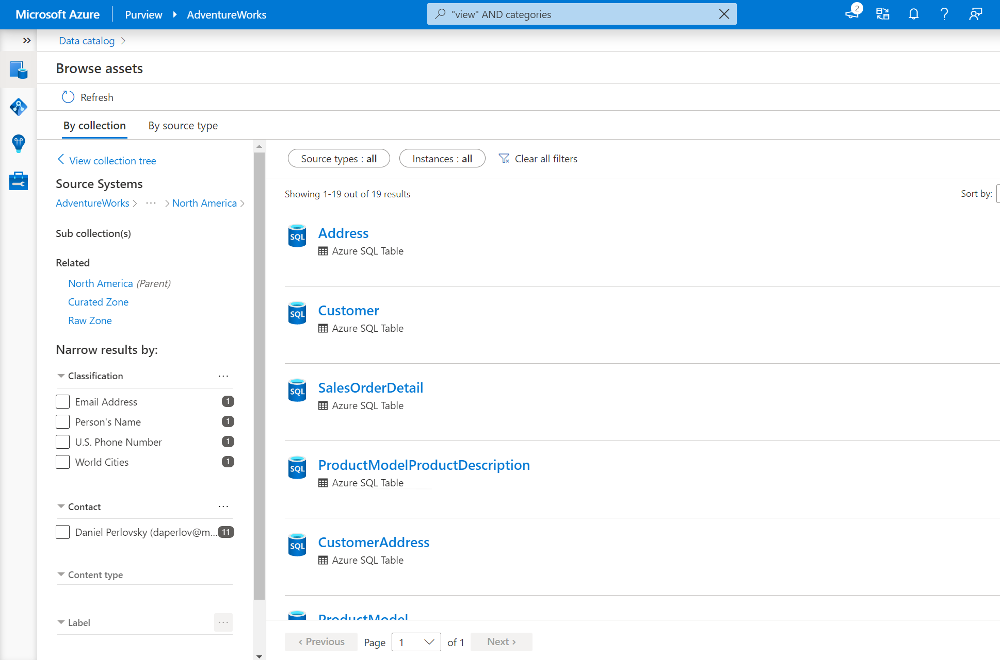
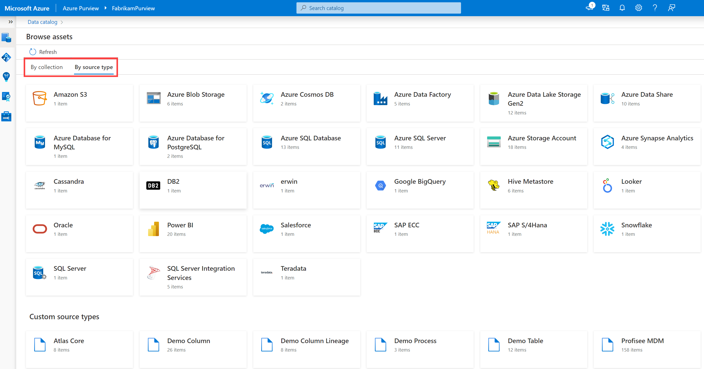
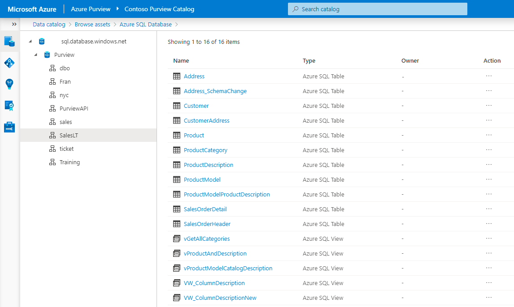

Searching a data catalog is a great tool for data discovery you know what you're looking for. Often, you may not know how your data estate is structured. The Microsoft Purview data catalog offers a browse experience that enables exploration of available data, either by collection or by exploring the hierarchy of each data source in the catalog.

## Browse by collection or source type

If you're new to an organization or department, you may want to familiarize yourself with the contents of the data estate. From the Microsoft Purview Studio home page, select the “Browse assets” tile to browse either by collection or by source type.

Here you can specify whether you'd like to browse by collection or by source type.

**Browse by collection** allows you to explore the different collections you're a data reader or curator for. You'll only see collections you have access to. Select a collection to get a list of assets in that collection with the facets and filters available in search.

>[!TIP]
>Collections are a tool to manage ownership and access control across assets and data sources. They also organize assets and sources into categories that are customized to match the business flow. See [Create and manage collections in Microsoft Purview](/azure/purview/how-to-create-and-manage-collections) to learn more.

**Browse by source type** allows you to explore the hierarchies of data sources using an explorer view. 

After selecting a tile associated with a data source type, you'll see a list of assets belonging to that type. From there, you'll be able to use the explorer view to see parent and child assets.

The Microsoft Purview data catalog browse experience enables analysts or data consumers to explore what data is available in many different ways. Microsoft Purview has the ability to enable users access to data you may not have known about before. The possibilities are endless so long as your organization's data stewards have scanned and classified data across the estate.