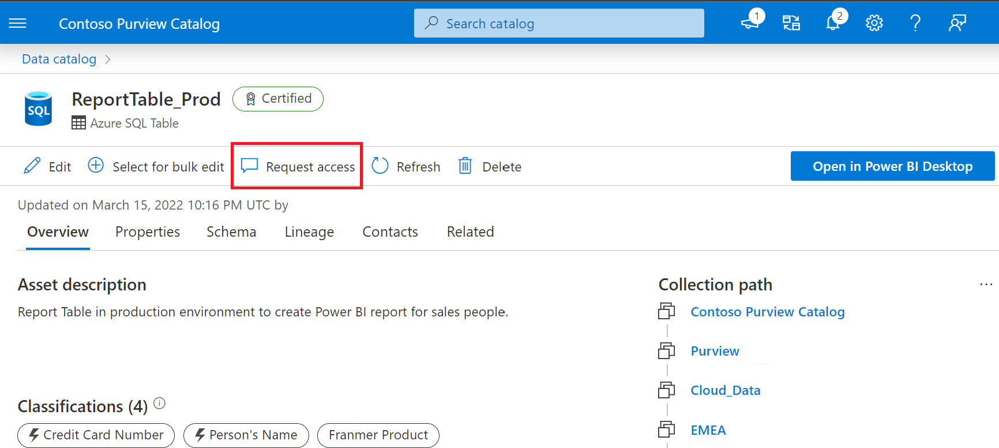
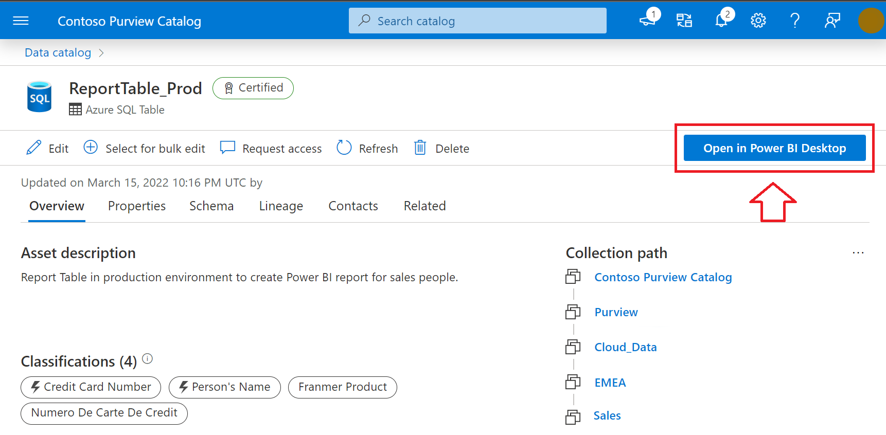

The integration of Azure Purview and Power BI makes it possible to gain a more complete understanding of the data across your estate.

## Request access to assets

In your search or browsing session, you may come across assets that you don't have access to. Azure Purview makes it simple to request access directly from the Data Catalog by using the “Request access” button.  Requesting access will kick off a workflow that manages requests and approvals.

## Build a Power BI report using data discovered in Purview

Working as a new analyst, you've taken the time to search and browse assets and now you'd like to use those trusted assets in a Power BI report. Purview makes it simple, with the ability to open the asset in Power BI desktop.

Selecting Open in Power BI Desktop initiates the download of a Power BI Data Source file (PBIDS) you can open with Power BI Desktop. PBIDS files contain a connection to the data source, so all you need to do is enter credentials upon opening the file and you're ready to start building. 

## Scan a Power BI tenant

In addition to using Purview to find trusted data sources in the data estate to build reports, you can also scan your Power BI tenant to manage and catalog assets. The metadata of Power BI assets, and information about their lineage across Power BI workspaces and their connections to data sources, are then available in Azure Purview.

>[!NOTE]
>See [Connect to and manage a Power BI tenant in Azure Purview](/azure/purview/register-scan-power-bi-tenant) for more details.