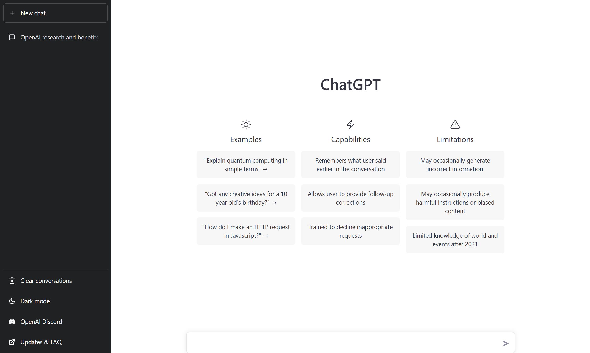

Azure OpenAI's natural language models are able to take in natural language and generate responses. 

Natural language learning models are trained on words or chunks of characters known as *tokens*. For example, the word "hamburger" gets broken up into the tokens "ham,", "bur," and "ger,", while a short and common word like "pear" is a single token. These tokens are mapped into vectors for a machine learning model to use for training. When a trained natural language model takes in a user's input, it also breaks down the input into tokens.  

## Understanding GPT models for natural language generation 

Generative pre-trained transformer (GPT) models are excellent at both understanding and creating natural language. If you've seen recent news around AI answering questions or writing a paragraph based on a prompt, it likely could have been generated by a GPT model. GPT models often have the version appended to the end, such as GPT-2 or GPT-3. Azure OpenAI offers access to GPT-3, and will provide access to GPT-3.5 soon.

#### What does GPT-3 look like? 

A key aspect of OpenAI's generative AI is that it takes an input, or **prompt**, to return a natural language, visual, or code response. GPT tries to infer, or guess, the context of the user's question based on the prompt.    

GPT models are great at completing several natural language tasks, some of which include:

| Task | Prompt |
|------|---------|
| Summarizing text | "Summarize this text into a tl;dr" |
| Classifying text | "What genre of book is this?" |
| Generating names or phrases | "Write a tagline for my flower company" |
| Translation | "Translate 'How are you' to French" |
| Answering questions | "What does Azure OpenAI do?" |
| Suggesting content | "Give me the five best weddings songs" |  

For example, given a prompt where the user types in text asking for a cooking recipe: 

```
Write a recipe based on these ingredients and instructions:

Fruit Pie

Ingredients:
Strawberries
Blueberries
Flour
Eggs
Milk
```

Here's an example of the OpenAI API generated response: 
```
Instructions:

1. Preheat your oven to 350 degrees Fahrenheit.

2. In a medium bowl, mix together 1 cup of flour and 1 egg until it forms a dough.

3. Grease a 9-inch pie dish with butter or non-stick cooking spray.

4. Roll out the dough and place it in the pie dish.

5. In a separate bowl, mix together 1 cup of strawberries, 1 cup of blueberries, and 1 cup of milk.

6. Pour the fruit mixture into the pie dish.

7. Bake
```

Delicious - maybe! It's important to understand that the generated responses are best guesses from a machine. In this case, the generated text may be useful for cooking something that tastes good in real life, or not. 

## How models are applied to new use cases 

ChatGPT is chatbot built on the GPT-3.5 generative AI model. You may have tried out ChatGPT's predictive capabilities in a chat portal similar to this screenshot, where you can type prompts and receive automated responses. The portal consists of the front-end user interface (UI) users see, and a back-end that includes the GPT-3.5 model. The combination of the front and back end can be described as a chatbot. The model provided on the back end is what is available as a building block with the OpenAI API. When you see ChatGPT-like capabilities in other applications, developers have taken the building blocks, customized them to a use case, and built them into the back end of new front-end user interfaces.  


