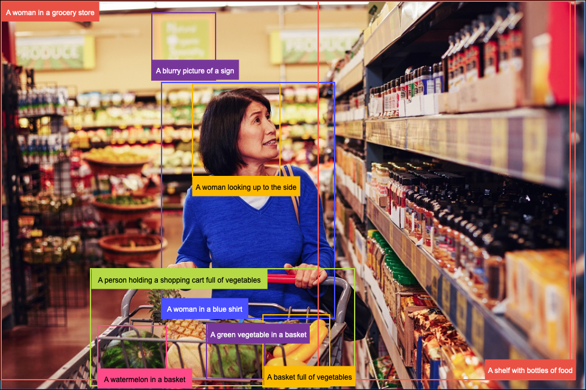
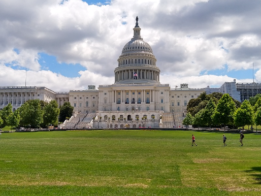
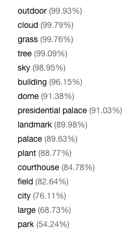
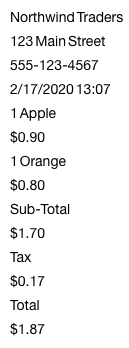
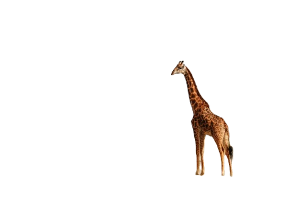
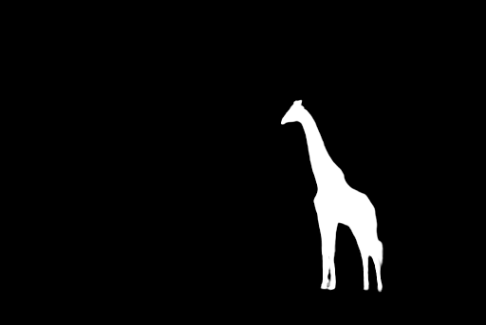

The Azure AI Vision Image Analysis 4.0 service is designed to enable the extraction of a vast assortment of visual elements from images, drawing from more than 10,000 concepts and objects to detect, classify, caption, and generate insights. Powered by Microsoft's Florence foundation model, the updated Image Analysis service uses state-of-the-art algorithms to process images and interpret visual information. For example, the service can be used to find all the people in an image, categorize the content of images, and describe a picture with a complete English sentence.

## Analyze images with Image Analysis 4.0

Accessible via the Vision SDK and REST APIs, Image Analysis 4.0 provides developers with advanced AI for analyzing images to extract information about their visual features and characteristics.

### Describe and caption images

Image captions are accessible through the **Caption** and **Dense Captions** features of Image Analysis 4.0. Both features use the latest groundbreaking Florence-based AI models to analyze an image to understand and generate a human-readable English sentence or phrase describing its content.

**Caption** generates a single sentence describing the image, evaluating the image's content holistically. This feature can be helpful for activities such as auto-generating alternative image text.

**Dense Captions** provides supplementary information by also generating descriptive phrases for individual objects within the image. These captions can help enhance the understanding of the elements that make up the image. The Dense Captions API response includes bounding box coordinates of the described image regions. This feature can be used to generate descriptions for different parts of an image.

### Use natural language queries to search photos

Searching images involves scouring a collection of pictures to find the photos most similar to a given query image or text. Image retrieval techniques have historically used features extracted from the images, such as content labels, tags, and descriptors, to compare images and rank them according to their similarity.

**Image Retrieval** in Image Analysis 4.0 relies on the more efficient technique of _vectorization_. Vectorization converts images to coordinates in a multi-dimensional vector space. Vector similarity search converts incoming queries to vectors and matches images based on semantic closeness, often producing better, more accurate search results.

**Image Retrieval** enables developers to build the capability to search images using natural language queries and get results based on image contents rather than having to rely on manually assigned labels or tags. The **VectorizeImage** and **VectorizeText** APIs enable the _vectorization_ of images and text queries, allowing images to be matched using text without defining image tags or other metadata.

### Generate tags based on image content

Tagging images involves using AI to identify content within an image, such as objects, actions, living beings, and scenery. Image Analysis 4.0 can generate content tags for thousands of recognizable entities that appear in photos.

| Image | Tags |
| :-----: | :----: |
|  | |

Image tagging evaluates all image content, not just the main subject, such as a person in the foreground. Tags are generated for image contents, such as the setting (indoor or outdoor), activities, landscapes, landmarks, colors, plants, animals, and other detected objects and actions.

### Detect objects in images

Object detection is similar to tagging, but the API returns a tag plus the bounding box coordinates for each object found in the image. For example, if a picture contains a dog, cat, and person, the object detection operation lists those objects with their pixel coordinates in the image. You can use this functionality to process the relationships between the objects in an image. It also lets you determine whether multiple instances of the same object exist in an image.

The object detection function only finds objects and living things, which can be localized with bounding boxes. At the same time, the tag function can also include contextual terms like "indoor," which are more generalized to the image contents.

### Read text from images using optical character recognition

Image Analysis 4.0 enables developers to extract printed or handwritten text from images using a unified performance-enhanced synchronous API. This API simplifies retrieving optical character recognition (OCR) results and other image insights by allowing the information to be retrieved using a single API call and providing global language support.

| Image   | Extracted text |
| :-----: | :------------: |
|  | |

The new unified performance-enhanced API in Image Analysis 4.0 provides a fast, synchronous API for scenarios that include running OCR on single images that aren't text-heavy, allowing OCR to be embedded in near real-time user experiences to enrich content understanding and follow-up user actions with rapid turn-around times.

### Create image thumbnails using smart cropping

Reduced-size representations of images, often called thumbnails, are frequently used by app developers to display pictures in user interfaces in a more economical, layout-friendly manner. Image Analysis 4.0 uses **Smart cropping** to generate image thumbnails that include the most integral regions of an image. When any people are detected within the image, the bounding boxes that contain them are given priority when creating thumbnails.

The Smart cropping API takes one or more aspect ratios and returns the bounding box coordinates of the region or regions identified. Developers can configure their apps to use the results to crop and return the image using those coordinates.

### Detect people appearing in images

**People detection** in Image Analysis 4.0 represents an enhancement to the underlying object detection model, specifically created to detect people appearing in images. For each person detected, the bounding box coordinates of the person are returned, along with a confidence score.

People detection doesn't attempt to distinguish faces within the image or predict or classify facial attributes.

### Background removal

**Background removal** is a feature of Image Analysis 4.0 capable of splitting an image into multiple segments or regions to identify different objects or parts of the image. It creates an alpha matte that separates the foreground object from the background in a picture.

| Original image | Background removed | Alpha matte |
| :------------: | :----------------: | :---------: |
|  | | |

When analyzing images, it can often be helpful to isolate essential elements of an image from the "background" of the picture. Separating image components by identifying the image subjects and isolating them from an image's background allows you to analyze the most critical features while ignoring background noise.
