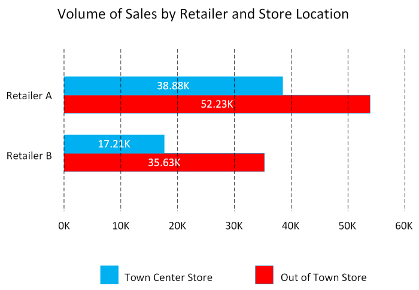
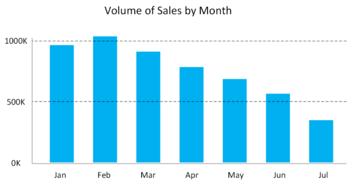
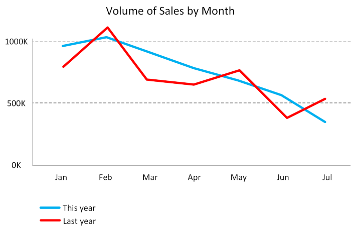
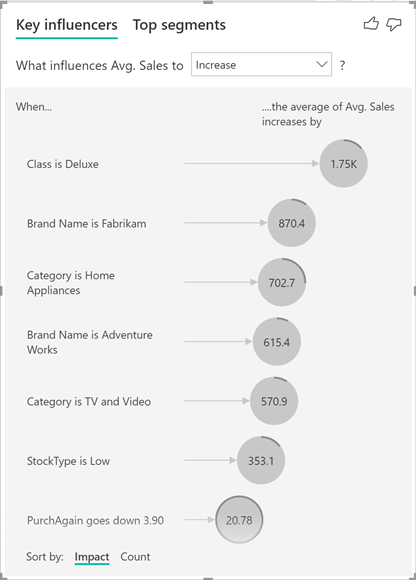
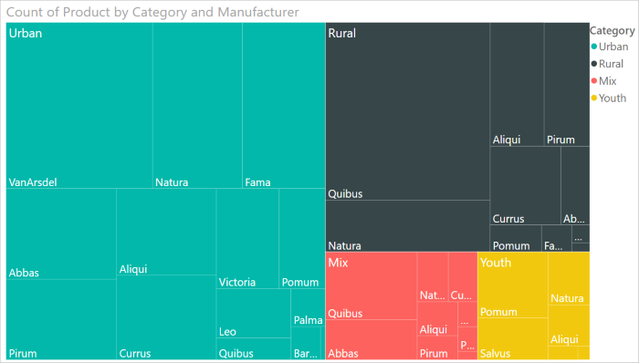
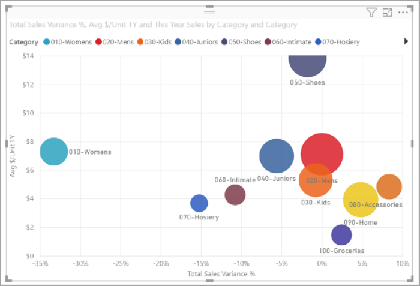
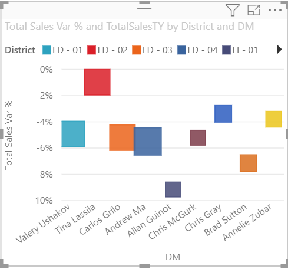

A business model can contain an enormous amount of information. The purpose of producing a model such as this is to help you reason over the information it contains, ask questions, and hopefully obtain answers that can help you drive your business forward. 

This unit discusses some of the techniques you can use to analyze and understand the information in your models.

## What is reporting?

Reporting is the process of organizing data into informational summaries to monitor how different areas of an organization are performing. Reporting helps companies monitor their online business, and know when data falls outside of expected ranges. Good reporting should raise questions about the business from its end users. Reporting shows you what has happened, while analysis focuses on explaining why it happened and what you can do about it.

## What is business intelligence?

The term *Business Intelligence* (BI) refers to technologies, applications, and practices for the collection, integration, analysis, and presentation of business information. The purpose of business intelligence is to support better decision making. 

Business intelligence systems provide historical, current, and predictive views of business operations, most often using data that has been gathered into a data warehouse, and occasionally working from live operational data. Software elements support reporting, interactive “slice-and-dice” pivot table analysis, visualization, and statistical data mining. Applications tackle sales, production, financial, and many other sources of business data for purposes that include business performance management. Information is often gathered about other companies in the same industry for comparison. This process is known as *benchmarking*.

## What is data visualization?

Data visualization is the graphical representation of information and data. By using visual elements like charts, graphs, and maps, data visualization tools provide an accessible way to spot and understand trends, outliers, and patterns in data. If you are using Azure, the most popular data visualization tool is Power BI. 

Using Power BI, you can connect to multiple different sources of data, and combine them into a data model. This data model lets you build visuals, and collections of visuals you can share as reports, with other people inside your organization. 

### Explore visualization options to represent data

Data visualization helps you to focus on the meaning of data, rather than looking at the data itself. A good data visualization enables you to quickly spot trends, anomalies, and potential issues. The most common forms of visualizations are:

- *Bar and column charts*: Bar and column charts enable you to see how a set of variables changes across different categories. For example, the first chart below shows how sales for a pair of fictitious retailers vary between store sites.

    > [!div class="mx-imgBorder"]
    > 

    This chart shows how sales vary by month.

    > [!div class="mx-imgBorder"]
    > 

- *Line charts*: Line charts emphasize the overall shape of an entire series of values, usually over time.

    > [!div class="mx-imgBorder"]
    > 

- *Matrix*: A matrix visual is a tabular structure that summarizes data. Often, report designers include matrixes in reports and dashboards to allow users to select one or more element (rows, columns, cells) in the matrix to cross-highlight other visuals on a report page.

    > [!div class="mx-imgBorder"]
    > 

- *Key influencers*: A key influencer chart displays the major contributors to a selected result or value. Key influencers are a great choice to help you understand the factors that influence a key metric. For example, what influences customers to place a second order or why sales were so high last June.

    > [!div class="mx-imgBorder"]
    > 

- *Treemap*: Treemaps are charts of colored rectangles, with size representing the relative value of each item. They can be hierarchical, with rectangles nested within the main rectangles.

    > [!div class="mx-imgBorder"]
    > 

- *Scatter*: A scatter chart shows the relationship between two numerical values. A *bubble chart* is a scatter chart that replaces data points with bubbles, with the bubble size representing an additional third data dimension. 

    > [!div class="mx-imgBorder"]
    > 

    A dot plot chart is similar to a bubble chart and scatter chart, but can plot categorical data along the X-Axis.

    > [!div class="mx-imgBorder"]
    > 

- *Filled map*. If you have geographical data, you can use a filled map to display how a value differs in proportion across a geography or region. You can see relative differences with shading that ranges from light (less-frequent/lower) to dark (more-frequent/more).

    > [!div class="mx-imgBorder"]
    > 
   

