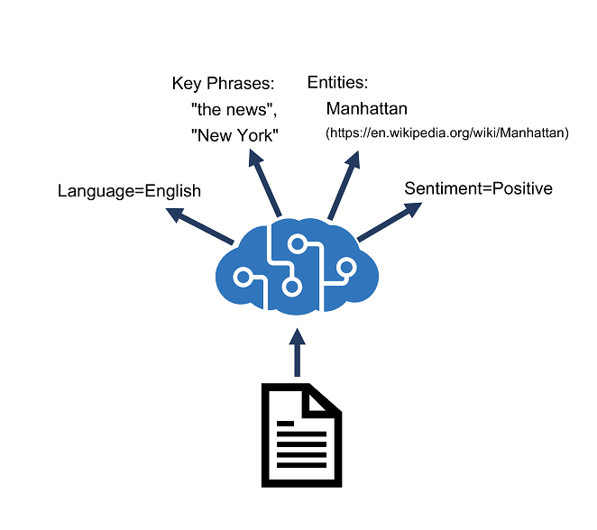

The **Text Analytics** service is designed to help you extract information from text. It provides functionality that you can use for:

- *Language detection* - determining the language in which text is written.
- *Key phrase extraction* - identifying important words and phrases in the text that indicate the main points.
- *Sentiment analysis* - quantifying how positive or negative the text is.
- *Named entity recognition* - detecting references to entities, including people, locations, time periods, organizations, and more.
- *Entity linking* - identifying specific entities by providing reference links to Wikipedia articles.

## Azure resources for Text Analytics

To use the Text Analytics service, you must provision a resource for it in your Azure subscription. You can provision a single-service **Text Analytics** resource, or you can use the Text Analytics API in a multi-service **Cognitive Services** resource.

After you have provisioned a suitable resource in your Azure subscription, you can use its **endpoint** and one of its **subscription keys** to call the Text Analytics APIs from your code. You can call the Text Analytics APIs by submitting requests in JSON format to the REST interface, or by using any of the available programming language-specific SDKs.

> [!NOTE]
> The code examples in the subsequent units in this module show the JSON requests and responses exchanged with the REST interface. When using an SDK, the JSON requests are abstracted by appropriate objects and methods that encapsulate the same data values. You'll get a chance to try the SDK for C# or Python for yourself in the exercise later in the module.
