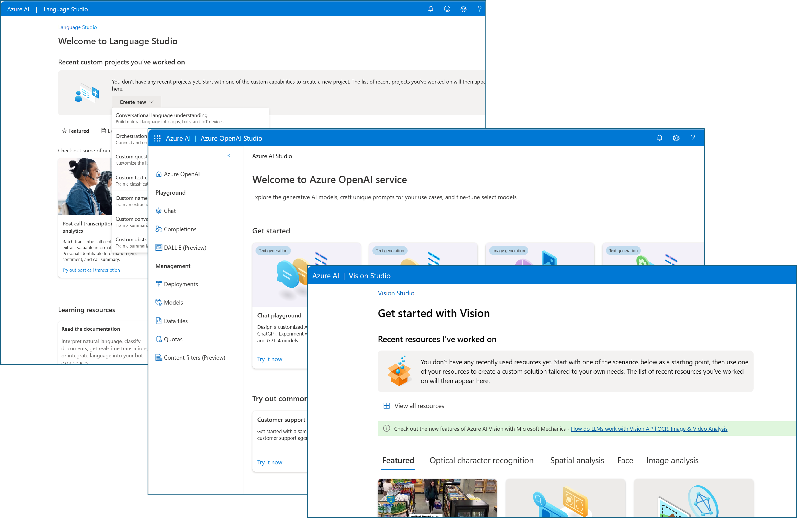

Once you create an Azure AI service resource, you can build applications using the REST API, software development kits (SDKs), or visual studio interfaces.

 

## Using service studio interfaces

Studio interfaces provide a friendly user interface to explore AI services. There are different studios for different AI services, such as Vision Studio, Language Studio, Speech Studio, or the Content Safety Studio. You can use the samples provided, or experiment with your own content. This studio-based approach allows you to explore, demo, and evaluate AI services regardless of your experience with AI or coding.

## Associate the AI service resource with the AI studio
Before you can use an AI services resource, you must associate it with the AI studio you want to use. You do this on the Settings page. Select the resource, and then click **Use Resource**. You are then ready to explore the AI service within the Azure AI studio. 

As an example, we will use Content Safety, which is an AI service that identifies harmful text or images. To explore what the Content Safety service does, you will use an Azure AI studio. First create either a multi-service Azure AI services resource, or a single-service Content Safety resource. Then, on the Content Safety Studio Settings page, select the resource, and click **Use Resource**. The AI service you created is now associated with the Content Safety Studio, and ready to be used.

In this section you have looked at using an Azure AI studio to explore the functionality of an AI service. When developers incorporate an AI service into their applications, they identify the resource using an SDK or through the REST API. See Azure AI services [development options]() for more information.
