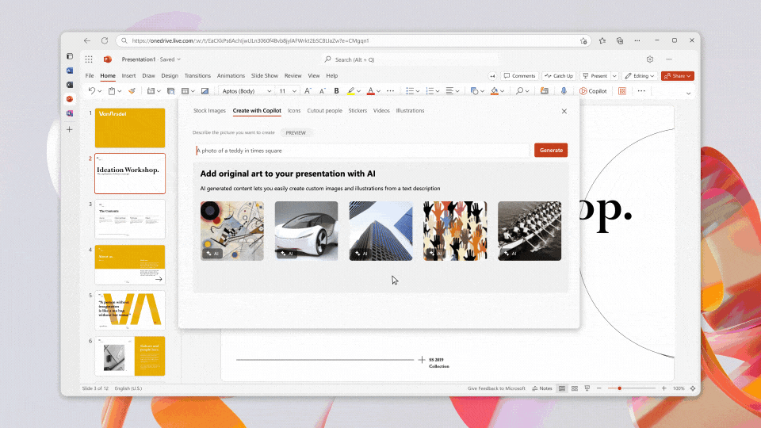

The availability of LLMs has led to the emergence of a new kind of software application, often referred to as a copilot. Copilots are often integrated into other applications and provide a way for users to get help with common tasks from a generative AI model. Copilots are based on a common architecture, so developers can build custom copilots for a variety of business-specific applications and services.

You may see copilots appear within the products that you already use, for example, as a chat screen feature that opens up next to your file. These copilots use the content that is created or searched for in the product as specific information for its results. For example, in the Microsoft Edge browser, a copilot enables you to use a GPT-4 model to summarize the page you’re currently browsing or to generate new content, as shown here:

## Tying it all together
It is helpful to think of how the creation of a language model is related the process of creating a copilot application. We can think of this process: 

- A large amount of data is used to train a large language model 
- The model that is ready to return responses is known as pre-trained. Pre-trained models are also known as base or foundation models.  
- Services such as Azure OpenAI make pre-trained models available for developers to use "off the shelf".
- Developers can take the pre-trained model and customize is or leave it as is.
- Developers deploy the model, which enables them to use the models in applications
- Developers write other code, possibly to create a front and back end to an intelligent application. At this stage, developers can also give the application specific instructions for what to do with prompts. 
- Consumers interact with the intelligent application by typing in a prompt.

When we think about the question of how AI will impact our lives, copilots have the potential to revolutionize the way we work. Using generative AI, these copilots can help with first drafts, information synthesis, and strategic planning.   

Some examples include: 

- **Bing copilot**: provides AI help when browsing or searching the Internet by generating natural language answers to questions based on context rather than just search results of indexed pages. 

- **M365 copilot**: works alongside you in productivity and communication apps, assisting you in creating effective documents, spreadsheets, presentations, emails, and other ways. 

- **GitHub copilot**: provides support to software developers, helping them write, document, and test code.  

## Extending and customizing copilots
Plugins, computer applications that can be added to other applications to extend their capabilities, can be used with copilots. An example of a generic plugin is an application you download and add to your web browser that can be used to count the number of words on a web page.   
 
Plugins for copilots can add a specific context layer to "ground" the responses returned by large language models. For example, the prompt "Tell me about Edinburgh" to an LLM might result in historic, cultural, and geographical information about Edinburgh. A plug-in for a travel company might provide additional context data that enables the response to include details of hotels in Edinburgh. 

