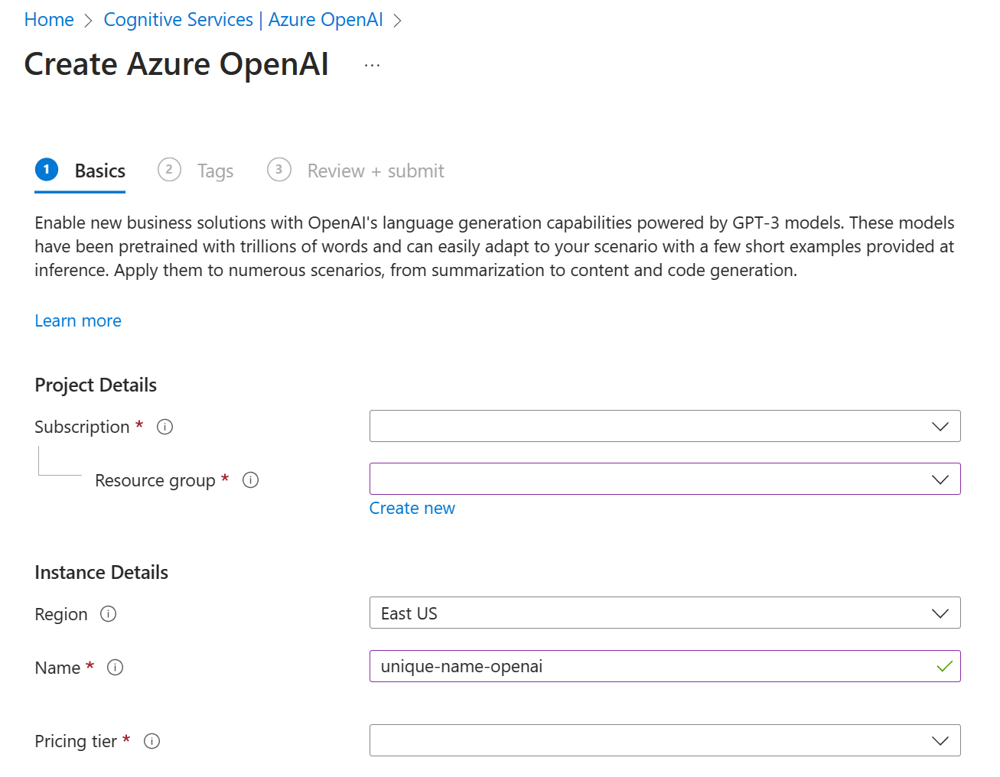

Currently Azure OpenAI Service is in limited access. This means users need to apply for service access at [https://aka.ms/oai/access]( https://aka.ms/oai/access?portal=true). 

>[!NOTE]
>Azure OpenAI Service has been released with limited access to support the ethical use of the service. You can read Microsoft's Transparency note for Azure OpenAI Service [here](https://learn.microsoft.com/legal/cognitive-services/openai/transparency-note?portal=true).

Once you have access to Azure OpenAI Service, you can begin to use it by creating a resource in the [Azure portal](https://portal.azure.com/?portal=true) or through the Azure command line interface (CLI). 

## Create an Azure OpenAI Service resource in the Azure portal 
When you create a resource, you will need to provide a subscription name, resource group name, region, unique instance name, and select a pricing tier.


## Create an Azure OpenAI Service resource in Azure CLI

To create an Azure OpenAI Service resource from the CLI, refer to the example below and replace the following variables with your own:
- MyOpenAIResource: *replace with a unique name for your resource*
- OAIResourceGroup: *replace with your resource group name* 
- eastus: *replace with the region to deploy your resource*
- subscriptionID: *replace with your subscription ID*

```dotnetcli
az cognitiveservices account create \
-n MyOpenAIResource \
-g OAIResourceGroup \
-l eastus \
--kind OpenAI \
--sku s0 \
--subscription subscriptionID
```

>[!NOTE]
>You can find the regions available for a service through the CLI command `az account list-locations`. To see how to sign into Azure and create an Azure group via the CLI, you can refer to the [documentation here](https://learn.microsoft.com/azure/cognitive-services/openai/how-to/create-resource?pivots=cli#sign-in-to-the-cli). 
  

### Regional availability 
Azure OpenAI Service provides access to many types of models. Certain models are only available in select regions. Consult the [Azure OpenAI model availability guide](https://learn.microsoft.com/azure/cognitive-services/openai/concepts/models#model-summary-table-and-region-availability/?portal=true) for region availability. You can create two Azure OpenAI resources per region. 


 