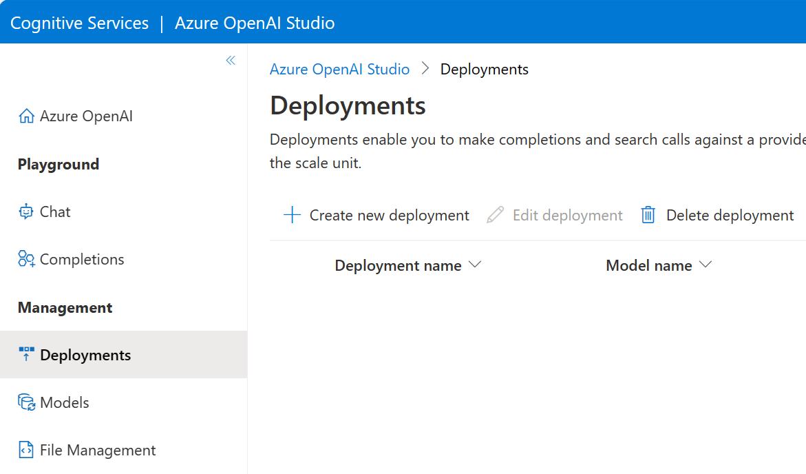

Azure OpenAI Studio provides access to model management, deployment, experimentation, customization, and learning resources. 

You can access the Azure OpenAI Studio through the Azure Portal after creating a resource, and at [https://oai.azure.com](https://oai.azure.com/?azure-portal=true) by logging in with your Azure OpenAI resource instance. During the sign-in workflow, select the appropriate directory, Azure subscription, and Azure OpenAI resource. 

Once you are in the Studio, you will see a call-to-action button at the top of the screen. If you do not have any deployments yet, the button reads **Create new deployment**. Get started by selecting to button, which will bring you to the **deployments** page. Deployments is one of several navigation options that will appear on the left-hand side of the screen. 

Once in the studio, your next steps include: 
1. Choosing a base model.
1. Deploying a base model. 
1. Testing the model. An easy way to do this is in one of the studio playgrounds. 
1. Experimenting with prompts and parameters to see their effect on completions, or the generated output.

   