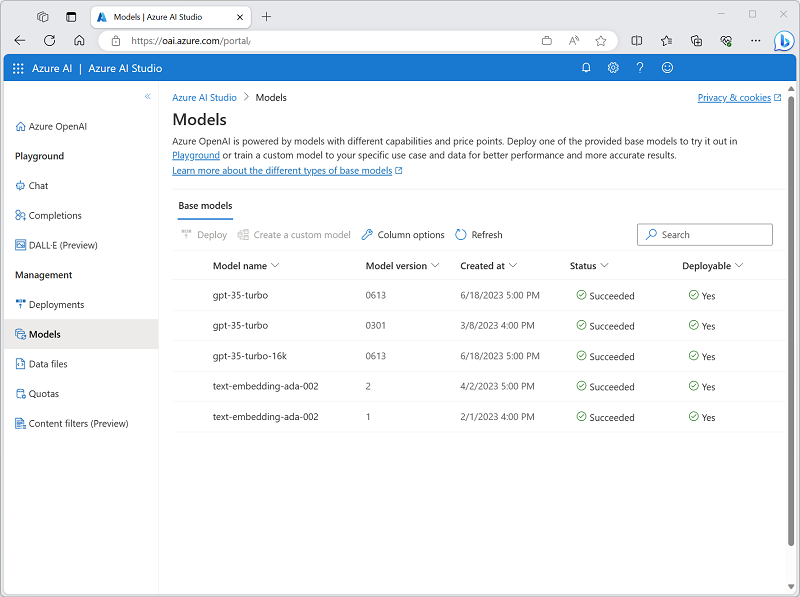

To begin building with Azure OpenAI, you need to choose a base model and deploy it. Microsoft provides base models and the option to create customized base models. This module will cover the currently available out-of-the-box base models. Microsoft's partnership with OpenAI means models that become availible with OpenAI can become available with Azure OpenAI.   

Azure OpenAI's models are grouped by family and capability. 

|Family|Description|Models within family|
|GPT-4|--|--|
|GPT-3|--|--|
|Codex|--|--|
|Embeddings|--|--|

GPT-4 models are currently in preview. For access, existing Azure OpenAI customers can apply by [filling out this form](https://aka.ms/oai/get-gpt4).

## Choosing a model 
The models within the family differ in speed, cost, and capability. You can think of   

In the Azure OpenAI Studio, you can navigate to the models by creating a new deployment. 

>[!NOTE]
>Pricing is determiend by tokens and by model type. Learn more from the latest [pricing documentation](https://azure.microsoft.com/pricing/details/cognitive-services/openai-service/). 