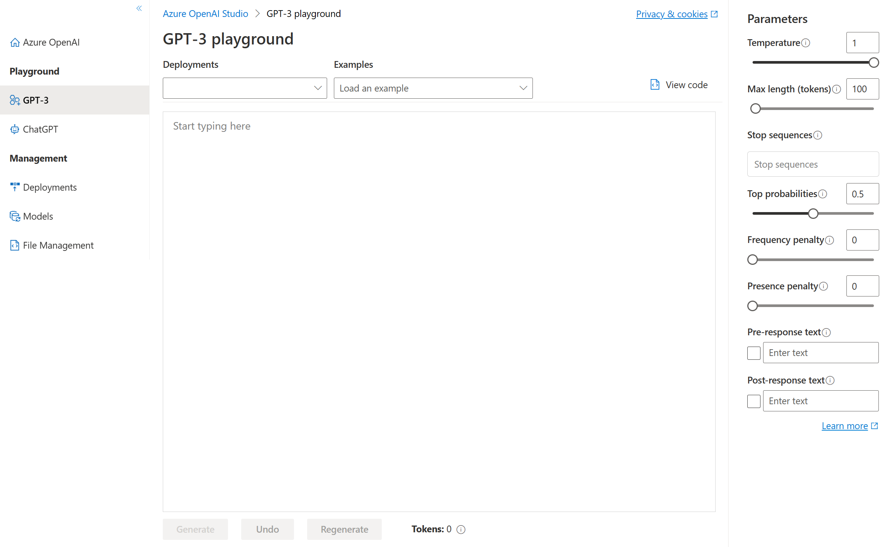

Playgrounds are useful interfaces in Azure OpenAI Studio that you can use to experiment with your deployed models without needing to develop your own client application. Azure OpenAI Studio offers multiple playgrounds with different parameter tuning options.  

## GPT-3 Playground
GPT-3 playground allows you to make calls to your deployed models through a text-in, text-out interface and to adjust parameters. You will need to select the deployment name of your model under Deployments. Optionally, you can use the pre-provided examples to get you started; and then you can enter your own prompts. 

#### GPT-3 Playground parameters

There are many parameters that you can adjust to change the performance of your model: 
- **Temperature**: Controls randomness. Lowering the temperature means that the model will produce more repetitive and deterministic responses. Increasing the temperature will result in more unexpected or creative responses. Try adjusting temperature or Top P but not both.
- **Max length (tokens)**: Set a limit on the number of tokens per model response. The API supports a maximum of 4000 tokens shared between the prompt (including system message, examples, message history, and user query) and the model's response. One token is roughly 4 characters for typical English text.
- **Stop sequences**: Make responses stop at a desired point, such as the end of a sentence or list. Specify up to four sequences where the model will stop generating further tokens in a response. The returned text will not contain the stop sequence.
- **Top probabilities**: Similar to temperature, this controls randomness but uses a different method. Lowering Top P will narrow the model’s token selection to likelier tokens. Increasing Top P will let the model choose from tokens with both high and low likelihood. Try adjusting temperature or Top P but not both.
- **Frequency penalty**: Reduce the chance of repeating a token proportionally based on how often it has appeared in the text so far. This decreases the likelihood of repeating the exact same text in a response.
- **Presence penalty**: Reduce the chance of repeating any token that has appeared in the text at all so far. This increases the likelihood of introducing new topics in a response.
- **Pre-response text**: Insert text after the user’s input and before the model’s response. This can help prepare the model for a response.
- **Post-response text**: Insert text after the model’s generated response to encourage further user input, as when modeling a conversation.

## Chat Playground

Chat playground (preview) is based on a conversation-in, message-out interface. You can initialize the session with a system message to set up the chat context. 

#### Chat playground parameters

The Chat playground includes the Temperature parameter, as well as others not available in the GPT-3 playground.  These include: 
- **Max response**: Set a limit on the number of tokens per model response. The API supports a maximum of 4000 tokens shared between the prompt (including system message, examples, message history, and user query) and the model's response. One token is roughly 4 characters for typical English text.
- **Top P**: Similar to temperature, this controls randomness but uses a different method. Lowering Top P will narrow the model’s token selection to likelier tokens. Increasing Top P will let the model choose from tokens with both high and low likelihood. Try adjusting temperature or Top P but not both.
- **Past messages included**: Select the number of past messages to include in each new API request. This helps give the model context for new user queries. Setting this number to 10 will include 5 user queries and 5 system responses.

The **Current token count** is viewable from the Chat playground. Since the API calls are priced by token, and it is possible to set a max response token limit, you will want to keep an eye out for the current token count to make sure the conversation-in does not exceed the max response token count.